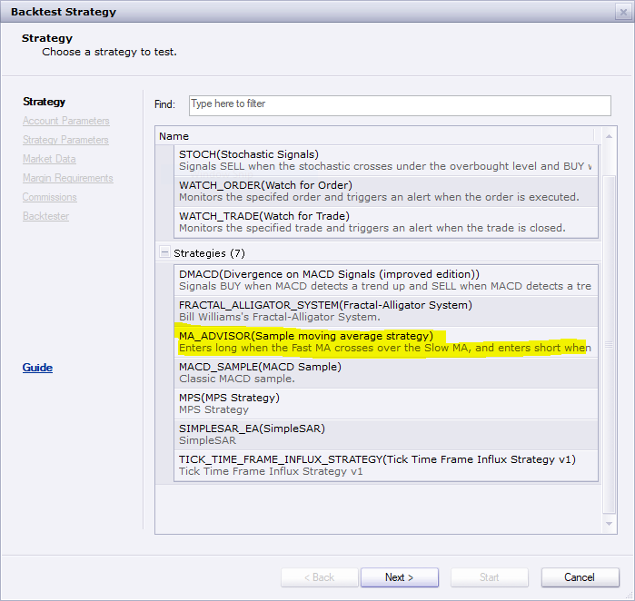

# Profit Matrix

> Source: https://fxcodebase.com/code/viewtopic.php?f=17&t=66586  
> Forum: 17 · Topic 66586 · 5 post(s)

---

## Profit Matrix

**Apprentice** · Wed Aug 22, 2018 2:36 am

Based on request.
[viewtopic.php?f=27&t=66577](https://fxcodebase.com/code/viewtopic.php?f=27&t=66577)

 [ProfitMatrix.lua](files/120731/ProfitMatrix.lua)

---

## Re: Profit Matrix

**bruno2017** · Wed Aug 22, 2018 2:00 pm

Merci beaucoup pour l indicateur.

Methode pour trading:
Tendance acheteur nuage vert
Tendance vendeur nuage rouge
Pour une reel tendance il faut que les prix soit au dessus du nuage vert soit au dessous du nuage rouge.
le nuage bleu indique la force de la tendance.

> Thank you very much for the indicator.
>
> Method for trading:
> Green cloud buyer trend
> Red cloud seller trend
> For a real trend prices must be above the green cloud or below the red cloud.
> the blue cloud indicates the strength of the trend.

---

## Re: Profit Matrix

**yolerap** · Thu Nov 14, 2019 2:41 pm

Hello,

Is it possible to create a strategy with this indicator ?

Buy when it's green.
Sell when it's red.

Could you add the limit and stop positions ?
Thank you,

---

## Re: Profit Matrix

**Apprentice** · Sun Nov 17, 2019 7:16 am

This pre-installed strategy will give the same results.

---

## Re: Profit Matrix

**bruno2017** · Mon Nov 18, 2019 8:01 am

Hello
If I can afford this indicator works with a MACD that will give the Buy or Sell signal.
the indicator gives only the tendency.
IF you want more information you can contact me by MP
