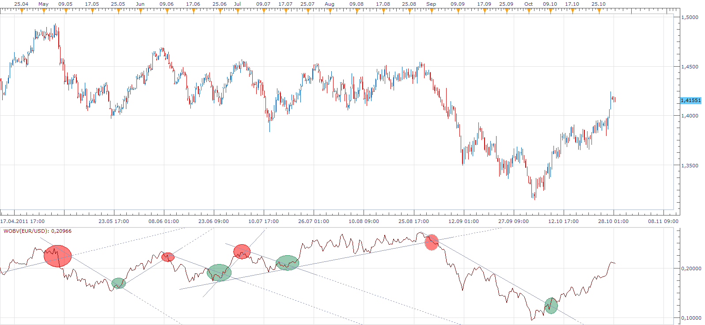

# Progress

> Source: https://fxcodebase.com/code/viewtopic.php?f=17&t=7690  
> Forum: 17 · Topic 7690 · 16 post(s)

---

## Progress

**Apprentice** · Sat Oct 29, 2011 10:22 am

This is an indicator that I have personally created.
It is similar to OBV and you can use it the same way.
Although it gives a greater number of signals.
In my opinion, provides earlier and more accurate signals.

I have added three algorithms.
Price, Volume, Price*Volume

Basically, the indicator is a result of the sum of Price, Volume, or the results of their product.

Old version is using Price algorithm

 [Progress.bin](files/17083/Progress.bin)

---

## Re: Progress

**sabrumea** · Sat Oct 29, 2011 9:19 pm

Apprentice, it looks very interesting, but which time frame would you recommend for this one?

---

## Re: Progress

**Apprentice** · Sun Oct 30, 2011 7:08 am

As I have repeatedly stressed,
I do not use indicators in my trading.

This is a relatively new indicator,
i do not have much information on it.

In theory, it should give similar results in all time frames.

Feedback is welcome.

---

## Re: Progress

**Apprentice** · Sun Oct 30, 2011 7:34 am

I have added two additional algorithms.

---

## Re: Progress

**sabrumea** · Mon Oct 31, 2011 6:03 pm

Apprentice, i think after you added these two algorithms the indicator became more reliable on H4 !!!.. but on m5 or m15 it has become less reliable—you can not even draw a line that should be crossed to trigger the entry because i many cases it is almost horizontal

---

## Re: Progress

**Apprentice** · Tue Nov 01, 2011 2:51 am

Old algorithm should be unchanged.
 You Correct me if I'm wrong.
 I can release the old version, also.

---

## Re: Progress

**luciana** · Tue Nov 01, 2011 6:36 am

Hi, how can I check/change the version? Thanks. Luciana

---

## Re: Progress

**Apprentice** · Tue Nov 01, 2011 4:27 pm

By selecting one of the available algorithms.
Type parameter (volume, price or volume * price)
Old Version, Use Price.

---

## Re: Progress

**sabrumea** · Wed Nov 02, 2011 7:18 am

Apprentice, i think the indicator (with new algorithms) is ok for all time frames... just on the smaller time frames you have to zoom in ! i think your new version is much more reliable. i really like it!!

---

## Re: Progress

**jackfx09** · Sat Jul 28, 2012 2:07 pm

Can I please ask that this indicator be written in .lua format. I have tried to open the bin file with secondary file opener and no luck. Or please advise on how to accomplish that task.

Thanks!

sjc

---

## Re: Progress

**nsaale** · Thu Oct 11, 2012 2:50 am

Where can I find the WOBV indicator that appears in the picture for progress indicator?

---

## Re: Progress

**Apprentice** · Thu Oct 11, 2012 3:01 am

Progress and WOBV are essentially one and the same indicator.

---

## Re: Progress

**Apprentice** · Thu Oct 11, 2012 4:06 am

to jackfx09
I use. Bin deliberately, to hide the algorithm that is use.

---

## Re: Progress

**Winner22** · Sun Dec 16, 2012 3:34 am

hi apprentice

very interesting indicator. much better than obv. thanks a lot.

can you explain me please why there is a such big difference between the bid and the ask on these volume indicators.
thereby, i don't know if i have to check trends on ask or bid and it's often very different. maybe it depends if i need to buy or sell.

i'll be very grateful if someone could help me on this.

thx a lot

winner22

---

## Re: Progress

**Apprentice** · Sun Dec 16, 2012 4:44 am

Between the Bid and Ask a negligible difference,
Progress, like OBV, is a cumulative indicator.
If you add a lot of negligible values,
You get a noticeable difference.

---

## Re: Progress

**Apprentice** · Tue May 02, 2017 12:00 pm

Bump up.
