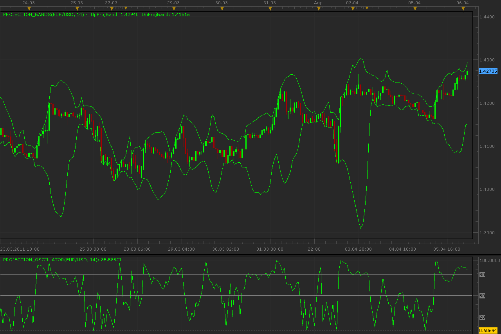

# Projection bands and oscillator

> Source: https://fxcodebase.com/code/viewtopic.php?f=17&t=3847  
> Forum: 17 · Topic 3847 · 2 post(s)

---

## Projection bands and oscillator

**Alexander.Gettinger** · Wed Apr 06, 2011 1:45 am

Projection bands and oscillator is a port of 2 Metastock indicators: [http://trader.online.pl/MSZ/e-w-Project ... width.html](http://trader.online.pl/MSZ/e-w-Projection_Bandwidth.html) and [http://trader.online.pl/MSZ/e-w-Project ... lator.html](http://trader.online.pl/MSZ/e-w-Projection_Oscillator.html).

 

Download projection bands:

 [Projection_Bands.lua](files/9402/Projection_Bands.lua)

Download projection oscillator:

 [Projection_Oscillator.lua](files/9402/Projection_Oscillator.lua)

The indicator was revised and updated

---

## Re: Projection bands and oscillator

**Apprentice** · Mon Mar 06, 2017 7:34 am

Indicator was revised and updated.
