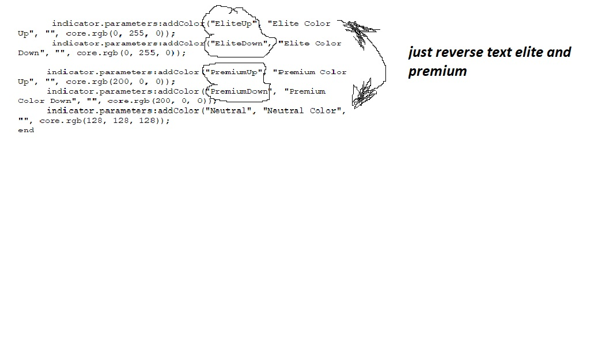

# PRT indicator

> Source: https://fxcodebase.com/code/viewtopic.php?f=17&t=68886  
> Forum: 17 · Topic 68886 · 25 post(s)

---

## PRT indicator

**Apprentice** · Thu Sep 05, 2019 6:54 am

Based on request.
[viewtopic.php?f=27&t=68882](https://fxcodebase.com/code/viewtopic.php?f=27&t=68882)

 [PRT indicator.lua](files/128439/PRT%20indicator.lua)

---

## Re: PRT indicator

**MICKA76** · Thu Sep 05, 2019 12:42 pm

Hello,
i downloaded the version you created.
uoy do a great job.
the probleme i described is about the version you created. may have changed the code to have what is on the message above.
the bar do not appear on small time units.

i thank you.

---

## Re: PRT indicator

**Apprentice** · Thu Sep 05, 2019 2:56 pm

The indicator was updated.
I am still waiting for the original code.

---

## Re: PRT indicator

**MICKA76** · Thu Sep 05, 2019 6:11 pm

good evening sorry to disturb.
i tried the indicator, it works,however there is an inversion of color and appellation elite and premium.
can you just revers text elite down and up by premium up and down and the problem will be solved i think.
i enclose an illustration in picture.
great job and thank you.

 

 

---

## Re: PRT indicator

**Apprentice** · Sat Sep 07, 2019 5:35 am

Try it now.

---

## Re: PRT indicator

**MICKA76** · Tue Sep 10, 2019 2:06 pm

hello apprentice,

i tried the new version but some thing aanoys me in it, i enclose the original code, sorry for the delay. whith the original code can be solved the problem.
big thanks to you

sorry i can not attach the ITF file so here is the screenshot of my code.

 

---

## Re: PRT indicator

**Apprentice** · Wed Sep 11, 2019 4:34 am

Your request is added to the development list.
Development reference 68.

---

## Re: PRT indicator

**MICKA76** · Wed Sep 11, 2019 6:35 am

> **Apprentice wrote:**
> Your request is added to the development list.
> Development reference 68.

Hy appentice,
or then i find this topic.

thanks you for us

---

## Re: PRT indicator

**Apprentice** · Thu Sep 12, 2019 7:00 am

[PRT indicator.lua](files/128604/PRT%20indicator.lua)

Try this version.

---

## Re: PRT indicator

**MICKA76** · Thu Sep 12, 2019 10:20 am

> **Apprentice wrote:**
>
>
> PRT indicator.lua
>
>
> Try this version.

hello appentice,
i am really sorry but the indicator does not work.

did you try it?

thanks

---

## Re: PRT indicator

**Apprentice** · Fri Sep 13, 2019 6:12 am

You probably have insufficient data points to calculate.
Try to zoom out your chart.

---

## Re: PRT indicator

**MICKA76** · Fri Sep 13, 2019 6:03 pm

Hello appentice,

did you have time to look the indicator.
i join the sceenshot because it does not work.
i really sorry to disturb.

 

---

## Re: PRT indicator

**MICKA76** · Sun Sep 15, 2019 2:05 pm

Hy appentice,

i try new version of the indicator.
i noticed a problem with the code, the elite up don't works, i join the screenshot so that you can see.
can you name it the indicator " indicator elite / premium ".

otherwise the rest works fine.

thank you for your precious help

 

---

## Re: PRT indicator

**Apprentice** · Mon Sep 16, 2019 3:33 am

Your request is added to the development list.
Development reference 90.

---

## Re: PRT indicator

**Apprentice** · Mon Sep 16, 2019 7:15 am

Try this version.

 [PRT_indicator.lua](files/128711/PRT_indicator.lua)

---

## Re: PRT indicator

**MICKA76** · Mon Sep 16, 2019 12:54 pm

> **Apprentice wrote:**
> Try this version.
>
>
> The attachment **PRT_indicator.lua** is no longer available

hello apprentice.
i tried the new code, you worked on and i thank you for it.
however, i don't understand, why when you make an improvement on the code, i find myself whith something different and inconsistencies.
i understand that it is not easy to do so i thought that can be by simplifying the code and only consider the elite up and elite down that would be easier to do.

elite up = closing price > classique pivot point daily and closing price > classique pivot point weekly and closing price > classique pivot point monthly.

elite down = closing price < classique pivot point daily and closing price < classique pivot point weekly and closing price < classique pivot point monthly.

i join the screenshot.

 

i really sorry the difficulty.

thank you

---

## Re: PRT indicator

**MICKA76** · Tue Sep 17, 2019 11:56 pm

Hello apprentice,
Could you make the change.
Thank you so much

---

## Re: PRT indicator

**Apprentice** · Wed Sep 18, 2019 6:18 am

Your request is added to the development list.
Development reference 99.

---

## Re: PRT indicator

**Apprentice** · Wed Sep 18, 2019 6:42 am

The indicator works exactly like that.

---

## Re: PRT indicator

**MICKA76** · Wed Sep 18, 2019 2:00 pm

hello,apprentice

i thought back to the code and if we add the following condition:

neutral= close<pivot daily and close >pivot weekly and close>pivot monthly
or
neutral= close>pivot daily and close <pivot weekly and close<pivot monthly

would that be better.

thanks

---

## Re: PRT indicator

**Apprentice** · Thu Sep 19, 2019 1:03 pm

Your request is added to the development list.
Development reference 108.

---

## Re: PRT indicator

**Apprentice** · Fri Sep 20, 2019 3:09 am

I don't understand what needs to be done. Currently, everything not elite and a premium is neutral (including conditions specified)

---

## Re: PRT indicator

**MICKA76** · Fri Sep 20, 2019 4:23 am

Hello apprentice,
i join the screenshot for you to visualize.

 

 

the indicator watch a elite up but the price is between pivot daily and pivot weekly, the indicator should be gray(neutral) so that's why i thought i might have to add a condition.
it's just an assumption.

thank

good day.

---

## Re: PRT indicator

**Apprentice** · Tue Oct 22, 2019 8:59 am

[PRT_indicator.lua](files/129374/PRT_indicator.lua)

Try this version.

---

## Re: PRT indicator

**MICKA76** · Mon Nov 04, 2019 6:53 am

MAGNIFIQUE, merci appentice cela marche superbement bien.
