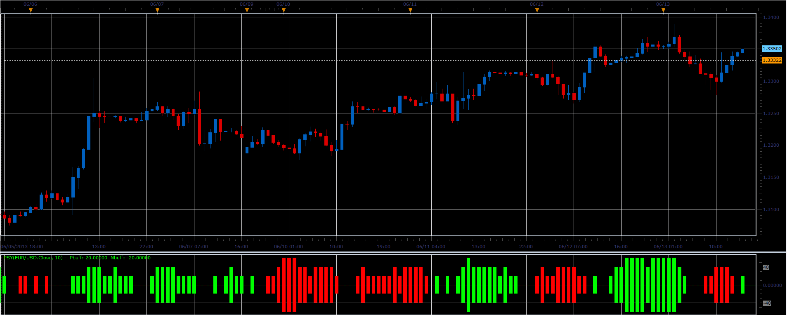

# Psy oscillator

> Source: https://fxcodebase.com/code/viewtopic.php?f=17&t=41291  
> Forum: 17 · Topic 41291 · 2 post(s)

---

## Psy oscillator

**Alexander.Gettinger** · Tue Jun 18, 2013 12:50 pm

This indicator is a ported MQL5 indicator from [http://www.mql5.com/en/code/1702](http://www.mql5.com/en/code/1702)

 

Download:

 [Psy.lua](files/67512/Psy.lua)

The indicator was revised and updated

---

## Re: Psy oscillator

**Apprentice** · Sat May 27, 2017 11:35 am

Indicator was revised and updated.
