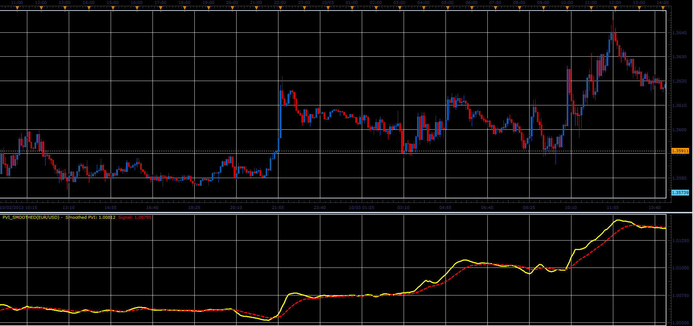

# PVI smoothed oscillator

> Source: https://fxcodebase.com/code/viewtopic.php?f=17&t=59617  
> Forum: 17 · Topic 59617 · 2 post(s)

---

## PVI smoothed oscillator

**Alexander.Gettinger** · Mon Oct 07, 2013 2:42 pm

This is a smoothed PVI indicator ([viewtopic.php?f=17&t=7886&p=17488](https://fxcodebase.com/code/viewtopic.php?f=17&t=7886&p=17488)).

Formulas:
Smoothed PVI = MVA(PVI, Smooth period),
Signal = EMA(Smoothed PVI, Signal period), where
PVI - Positive Volume Index.

 

Download:

 [PVI_Smoothed.lua](files/89869/PVI_Smoothed.lua)

The indicator was revised and updated

---

## Re: PVI smoothed oscillator

**Apprentice** · Mon Jun 12, 2017 6:18 am

The indicator was revised and updated.
