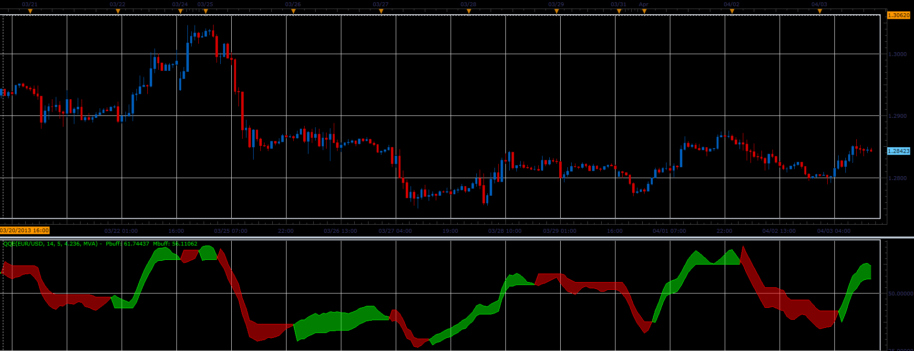

# QQE oscillator

> Source: https://fxcodebase.com/code/viewtopic.php?f=17&t=34069  
> Forum: 17 · Topic 34069 · 8 post(s)

---

## QQE oscillator

**Alexander.Gettinger** · Wed Apr 03, 2013 3:29 pm

This indicator is a ported MQL5 indicators from [http://www.mql5.com/en/code/1599](http://www.mql5.com/en/code/1599)

 

Download:

 [QQE.lua](files/57909/QQE.lua)

 [QQE with Alert.lua](files/57909/QQE%20with%20Alert.lua)

For this indicator must be installed Averages indicator ([viewtopic.php?f=17&t=2430](https://fxcodebase.com/code/viewtopic.php?f=17&t=2430)).

The strategy based on this indicator is available here.
[viewtopic.php?f=31&t=64808](https://fxcodebase.com/code/viewtopic.php?f=31&t=64808)

---

## Re: QQE oscillator

**mulligan** · Fri Apr 05, 2013 9:54 am

This is a great indicator. Putting "averages" option in the method makes fine tuning a breeze. If you can find the time, a strategy based on simple color change would most appreciated.

---

## Re: QQE oscillator

**Apprentice** · Sat Apr 06, 2013 4:34 am

Your request is added to the development list.

---

## Re: QQE oscillator

**Alexander.Gettinger** · Wed Apr 10, 2013 4:17 pm

MQL4 version of this oscillator: [viewtopic.php?f=38&t=34365](https://fxcodebase.com/code/viewtopic.php?f=38&t=34365)

---

## Re: QQE oscillator

**Apprentice** · Tue May 09, 2017 6:30 am

Indicator was revised and updated.

---

## Re: QQE oscillator

**adloule** · Thu May 06, 2021 6:05 am

hello
could you please add an alert that we can see ( dots or arrows) when the 2 lines crosses
thank yoy

---

## Re: QQE oscillator

**Apprentice** · Fri May 07, 2021 4:02 am

Your request is added to the development list.
Development reference 448.

---

## Re: QQE oscillator

**Apprentice** · Sat May 08, 2021 7:29 am

QQE with Alert.lua added.
