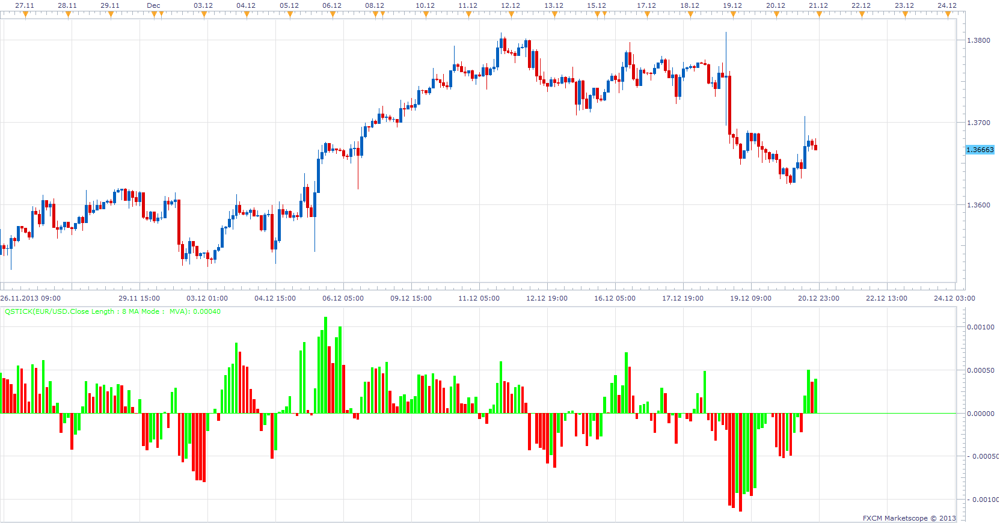

# QStick

> Source: https://fxcodebase.com/code/viewtopic.php?f=17&t=60135  
> Forum: 17 · Topic 60135 · 2 post(s)

---

## QStick

**Apprentice** · Sat Dec 21, 2013 9:19 am

Written According to MQ4 source.
[viewtopic.php?f=27&t=60128](https://fxcodebase.com/code/viewtopic.php?f=27&t=60128)
As the moving average, of the Open / Close differences.

 [QStick.lua](files/91638/QStick.lua)

The indicator was revised and updated

---

## Re: QStick

**Apprentice** · Wed Jun 14, 2017 6:33 am

The indicator was revised and updated.
