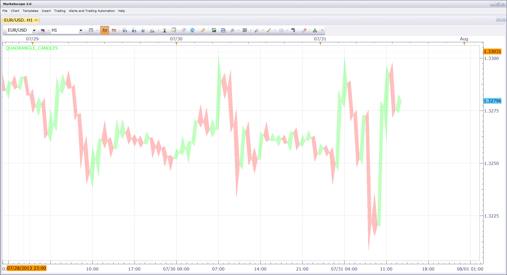

# Quadrangle Candles

> Source: https://fxcodebase.com/code/viewtopic.php?f=17&t=58431  
> Forum: 17 · Topic 58431 · 3 post(s)

---

## Quadrangle Candles

**Nikolay.Gekht** · Wed Jul 31, 2013 12:28 pm

The indicator offers an alternative view for the candles. The price bar is displayed as a quadrangle, where left vertex shows the open price, the right vertex shows the close price, the top vertex shows the high price and the bottom vertex shows the low price. The major difference from usual bars and candles is that this visualization shows which price - high or low is reached first. The corresponding vertex will be drawn closer to the open vertex and the other will be drawn closer to the close vertex.

To use this view just apply the indicator at any bar chart.

 

Download:

 [Quadrangle_Candles.lua](files/87592/Quadrangle_Candles.lua)

The indicator was revised and updated

---

## Re: Quadrangle Candles

**Apprentice** · Tue Oct 15, 2013 1:44 am

Bump Up

---

## Re: Quadrangle Candles

**Apprentice** · Mon Jun 12, 2017 5:55 am

The indicator was revised and updated.
