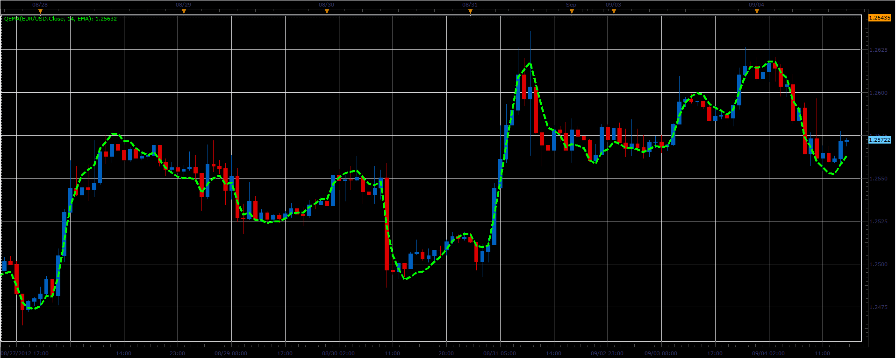

# Quadruple Exponential Moving Average

> Source: https://fxcodebase.com/code/viewtopic.php?f=17&t=23006  
> Forum: 17 · Topic 23006 · 2 post(s)

---

## Quadruple Exponential Moving Average

**Alexander.Gettinger** · Tue Sep 04, 2012 2:22 pm

Formulas ([http://daytradersjournal.com/qema.php](http://daytradersjournal.com/qema.php)):
QEMA=5*MA1-10*MA2+10*MA3-5*MA4+MA5, where
MA1=Moving Average(Price),
MA2=Moving Average(MA1),
MA3=Moving Average(MA2),
MA4=Moving Average(MA3),
MA5=Moving Average(MA4).

 

Download:

 [QEMA.lua](files/39656/QEMA.lua)

For this indicator must be installed Averages indicator ([viewtopic.php?f=17&t=2430](https://fxcodebase.com/code/viewtopic.php?f=17&t=2430)).

The indicator was revised and updated

---

## Re: Quadruple Exponential Moving Average

**Apprentice** · Mon Dec 26, 2022 6:12 am

Updated.
