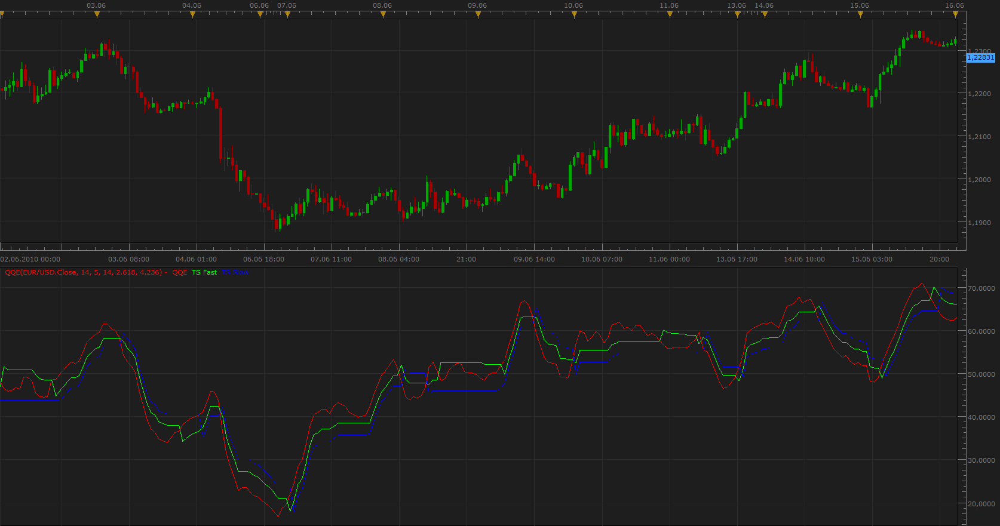

# Qualitative Quantitative Estimation (QQE)

> Source: https://fxcodebase.com/code/viewtopic.php?f=17&t=1347  
> Forum: 17 · Topic 1347 · 32 post(s)

---

## Qualitative Quantitative Estimation (QQE)

**Apprentice** · Wed Jun 16, 2010 8:30 am

*QQE*

Qualitative Quantitative Estimation (QQE) is a smoothed RSI.

Trailing stop is a smoothed ATR multiplied by a factor of 2.618 or, and 4.236,
ATR indicator is based on the EMA of RSI.

QQE trading signals.

**Crossovers**
 RSI /Trailing stop Crossover

**Overbought/Oversold**
Level are 30 and 70

**Divergence**
**Bullish Divergence - Long**
Lower lows in price and higher lows in the QQE.

**Bearish Divergence - Short**
Higher highs in price and lower highs in the QQE.

 [QQE.lua](files/2585/QQE.lua)

 [Averages QQE.lua](files/2585/Averages%20QQE.lua)

 [Averages QQE Overlay.lua](files/2585/Averages%20QQE%20Overlay.lua)

Averages indicator can be found here.
[viewtopic.php?f=17&t=2430](https://fxcodebase.com/code/viewtopic.php?f=17&t=2430)

MQ4/MT4 version
[viewtopic.php?f=38&t=63956&p=108514#p108514](https://fxcodebase.com/code/viewtopic.php?f=38&t=63956&p=108514#p108514)

 

 [QQE Alert.lua](files/2585/QQE%20Alert.lua)

---

## Re: Qualitative Quantitative Estimation (QQE)

**balaji** · Thu May 12, 2011 12:36 pm

Dear Sir,
I applied this indicator to my FXCM 1 hour chart and I can only see the Green and Red line of the indicator and I cant see the blue line of the indicator . I tried to apply it but still its not visible on the indicator window. Please help me out. Your indicator seems very promising.

Warm Regards,
Balaji.

---

## Re: Qualitative Quantitative Estimation (QQE)

**Apprentice** · Thu May 12, 2011 2:06 pm

Blue line is optional, Set Show Slow trailing stop parameter to YES.

---

## Re: Qualitative Quantitative Estimation (QQE)

**balaji** · Thu May 12, 2011 9:43 pm

Dear sir,
How to use this indicator effectively for exit confirmation? Can you please explain a little bit more?

Warm Regards,
Balaji.

---

## Re: Qualitative Quantitative Estimation (QQE)

**Apprentice** · Fri May 13, 2011 2:12 am

Personally I do not use indicators in my trading.
Specialy, I have no experience with this indicator.
This is the Copy Past research from my blog.

QQE indicator is based on the RSI.
Application of QQE indicators are multiple, independently or in combination with the RSI indicator,
to generate a Buy and Sell signals that determine the prevailing trend.

 1) QQE / Fast or Slow TL Crossover
Buy - QQE> Fast or Slow TL Crossover
Sell ​​- QQE <Fast or Slow TL Crossunder.

 2) 50-level Crossover
Buy> 50 Line Crossover
Sell ​​<50 Line Crossunder

 3) FastTL / Slow TL Crossover
Buy - Fast TL - TL Slow Crossover
Sell ​​- Fast TL -TL Slow Crossunder

Long signals are stronger if they have generated over 50, and vice versa.

QQE divergence between the indicators and the closing price.

Overbought / Oversold
Overbought QQE> 70
Oversold <30

---

## Re: Qualitative Quantitative Estimation (QQE)

**Tim123** · Wed May 18, 2011 4:51 pm

Apprentice, I have down loaded the QQE indicator and I like it a lot. I used it on MT4 platform and I am glad to see that it is here. Thanks so much for developing it for us to use.

I would like to request that you create an alert for this indicator. It would be a simple alert that gives an alarm when the QQE and the signal cross at the close of the bar.

Thanks
Tim

---

## Re: Qualitative Quantitative Estimation (QQE)

**Apprentice** · Thu May 19, 2011 3:41 am

Your request has been added to developmental cue.

---

## Re: Qualitative Quantitative Estimation (QQE)

**vstrelnikov** · Fri May 20, 2011 11:11 am

The simlpe signal posted [here](https://fxcodebase.com/code/viewtopic.php?f=29&t=4382).

---

## Re: Qualitative Quantitative Estimation (QQE)

**cersoz** · Fri Dec 02, 2011 8:16 am

can u add 50 lvl line to this indicator.

---

## Re: Qualitative Quantitative Estimation (QQE)

**Apprentice** · Fri Dec 02, 2011 6:02 pm

50 level line Added.

---

## Re: Qualitative Quantitative Estimation (QQE)

**cersoz** · Sat Dec 03, 2011 12:33 am

thanks man!çç

---

## Re: Qualitative Quantitative Estimation (QQE)

**Apprentice** · Thu Jan 31, 2013 5:29 am

Style and Performance Update

---

## Qualitative Quantitative Estimation (QQE)

**mehrdadr27** · Mon Sep 29, 2014 9:44 am

Hi Apprentice
Thanks for your great work. please add MA methods like EMA,TMA,TIANGULAR MA .... to this indicator.

thanks a lot

---

## Re: Qualitative Quantitative Estimation (QQE)

**Apprentice** · Tue Sep 30, 2014 2:05 am

Averages QQE.lua Added.

---

## Re: Qualitative Quantitative Estimation (QQE)

**mpatrick1024** · Mon Oct 20, 2014 12:21 pm

Is there a QQE crossover alert developed for TSII? If so, can someone direct me to it.

Thanks.

---

## Re: Qualitative Quantitative Estimation (QQE)

**Apprentice** · Mon Oct 20, 2014 1:38 pm

Simple signal can be found here.
[http://fxcodebase.com/code/viewtopic.php?f=29&t=4382](https://fxcodebase.com/code/viewtopic.php?f=29&t=4382)

---

## Re: Qualitative Quantitative Estimation (QQE)

**Coondawg71** · Thu Jul 09, 2015 9:08 pm

Can we please request price bar coloration for Averages QQE. Gradient colorization upon cross of fast ATR and slow ATR would be the request.

Thanks!

sjc

---

## Re: Qualitative Quantitative Estimation (QQE)

**Apprentice** · Mon Jul 13, 2015 8:14 am

Averages QQE Overlay.lua Added.

---

## Re: Qualitative Quantitative Estimation (QQE)

**mulligan** · Wed Jul 22, 2015 9:34 am

A small request when there is time. For those of us who use a black background, a color option for the 50 line would be very helpful.

Thanks

---

## Re: Qualitative Quantitative Estimation (QQE)

**Apprentice** · Wed Aug 05, 2015 7:44 am

Central Line Added.

---

## Re: Qualitative Quantitative Estimation (QQE)

**jaricarr** · Mon Feb 29, 2016 9:25 pm

Hi Apprentice,

Can the confirmation line have adjustable levels ?

That way the indicator can be set to match the actual parameters being used with the optimized strategy.

Thanks,

JariCarr

---

## Re: Qualitative Quantitative Estimation (QQE)

**Apprentice** · Tue Mar 01, 2016 2:25 pm

Central Level Parameter Added.

---

## Re: Qualitative Quantitative Estimation (QQE)

**Apprentice** · Tue Oct 11, 2016 5:53 am

Minor Update.

---

## Re: Qualitative Quantitative Estimation (QQE)

**Apprentice** · Tue Mar 13, 2018 11:08 am

The indicator was revised and updated

---

## Re: Qualitative Quantitative Estimation (QQE)

**Apprentice** · Fri Dec 17, 2021 4:34 am

QQE Alert.lua added.

---

## Re: Qualitative Quantitative Estimation (QQE)

**Xtian56** · Thu Feb 03, 2022 5:56 pm

QQE ALERT.lua

Hello,
Thank you for your work !
On the indicator: QQE ALERT.lua, I detected that signals were missing with the settings indicated.
is there a bug please ?

---

## Re: Qualitative Quantitative Estimation (QQE)

**Apprentice** · Fri Feb 04, 2022 3:17 am

Look ok to me.
Can you send me both files to my email mario(.)jemic(@)gmail(.)com
Make sure to provide the link to the forum post.

---

## Re: Qualitative Quantitative Estimation (QQE)

**FabioE** · Thu Feb 24, 2022 10:13 am

I noticed a glitch on the Averages QQE indicator.
Changing the "Line width" and "Line style" for QQE, also affects "Fast trailing stop" and "Slow trailing stop". Changing the parameters for Fast and Slow trailing stop doesn't work at all.
It's a minor issue, but still if would be nice if it could be fixed

---

## Re: Qualitative Quantitative Estimation (QQE)

**Apprentice** · Fri Feb 25, 2022 4:06 am

Fixed.

---

## Re: Qualitative Quantitative Estimation (QQE)

**Xtian56** · Fri May 20, 2022 6:34 am

The attachment **QQE.lua** is no longer available

Hello & thank you for your work.
Can you paint between the two ATRs as in this example please ?

Thanks very much

---

## Re: Qualitative Quantitative Estimation (QQE)

**Apprentice** · Sun May 22, 2022 4:39 am

We have added your request to the development list.
Development reference 302.

---

## Re: Qualitative Quantitative Estimation (QQE)

**Apprentice** · Fri May 27, 2022 11:35 am

Try this version.
[https://fxcodebase.com/code/viewtopic.php?f=17&t=72220](https://fxcodebase.com/code/viewtopic.php?f=17&t=72220)
