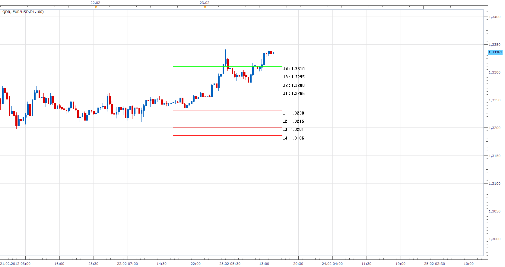
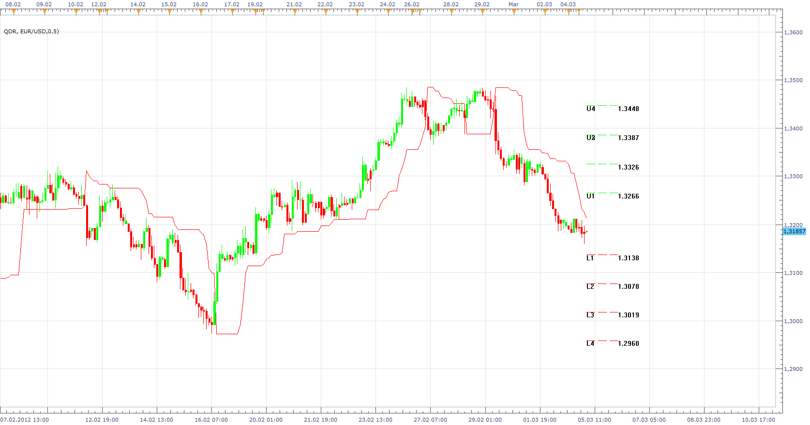

# Quantitative Daily Range Indicator (QDR)

> Source: https://fxcodebase.com/code/viewtopic.php?f=17&t=13904  
> Forum: 17 · Topic 13904 · 5 post(s)

---

## Quantitative Daily Range Indicator (QDR)

**Apprentice** · Thu Feb 23, 2012 2:11 pm

 [QDR.lua](files/26712/QDR.lua)

The indicator was revised and updated

---

## Re: Quantitative Daily Range Indicator (QDR)

**GekkoBlueHorseshoe** · Thu Feb 23, 2012 3:02 pm

Apprentice,

First of all, Many Thanks for coding this up in such a short space of time.

You have 'hit the essence' of it however, there are a few problems:

1) I can only display the lines when I select 'place under chart' from the 'Location' tab.
2) The indicator shows errors when it runs ("select lower time frame").
3) There seems to be a problem with the calculations as the values generated are way off the mark and they update with every increase/decrease in price.

If I give you the source code for my original VB application, that should help iron out the calculation errors.

Once the above errors/faults have been eradicated, I will be able to better explain the indicator for the other members.

---

## Re: Quantitative Daily Range Indicator (QDR)

**Apprentice** · Thu Feb 23, 2012 3:11 pm

If you select D1 from Indicator parameter menu.
You can use time frames less than or equal to D1.
And so on.

---

## Re: Quantitative Daily Range Indicator (QDR)

**Apprentice** · Mon Mar 05, 2012 4:59 am

 [QDR V2.lua](files/27608/QDR%20V2.lua)

 [QDR V3.lua](files/27608/QDR%20V3.lua)

---

## Re: Quantitative Daily Range Indicator (QDR)

**Apprentice** · Mon Apr 03, 2017 5:40 am

Indicator was revised and updated.
