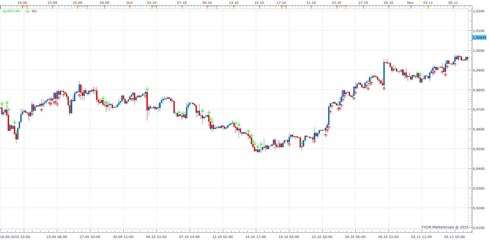

# Quantum

> Source: https://fxcodebase.com/code/viewtopic.php?f=17&t=62888  
> Forum: 17 · Topic 62888 · 19 post(s)

---

## Quantum

**Apprentice** · Mon Nov 16, 2015 5:57 am

Based on request.
[viewtopic.php?f=27&t=62764](https://fxcodebase.com/code/viewtopic.php?f=27&t=62764)
Will indicate period Min / Max.

 [Quantum.lua](files/103384/Quantum.lua)

 [Quantum with Alert.lua](files/103384/Quantum%20with%20Alert.lua)

 [Quantum Signal Oscillator.lua](files/103384/Quantum%20Signal%20Oscillator.lua)

Indicator-based strategy.
[https://fxcodebase.com/code/viewtopic.php?f=31&t=74976](https://fxcodebase.com/code/viewtopic.php?f=31&t=74976)

---

## Re: Quantum

**armin0012003** · Mon Aug 29, 2016 7:39 am

Hi
can you please change the indicator the way it is in mt4
I need square instead of arrow ( cant change the size of square)and need it at the bottom or top of the candle
I appreciated in advance

---

## Re: Quantum

**Apprentice** · Tue Aug 30, 2016 5:10 am

Your request is added to the development list, Under Id Number 3614
 If someone is interested to do this task, please contact me.

---

## Re: Quantum

**cnikitopoulos94** · Sun Sep 25, 2016 11:59 pm

Hello,

Please try the attatched file below. If this does not work please submit a picture of which exact square. I will do my best, no promises.

Sincerely, Christos.

 [Quantum Square.lua](files/108261/Quantum%20Square.lua)

---

## Re: Quantum

**armin0012003** · Tue Oct 04, 2016 1:42 am

hi Mario
thanks for nice work but can yo change the square box to goes at the bottom of candle for downtrend and top of candle for uptrend
thanks

---

## Re: Quantum

**Apprentice** · Tue Oct 04, 2016 1:52 am

Is already implemented.

---

## Re: Quantum

**armin0012003** · Tue Oct 04, 2016 2:17 am

sorry that was my bad
I meant always at the top of the candle
i attached the photo of the mt4 version
thanks

---

## Re: Quantum

**chai88888** · Tue Mar 14, 2017 12:03 pm

can you put alert on this indicator.. even play sounds only . thanks

---

## Re: Quantum

**Apprentice** · Wed Mar 15, 2017 4:26 am

Quantum with Alert.lua added.

---

## Re: Quantum

**chai88888** · Wed Mar 15, 2017 4:37 am

it is the same as the quantum square?

---

## Re: Quantum

**Apprentice** · Wed Mar 15, 2017 4:46 am

Yes.

---

## Re: Quantum

**chai88888** · Thu Jan 04, 2018 6:27 am

hi can you make an alert.... when a opposite sign appear thats the only time it sounds? thanks

---

## Re: Quantum

**Apprentice** · Fri Jan 05, 2018 5:58 am

Can you show this on an example?

---

## Re: Quantum

**chai88888** · Fri Jan 05, 2018 12:09 pm

when first new color appear thats the only time triggers the alerts. first red and the first green thanks

---

## Re: Quantum

**Apprentice** · Sun Jan 07, 2018 7:05 am

Try it now.

---

## Re: Quantum

**chai88888** · Sun Jan 07, 2018 11:58 am

many thanks

---

## Re: Quantum

**chai88888** · Mon Apr 23, 2018 10:40 pm

is there a strategy for this?

like the donchain channel but the difference is it will open a trade when a box appear and take the trade when the candle close not open.

close all when it reaches the centerline of the donchain channel

and its has start time and end time

thanks

---

## Re: Quantum

**Apprentice** · Wed Apr 25, 2018 2:55 pm

The Indicator was revised and updated.

---

## Re: Quantum

**Apprentice** · Wed Apr 25, 2018 3:42 pm

Try this version.
[viewtopic.php?f=31&t=65964&p=118821#p118821](https://fxcodebase.com/code/viewtopic.php?f=31&t=65964&p=118821#p118821)
