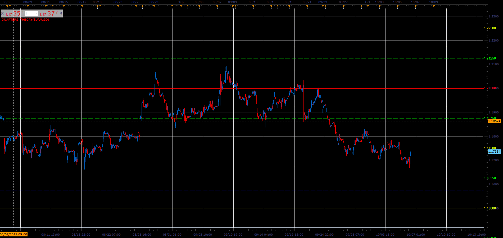

# Quarters Theory indicator

> Source: https://fxcodebase.com/code/viewtopic.php?f=17&t=65158  
> Forum: 17 · Topic 65158 · 14 post(s)

---

## Quarters Theory indicator

**Alexander.Gettinger** · Fri Oct 06, 2017 12:46 pm

Based on request: [viewtopic.php?f=27&t=65146](https://fxcodebase.com/code/viewtopic.php?f=27&t=65146)

 

Download:

 [Quarters_Theory.lua](files/115300/Quarters_Theory.lua)

MT4/MQ4 version
[viewtopic.php?f=38&t=66218](https://fxcodebase.com/code/viewtopic.php?f=38&t=66218)

---

## Re: Quarters Theory indicator

**jrichardson83** · Mon Oct 09, 2017 4:48 pm

Can we adjust the price labels so that they appear underneath the price lines on the chart, rather than on the axis. Like the Prime Levels indicator?

---

## Re: Quarters Theory indicator

**Apprentice** · Tue Oct 10, 2017 4:43 am

Try it now.

---

## Re: Quarters Theory indicator

**jrichardson83** · Wed Feb 21, 2018 9:42 am

> **Alexander.Gettinger wrote:**
> Based on request: [viewtopic.php?f=27&t=65146](https://fxcodebase.com/code/viewtopic.php?f=27&t=65146)
>
>
>
> The attachment **Quarters_Theory.PNG** is no longer available
>
>
>
> Download:
>
>
> The attachment **Quarters_Theory.PNG** is no longer available

I noticed that the "Hesitation Points" line on this indie is not printing a value. Can we get that adjusted? Also, can we add the option to modify the width and style of the individual lines?

Thanks!

 

---

## Re: Quarters Theory indicator

**Apprentice** · Wed Feb 21, 2018 9:55 am

Try it now.

---

## Re: Quarters Theory indicator

**Apprentice** · Wed Feb 21, 2018 9:55 am

Try it now.

---

## Re: Quarters Theory indicator

**jrichardson83** · Wed May 09, 2018 8:21 am

Apprentice,

Can you add the option to change the color of the line value so that it can be colored differently than the line itself?

---

## Re: Quarters Theory indicator

**Apprentice** · Thu May 10, 2018 5:13 am

Can you clarify.

---

## Re: Quarters Theory indicator

**jrichardson83** · Thu May 10, 2018 11:08 am

> **Apprentice wrote:**
> Can you clarify.

Yes, can the numbers be a different color than the line? For example, lets say I have a light gray line but wan't the numbers on the right to be black.

---

## Re: Quarters Theory indicator

**Apprentice** · Mon May 14, 2018 6:14 am

Try it now.

---

## Re: Quarters Theory indicator

**jrichardson83** · Tue May 15, 2018 9:13 am

> **Apprentice wrote:**
> Try it now.

Perfect, thanks a million .

---

## Re: Quarters Theory indicator

**lanreakinsiun** · Thu Jun 21, 2018 10:38 pm

Please can you add the final mq4 or ex4 file to this trend for me please?

---

## Re: Quarters Theory indicator

**Apprentice** · Fri Jun 22, 2018 5:16 am

Your request is added to the development list under Id Number 4167

---

## Re: Quarters Theory indicator

**Apprentice** · Fri Jun 22, 2018 7:18 am

MT4/MQ4 version
[viewtopic.php?f=38&t=66218](https://fxcodebase.com/code/viewtopic.php?f=38&t=66218)
