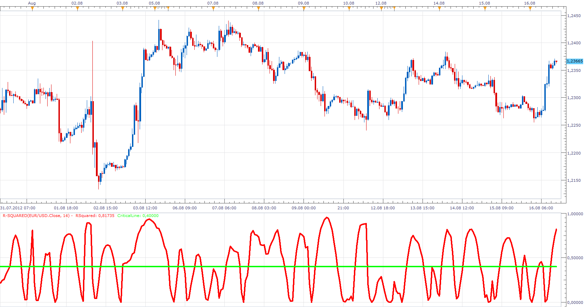

# R-Squared

> Source: https://fxcodebase.com/code/viewtopic.php?f=17&t=546  
> Forum: 17 · Topic 546 · 6 post(s)

---

## R-Squared

**Apprentice** · Wed Mar 31, 2010 9:05 am

*R-Squared*

R-Squared shows the correlation between the closing price and the line of linear regression
It is used as an indicator of strength of the existing trend.

Perfect correlation - 1.0
Correlation does not exist - 0.0

Within this limit indicator guarantees 95 percent accuracy.

The fall of the R-Squared index below the critical value, after reaching the extreme values, is a sign of the weakening of the dominant trends and opportunities for open positions in a direction opposite to the trend line defined by linear regression.
R-Squared is opportune to use in combination with the Linear Regression Slope indicator.
R-Squared for the determination of power and Linear Regression Slope for determining the direction of the trend.

Described in BookTechnical Analysis from A to Z, By Steven Achelis.

 [R-Squared.lua](files/956/R-Squared.lua)

The indicator was revised and updated

---

## Re: R-Squared

**mjf1288** · Mon Aug 13, 2012 2:37 pm

Hello,

I really like this indicator and I find it can be very useful, however it may need a very important adjustment. Right now, this just shows the correlation between the closing price and selected period linear regression line.

 To make this much, much more useful it would need to show the **correlation**between **user selected streams of price**(ie open, close, high, low, weighted, typical, median) and the **indicators that are currently on the chart.**

 So for example, if I had a DSS stochastic and a CCI value streams being produced on the chart, I would then want to know the correlation between those indicators and the price. **So the adjustment that would need to be made would be the types of data source used for the calculation.** **There would need to be a function to select multiple data sources to determine correlation between all of them.**

Could someone make this adjustment, it would be very helpful.

Thank You!

---

## Re: R-Squared

**Apprentice** · Tue Aug 14, 2012 1:55 am

Your request is added to the development list.

---

## Re: R-Squared

**Apprentice** · Thu Aug 16, 2012 1:28 pm

This is one of my earliest indicators.
Unlike the old version, which supported only a bar chart,
The new version provides support to Tick Data.
Style and performance update is also added.

 [Tick-R-Squared.lua](files/38775/Tick-R-Squared.lua)

---

## Re: R-Squared

**Apprentice** · Fri Aug 17, 2012 2:16 pm

Here you can find a version that can compare the two indicators.
[viewtopic.php?f=17&t=22506](https://fxcodebase.com/code/viewtopic.php?f=17&t=22506)

---

## Re: R-Squared

**Apprentice** · Mon Apr 24, 2017 5:05 am

Indicator was revised and updated.
