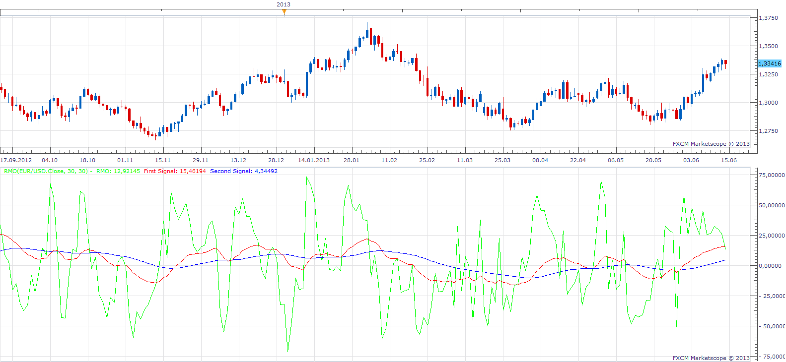

# Rahul Mohindar Oscillator

> Source: https://fxcodebase.com/code/viewtopic.php?f=17&t=41106  
> Forum: 17 · Topic 41106 · 6 post(s)

---

## Rahul Mohindar Oscillator

**Apprentice** · Sun Jun 16, 2013 8:07 am

 [RMO.lua](files/67247/RMO.lua)

 

 [Advanced RMO.lua](files/67247/Advanced%20RMO.lua)

 

 [MTF MCP Advanced RMO Heat Map.lua](files/67247/MTF%20MCP%20Advanced%20RMO%20Heat%20Map.lua)

MQ4 version.
[viewtopic.php?f=38&t=59124](https://fxcodebase.com/code/viewtopic.php?f=38&t=59124)

Indicator-based strategies.
[viewtopic.php?f=31&t=59451](https://fxcodebase.com/code/viewtopic.php?f=31&t=59451)
[viewtopic.php?f=31&t=68305](https://fxcodebase.com/code/viewtopic.php?f=31&t=68305)

---

## Re: Rahul Mohindar Oscillator

**Alexander.Gettinger** · Wed Aug 14, 2013 2:47 pm

MQL4 version of Rahul Mohindar Oscillator: [http://www.fxcodebase.com/code/viewtopi ... 38&t=59124](http://www.fxcodebase.com/code/viewtopic.php?f=38&t=59124)

---

## Re: Rahul Mohindar Oscillator

**Apprentice** · Fri Jun 09, 2017 7:40 am

The indicator was revised and updated.

---

## Re: Rahul Mohindar Oscillator

**Apprentice** · Sun Apr 07, 2019 5:45 am

Advanced RMO.lua added.

---

## Re: Rahul Mohindar Oscillator

**bartwas1** · Sun Apr 07, 2019 4:54 pm

Hi Apprentice

Just a quick question? Any chance to develop this advanced RMO for meta trader 4?

---

## Re: Rahul Mohindar Oscillator

**Apprentice** · Mon Apr 08, 2019 7:38 am

Advanced RMO.mq4 added.
[viewtopic.php?f=38&t=59124](https://fxcodebase.com/code/viewtopic.php?f=38&t=59124)
