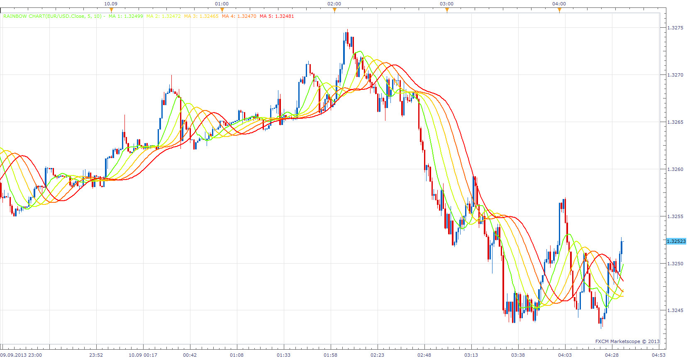
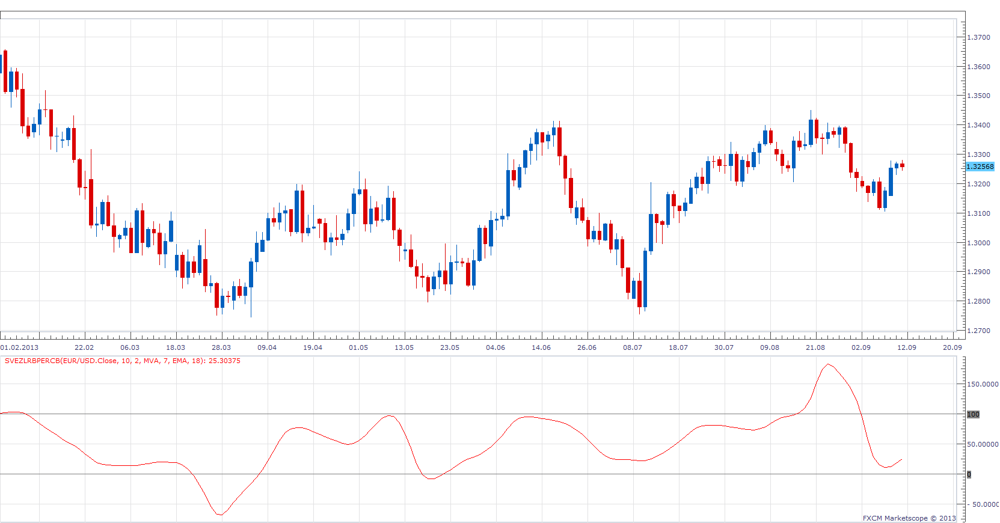
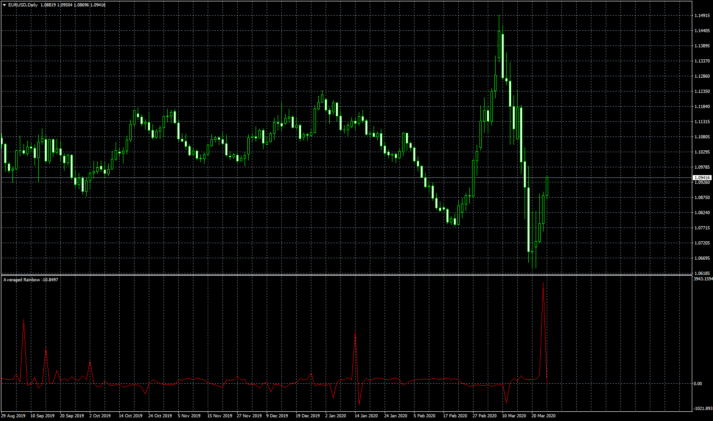

# Rainbow Chart

> Source: https://fxcodebase.com/code/viewtopic.php?f=17&t=59441  
> Forum: 17 · Topic 59441 · 17 post(s)

---

## Rainbow Chart

**Apprentice** · Tue Sep 10, 2013 3:36 am

MA[1] = MA of Price
MA[2] = MA of MA[1]
....
MA[n]= MA of MA[n-1]

 [Rainbow Chart.lua](files/89309/Rainbow%20Chart.lua)

The indicator was revised and updated

---

## Average Rainbow

**Apprentice** · Tue Sep 10, 2013 3:51 am

Average Rainbow = (MA[1] + ... + MA[n]) /N

 [Averaged Rainbow.lua](files/89311/Averaged%20Rainbow.lua)

---

## Mel Widner Averaged Rainbow

**Apprentice** · Tue Sep 10, 2013 3:58 am

Average Rainbow = (5*MA[1] +4*MA[2]+3*MA[3] +2*MA[4] +1*MA[5] ... + 1*MA[10]) /20
In a July 1997 Stocks & Commodities article, Mel Widner introduced rainbow charts give some extra weight for the less-smoothed data:

 [Mel Widner Averaged Rainbow.lua](files/89312/Mel%20Widner%20Averaged%20Rainbow.lua)

---

## Zero-Lag Rainbow

**Apprentice** · Tue Sep 10, 2013 4:34 am

MA1 = MA of Mel Widner Averaged Rainbow
MA2 = MA of MA1
Diff = MA1 - MA 2
Zero-Lag Rainbow = MA1 +Diff

 [Zero-Lag Rainbow.lua](files/89313/Zero-Lag%20Rainbow.lua)

---

## SVEZLRBPercB

**Apprentice** · Wed Sep 11, 2013 6:12 am

As described in the article by Sylvain Vervoort, The Best Of Both Worlds
Oscillators, Smoothed. The September issue of S & C magazine.

 [SVEZLRBPercB.lua](files/89375/SVEZLRBPercB.lua)

---

## Re: Rainbow Chart

**StefPasc** · Wed Sep 11, 2013 6:25 am

so many thanks Apprentice...

---

## Re: Rainbow Chart

**Apprentice** · Wed Sep 11, 2013 6:29 am

SVEZLRBPercB Update

---

## Re: Rainbow Chart

**Coondawg71** · Mon Nov 04, 2013 1:03 pm

Unable to download this file, possibly a bad link???

Thanks,

sjc

---

## Re: Rainbow Chart

**Apprentice** · Mon Nov 04, 2013 3:19 pm

Fixed.
It was a temporary Server glitch.

---

## Re: Rainbow Chart

**Apprentice** · Tue Jul 15, 2014 3:15 am

Bump Up.

---

## Re: Rainbow Chart

**Apprentice** · Sun Jun 25, 2017 1:08 pm

The indicator was revised and updated.

---

## Re: Rainbow Chart

**sathistrader** · Tue Mar 17, 2020 9:00 am

Is it possible to make these indicators for **mt4**?

---

## Re: Rainbow Chart

**Apprentice** · Tue Mar 17, 2020 11:33 am

Your request is added to the development list.
Development reference 886.

---

## Re: Rainbow Chart

**Apprentice** · Thu Mar 19, 2020 6:00 am

Something like this?
[viewtopic.php?f=38&t=69549&p=132074#p132074](https://fxcodebase.com/code/viewtopic.php?f=38&t=69549&p=132074#p132074)

---

## Re: Rainbow Chart

**sathistrader** · Sun Mar 22, 2020 11:23 pm

wOw, Super.thanks a lot... i just need one more SVEZLRBPercB.lua to mq4 ?

---

## Re: Rainbow Chart

**Apprentice** · Mon Mar 23, 2020 5:02 am

Your request is added to the development list.
Development reference 921.

---

## Re: Rainbow Chart

**Apprentice** · Thu Mar 26, 2020 6:47 am

 [SVEZLRBPercB.mq4](files/132294/SVEZLRBPercB.mq4)
