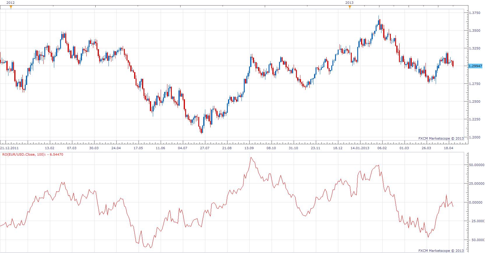

# Rainbow Oscillator

> Source: https://fxcodebase.com/code/viewtopic.php?f=17&t=35289  
> Forum: 17 · Topic 35289 · 2 post(s)

---

## Rainbow Oscillator

**Apprentice** · Tue Apr 23, 2013 8:05 am



As described by Allan J. McNichol.

```
Rainbow Oscillator
100 * (CLOSE - ((
Mov(C,2,S)
+ Mov(Mov(C,2,S),2,S)
+ Mov(Mov(Mov(C,2,S),2,S),2,S)
 + Mov(Mov(Mov(Mov(C,2,S),2,S),2,S),2,S)
 + Mov(Mov(Mov(Mov(Mov(C,2,S),2,S),2,S),2,S),2,S) +
Mov(Mov(Mov(Mov(Mov(Mov(C,2,S),2,S),2,S),2,S),2,S),2,S) +
Mov(Mov(Mov(Mov(Mov(Mov(Mov(C,2,S),2,S),2,S),2,S),2,S),2,S),2,
S) +
Mov(Mov(Mov(Mov(Mov(Mov(Mov(Mov(C,2,S),2,S),2,S),2,S),2,S),
2,S),2,S),2,S) +
Mov(Mov(Mov(Mov(Mov(Mov(Mov(Mov(Mov(C,2,S),2,S),2,S),2,S),
2,S),2,S),2,S),2,S),2,S) +
Mov(Mov(Mov(Mov(Mov(Mov(Mov(Mov(Mov(Mov(C,2,S),2,S),2,S),2,S),2,S),
2,S),2,S),2,S),2,S),2,S)) / 10)) / (HHV(C,10) - LLV(C,10))
```

 [RO.lua](files/59781/RO.lua)

---

## Re: Rainbow Oscillator

**Apprentice** · Fri Jun 22, 2018 8:09 am

The indicator was revised and updated.
