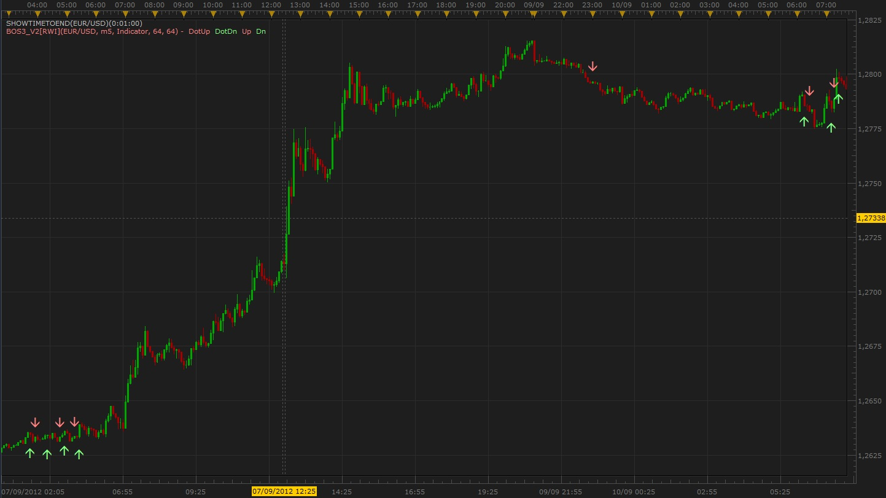

# Random Walk Index : Personal version "Buy or Sell"

> Source: https://fxcodebase.com/code/viewtopic.php?f=17&t=23340  
> Forum: 17 · Topic 23340 · 2 post(s)

---

## Random Walk Index : Personal version "Buy or Sell"

**Scrat_Power** · Wed Sep 12, 2012 4:02 pm

Hi,

Here an indicator (BoS Algo 3 Version 2) based on the RWI indicator.
Cross streams have been replaced by arrows to be more readable.
You can check both RWI with different periods (long and short) to try to clean signals.
Default parameter of the RWI indicator is 64.
BoS is set to long 64 and short 12.
If you put the same period for the long and the short period, you will retrieve the RWI standard information.

 

Regards,
Scrat.

The indicator was revised and updated

---

## Re: Random Walk Index : Personal version "Buy or Sell"

**Apprentice** · Wed Apr 12, 2017 6:20 am

Indicator was revised and updated.
