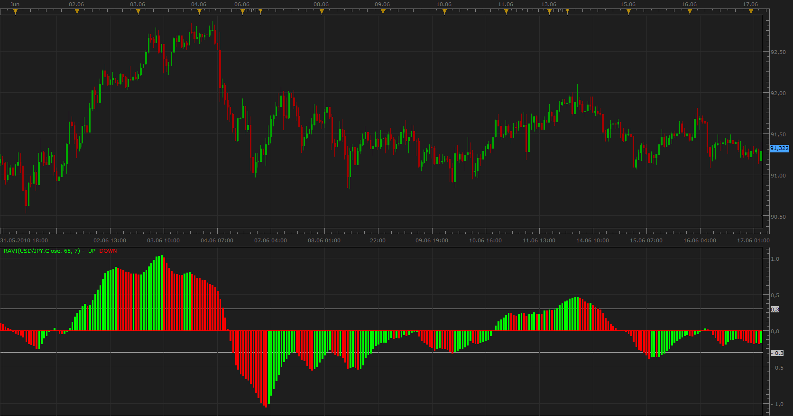
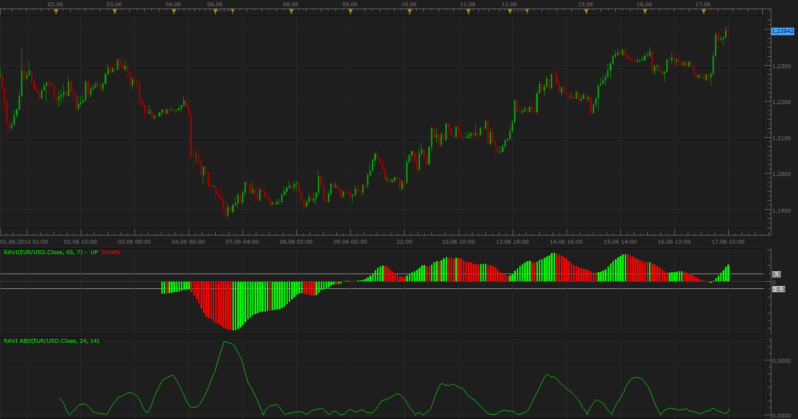

# Range Action Verification Index (RAVI)

> Source: https://fxcodebase.com/code/viewtopic.php?f=17&t=1356  
> Forum: 17 · Topic 1356 · 3 post(s)

---

## Range Action Verification Index (RAVI)

**Apprentice** · Thu Jun 17, 2010 5:00 am

*Range Action Verification Index (RAVI)*

Range Action Verification Index (RAVI) indicator was developed by Tushar Chande.
RAVI is used to identify whether a security is trending.

The market is considered trending if the RAVI value is above, below 0.3 (0.1).

As soon as the indicator begins to turn back to the zero line, from peak, it is assumed that the trend has ended.

RAVI = 100*(SMA(7) - SMA(65)) / SMA(65)

 [RAVI.lua](files/2601/RAVI.lua)

The indicator was revised and updated

---

## Re: Range Action Verification Index (RAVI)

**Apprentice** · Thu Jun 17, 2010 9:24 am

*RAVI ABS*

RAVI = ABS ( 100*(SMA(14) - SMA(24)) / SMA(24))

 [RAVI ABS.lua](files/2608/RAVI%20ABS.lua)

The indicator was revised and updated

---

## Re: Range Action Verification Index (RAVI)

**Apprentice** · Sun Jan 08, 2017 7:01 am

Indicator was revised and updated.
