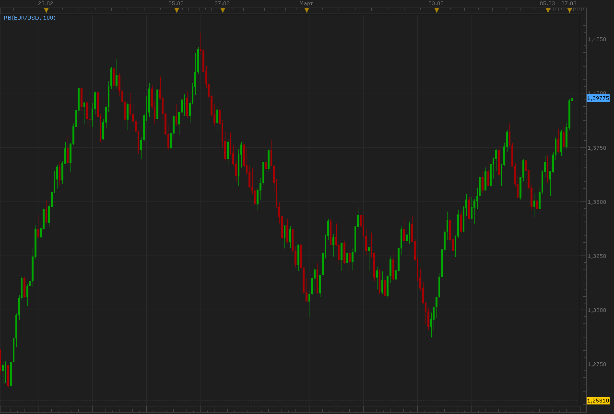
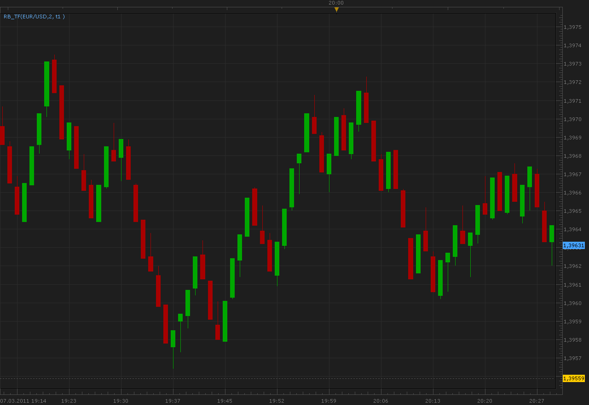
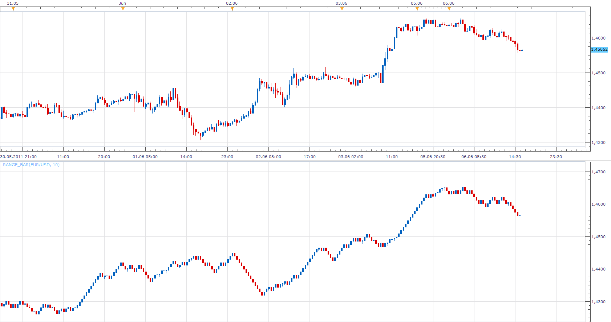

# Range bars (RB)

> Source: https://fxcodebase.com/code/viewtopic.php?f=17&t=3614  
> Forum: 17 · Topic 3614 · 57 post(s)

---

## Range bars (RB)

**Alexander.Gettinger** · Mon Mar 07, 2011 2:18 am

Indicator draw candles each of which have a constant range from high to low. As data is used source chart. For small value of range not is always got constant range of bars.

For example, chart with range 75 pips:

 



Download:

 [RB.lua](files/8681/RB.lua)

Download indicator for other chart:

 [RB2.lua](files/8681/RB2.lua)

---

## Re: Range bars (RB)

**Alexander.Gettinger** · Mon Mar 07, 2011 2:21 am

Indicators used as source data other (smaller) timeframes.
This allows to do range a bar corresponding to given.

Download:

 [RB_TF.lua](files/8682/RB_TF.lua)

Download indicator for other chart:

 [RB2_TF.lua](files/8682/RB2_TF.lua)

---

## Re: Range bars (RB)

**gg_frx** · Mon Mar 07, 2011 7:26 am

hi alexander
i don't know if this indicator is the one requested from webcon and me here
[viewtopic.php?f=27&t=3306&p=8577#p8577](https://fxcodebase.com/code/viewtopic.php?f=27&t=3306&p=8577#p8577).

but this isn't range bars chart because only one shadow (or none) can be on the candle, not two.
and is independent of time.

and again in my opinion we must use tick source data, but i don't know if it wil be too heavy for TSII and how many days we can go back ...

---

## Re: Range bars (RB)

**Alexander.Gettinger** · Mon Mar 07, 2011 11:48 pm

> **gg_frx wrote:**
> but this isn't range bars chart because only one shadow (or none) can be on the candle, not two.
> and is independent of time.

You are right.
In case use tick data as source bars may have only one or none shadow.

For example:

 



But if use not tick data there are pseudo-range bars, which may have two shadows.

---

## Re: Range bars (RB)

**madpipa** · Sun Apr 17, 2011 11:52 pm

Hi Alexander,

Firstly, thanks all the effort you & the other programmers put into developing these indicators. Great work!

I am also looking to use range bars on my charts. Unfortunately, I disagree that this indicator draws range bars correctly. Each candle MUST be the same pip size. If 1 minute data is used to draw past candles then it must be 'cut' so that each candle will only have the selected number of pips before a new candle is formed. They, therefore, can NOT have a wick on both ends of the candle.

Please compare these 2 images:

 


*GU from Trading Station*

 


*GU from Metatrader 4*

They depict range bars differently. Those shown by Metatrader are consistantly 10 pips. Those shown by Trading Station vary significantly. I exported the values to excel and found the minimum to be 10 pips & the maximum to be 31.7 pips, with the average of 11.8 pips.

Is it possible to change the way these bars are currently depicted to be the same or similar to MT4?

Also, I find that these charts tend to lock my computer for up to 2 minutes - with only 1 chart open. I had 2 range bar charts open the other day & killed the process after 5 minutes as the program had not responded in all that time. My computer is a 32 biy system with 3.20GHz CPU with 4G RAM. It handles everything else easily & only has a problem when range bars are drawn. Do you have any ideas?

Thanks for your time.
Cheers,
Mick

---

## Re: Range bars (RB)

**Apprentice** · Mon Jun 06, 2011 3:09 pm



To Madpipa
I tried to implement according to definitions of this indicator.
Can you test my version.

Even better.
If someone has a sample code of this indicator would ask him to tell me and send it by mail.
Or post it here.

 [Range_Bar.lua](files/11423/Range_Bar.lua)

---

## Re: Range bars (RB)

**madpipa** · Tue Jun 14, 2011 6:03 pm

Thanks Apprentice. Sorry for the late reply but I have been away for a few days. This seems to be the best version yet. The only thing I have found is that it **MUST** be used on a chart with 1 minute periods. If, for example, I use a 30 minute period the maximum level on a "normal" bar chart may be different to the correponding level on the range bar chart. One case I looked at had the "real" candle high = 1.64715 while the range bar high = 1.64523; a difference of 19.2 pips. But if you use the 1 minute period there doesn't seem to be a problem. And these bars load very quickly. They don't seem to put much or any overhead on the drawing time.

I have already looked around the internet for other versions but could only find *.exe file for MT4; not the mq4 file. If you want to see another implementation why not look at the version used in Strategy Trader? You may be able to get the code for that? Those range bars seem to follow all the rules.

While the range bar indicator seems to work very well there is a problem when other indicators are also placed on the chart. For instance, if I also place a moving average on the chart it is initially placed in the correct position. But after every new range bar is formed the MA is not updated. Is there any way to fix this?

Also, when I draw a 10 pip range bar using a 1 minute timeframe I get about 35-40 bars. If I draw 20 pip range bars I only get about 5-10 bars on the chart. Is it possible to 'force' a number of bars to be drawn? My guess is that this is a function of the amount of 1 minute data read by default when the chart is populated, so we may have to live with this.

I think this version seems to follow all the rules.
Thanks again for your efforts.

---

## Re: Range bars (RB)

**Apprentice** · Wed Jun 15, 2011 2:25 am

Any help is appreciated.
If you have. ex4 indicator send it.
Number of Bars determined by the amount of available data.
As regards the application of other indicators of nonlinear price data
I have not seen it anywhere in theory or practice.
Maybe it makes sense, I do not know.

---

## Re: Range bars (RB)

**Gadir21** · Fri Sep 23, 2011 5:22 am

Even better.
If someone has a sample code of this indicator would ask him to tell me and send it by mail.
Or post it here.

---

## Re: Range bars (RB)

**debra453** · Thu Oct 20, 2011 1:51 pm

I'd rather prefer him to post it here in order to make it publcy viewable

---

## Re: Range bars (RB)

**Average Joe** · Sun Feb 26, 2012 10:55 pm

Why is the range bars still time dependent? I thought it was designed to cut out 'noise' as most articles I have read suggest that it is ime independent.

---

## Re: Range bars (RB)

**Average Joe** · Sun Feb 26, 2012 11:55 pm

Why are these range bars time dependent? From my understanding its the number of bars hence the pips that defines when the bars move up or down.

---

## Re: Range bars (RB)

**sergesp** · Thu Mar 01, 2012 8:47 pm

The way I understand it all bars in a range bar chart are to be the same size and a new bar is only plotted when price moves out of the range of the current bar and therefore starts one tick above or below the high or the low respectively of the current bar and its extent is again the same size as the current bar i.e. no new bars are plotted while the price is within the range of the current bar. So I don't understand why in one of the range bar chart above there are many sideways bars at the same level. Also I don't understand where the wicks come in to in this picture - if some one can please clarify. Thanks.

---

## Re: Range bars (RB)

**Apprentice** · Fri Mar 02, 2012 5:10 am

A new bar does not start until a price tick exceed the fixed range of the current bar Up or Down.

Within this range, range bar behaves more or less like an ordinary candle, we can have wicks on one side.
But when price crosses boundaries up or down, the we break the range on that one side.
Range bar varies from Renko Chart.

Sideways bars? i have to backtest this one.

---

## Re: Range bars (RB)

**Apprentice** · Fri Mar 02, 2012 6:22 am

I have solve this problem.
Unfortunately, I made new one.
If you use too small, size of the candles, the application does not have enough memory.
I'm trying to find a fix.

 [Range_Bar.lua](files/27432/Range_Bar.lua)

---

## Re: Range bars (RB)

**Matteo Zucchini** · Wed Apr 18, 2012 4:57 am

Would be grateful to fix the limit of range bar loaded on the chart.Thanks.

---

## Re: Range bars (RB)

**fxcatty** · Thu Apr 19, 2012 8:54 am

It would certainly be awesome if you could fix the 'size' of range and memory error. I'd like to use 10 pip range bar charts. Is there a setting where I could adjust the amount of memory the charting uses?
I really am in need of range bars.

Thanks for your help!

---

## Re: Range bars (RB)

**lalala987** · Fri Jan 11, 2013 6:50 am

hi!

I can see that this indicator works on a bar-source:

Code: [Select all](https://fxcodebase.com/code/)
`indicator:requiredSource(core.Bar);`

Would it be possible to draw rangebars also on tick-base, meaning to replace "(core.Bar)" with "(core.Tick)"?
What would be the impact on the calculation-part of that indicator, since the ticksource doesnt provide h, l, o, c?

```lua
function TEST(i)      
         
       
      local FLAG= true;   
               while FLAG do               
               
                     if  source.high[i]>  (tick_low[Count]+   SIZE)  then
                     
                  
                     tick_high[Count] = tick_low[Count] + SIZE;                  
                     tick_close[Count] = tick_low[Count] + SIZE;
                     
                                     
                      tick_open[Count+1] = tick_close[Count];
                     tick_high[Count+1] = tick_close[Count];
                     tick_low[Count+1] = tick_close[Count];
                     tick_close[Count+1] = tick_close[Count];                  
                              
                           Count= Count+1;
                     elseif    source.low[i]  < (tick_high[Count] - SIZE) then
                     
                     tick_low[Count] = tick_high[Count] - SIZE;                  
                     tick_close[Count] = tick_high[Count] - SIZE;   
                     
                      tick_open[Count+1] = tick_close[Count];
                     tick_high[Count+1] = tick_close[Count];
                     tick_low[Count+1] = tick_close[Count];
                     tick_close[Count+1] = tick_close[Count];                     
                     
                  
                     Count= Count+1;
                      elseif   source.low[i] < tick_low[Count]   then
                           tick_low[Count] = source.low[i];
                            FLAG= false;
                     elseif   source.high[i] > tick_high[Count]  then
                           tick_high[Count] = source.high[i];
                            FLAG= false;
                     else   
                         FLAG= false;
                      end   

                                  
                         
                     
               end   
end
```

best regads,
S

---

## Re: Range bars (RB)

**lalala987** · Mon Feb 11, 2013 8:04 am

> **Apprentice wrote:**
>
> As regards the application of other indicators of nonlinear price data
> I have not seen it anywhere in theory or practice.

Dear Apprentice

I have gone tXrXoXuXgXh your rangebar code and i think rangebars are quite useful. Besides other small glitches, is there a way to place an indicator correctly on the rangebars? As someone above mentioned the indicator shifts/or is not beeing updatet correctly as new data arrives. if i press F5 in marketscope the indicator is at the correct position again.
would "core.UpdateAll" help in this case? or would something like "core.ASYNC_REDRAW" get rid of that behaviour?
Is "F5" just redrawing the indicator, or is the indicator beeing recalculated again as a whole?

kind regards

PS: for some reason the spamfilter of the board if blocking the word tXrXoXuXgXh (remove X's)

---

## Re: Range bars (RB)

**Apprentice** · Mon Feb 11, 2013 6:04 pm

We are planing to introduce new version of this indicator, along with the new version of TS.
Also I have ask, forum support team to investigate the spam filter problem.

---

## Re: Range bars (RB)

**lalala987** · Tue Feb 12, 2013 8:38 am

> **Apprentice wrote:**
> We are planing to introduce new version of this indicator, along with the new version of TS.

hi

that's good news

do you have any clue why that shift is happening? i am stuck there atm. a strategy would get wrong values.

kind regads

---

## Re: Range bars (RB)

**SvenStp** · Sat Mar 02, 2013 12:41 pm

Thats great Apprentice. It would be even more great if it would be incorporated in new TS as a chart mode not a indicator. Now that would be some platform.
New TS? When is that about to happen?

Cheers, SvenStp.

---

## Re: Range bars (RB)

**Apprentice** · Mon Mar 04, 2013 3:53 am

Final Release candidate is in pipeline.
It will be out, as soon FXCM OK it.

---

## Re: Range bars (RB)

**trendwatch** · Fri Oct 25, 2013 3:04 am

Will the Range Bar chart be available as a "chart view"? If so, can you tell when?

Thanks

---

## Re: Range bars (RB)

**Apprentice** · Fri Oct 25, 2013 6:08 am

Will add this to my list of development.
Unfortunately I can not give you a time frame.

---

## Re: Range bars (RB)

**TxChristopher** · Wed Jun 04, 2014 9:08 pm

Any update here?

It would be nice to have Range Bar capability in Trading Station, it is surprising that it lacks it. All of the view lua programs that I have found do not display Range Bars properly, a real Range Bar must be tied to ticks and cannot be tied to time. The same flaw exists in the Renko View in the latest Trading Station. Having Renko or Range Bars tied to time renders them useless, you may as well not bother, they MUST be tied to ticks and price movement only to be charted correctly and therefore useful. If your program is outputting Range Bars that are not all exactly the same size then it does not work, period, because that is how range bars function.

Range Bars reduce the float that is inherent in Renko Bars, as even a 1 point Renko bar can allow price to move nearly 3 points before it paints a new bar whereas a range bar can be painted as it develops and does not allow for price points that are not plotted like Renko does.

A whole lot more development needs to be done on the tick charting for Trading Station to be taken seriously.

---

## Re: Range bars (RB)

**scjohn2013** · Sun Jun 07, 2015 7:06 pm

I have been using a MT4 based constant range bar script running as an EA that I got from MQL services. It also works with the new MQL4 file of the newer MT4's. I am using it now with MT4 version 4.00 Build 825. I paid about 85 Euros for it and you get 3 downloads of the script in case you lose version you downloaded or it gets corrupted for some reason. I keep my download in my download file on my computer in case something happens to it. I have been successfully using this script since 2011. Michael is trustworthy and very helpful if you need help. Presently I am look for a constant range bar script the will work with Market Scope, as I feel MT4 is somewhat clunky to use. What is latest information you have on that?

---

## Re: Range bars (RB)

**scjohn2013** · Mon Jun 08, 2015 7:13 pm

Interesting what TX Christopher had to say. My MT4 range bars are all 8 pips. I have had them at 10 pips when I first got the script, but I like the 8 pip better. It comes with a default of 25 pips, which can be changed. I have checked my pips and they are all the same size and they they look like regular candlesticks on the chart ie. many have wicks with smaller bodies, but they are all 8 pips long. It is interesting what Christopher said as I run the script on a 1 minute chart, but the bars are not constrained by time, though I can get a time for each new range bar. On a 5 minute MT4 chart you would get 1 candlestick of various lengths. On my M2 offline chart showing contant range bars I get various numbers of 8 pip candlesticks, depending on the momentum of the price changes of the currency pairs I am following. During the Asia session, 1 candlestick could cover several hours in time if the momentum is very low. The reason I like constant range bars is that it is easier to see trends, especially since I am an inter-day trader. I was able to pick up over 300 pips in good back and forth trades on two currency pairs today. It may be better to try to tweek the one click trading on MT4 to my liking if I can not find a constant range bar script for Market Scope.

---

## Re: Range bars (RB)

**Apprentice** · Wed Jun 10, 2015 3:12 am

Something like this one.
[viewtopic.php?f=17&t=3347&hilit=constant+range](https://fxcodebase.com/code/viewtopic.php?f=17&t=3347&hilit=constant+range)
I'm not sure about logic,
indicator uses the same name.

---

## Re: Range bars (RB)

**BudFox** · Tue Jun 07, 2016 3:42 am

Hi,

What ever happened to development of a Range Bar indicator for Trading Station?
I know this has been attempted in the past, but as other posts have mentioned, there has yet to be a reliable version.

I'm using them on FXCM's MT4 platform with some success, but would much prefer to trade in TS.

I have the code for the MT4 Range Bar indicator if that would help.

Please advise what the plan for TS is.

Many thanks.

---

## Re: Range bars (RB)

**Apprentice** · Fri Jun 10, 2016 2:47 am

Can you provide mentioned code?

---

## Re: Range bars (RB)

**BudFox** · Mon Jun 13, 2016 7:46 am

Attached - let us know how you go with it...

---

## Re: Range bars (RB)

**Apprentice** · Tue Jun 14, 2016 2:43 am

Your request is added to the development list,
Under Bugzilla Id Number 3546

---

## Re: Range bars (RB)

**easytrading** · Tue Dec 20, 2016 12:27 am

> **Apprentice wrote:**
> We are planing to introduce new version of this indicator, along with the new version of TS.

please , Apprentice i have been waiting with all other traders more than 3 years to see Range bar view to be one of the trading station's views as it is in most of other trading platforms. is it possible from the programmers in trading station platform to include it in 2017 version ,please ?
with many many thanks.

---

## Re: Range bars (RB)

**easytrading** · Mon Dec 26, 2016 7:30 pm

Development team ;
is it possible from the programmers in trading station platform to include Range Bar View in 2017 version ,please ?

---

## Re: Range bars (RB)

**Apprentice** · Tue Dec 27, 2016 5:09 am

I forwarded your request for the development team.

---

## Re: Range bars (RB)

**easytrading** · Fri Jan 13, 2017 4:06 am

Hello Apprentice,
is it possible to develop Tick_Range_Bars please ? with many appreciation .

---

## Re: Range bars (RB)

**Apprentice** · Fri Jan 13, 2017 5:48 am

Your request is added to the development list, Under Id Number 3714
 If someone is interested to do this task, please contact me.

---

## Re: Range bars (RB)

**Alexander.Gettinger** · Fri Sep 29, 2017 3:11 pm

> **easytrading wrote:**
> Hello Apprentice,
> is it possible to develop Tick_Range_Bars please ? with many appreciation .

Please, try this indicator.

**Tick range bar indicator.**

Download:

 [Tick_RB.lua](files/115173/Tick_RB.lua)

---

## Re: Range bars (RB)

**easytrading** · Wed Dec 20, 2017 11:25 pm

Hello Apprentice and Alexander ,

is it possible to develop another version of Rang bar that is time independent and plot bars on chart the same way that Renko Bars did (i,e) the bars will have :
1) same size of presetting pipes .
2) no shadows.
3) no side bars with each other,(i,e) a new bar will plot only when the price exceed the presetting bar size either above or below the last bar exactly the same way that Renko Bars plot on chart but with no time effect . with many appreciation for the excellent work you all doing .

---

## Re: Range bars (RB)

**Apprentice** · Thu Dec 21, 2017 11:22 am

Your request is added to the development list under Id Number 3984

---

## Re: Range bars (RB)

**Apprentice** · Sat Dec 23, 2017 8:26 am

[RB_View.lua](files/116612/RB_View.lua)

Something like this?

---

## Re: Range bars (RB)

**easytrading** · Wed Dec 27, 2017 4:56 am

Yes , Apprentice but it still time dependent while what i request to get rid off time effect and keep only price effect to control plotting the candles on chart while meeting the 3 condition mentioned please .

---

## Re: Range bars (RB)

**Apprentice** · Wed Apr 04, 2018 6:35 am

The Indicator was revised and updated.

---

## Re: Range bars (RB)

**easytrading** · Thu May 10, 2018 6:31 pm

Is it possible Apprentice, to develop another version of RB_View .lua that is compatible with sub-minute partitions like 10 seconds ,5 or even 1 second .with my appreciation in advance.

---

## Re: Range bars (RB)

**Apprentice** · Mon May 14, 2018 6:26 am

Something like this?
[viewtopic.php?f=17&t=64929](https://fxcodebase.com/code/viewtopic.php?f=17&t=64929)

---

## Re: Range bars (RB)

**easytrading** · Tue May 15, 2018 5:28 pm

Yes, Apprentice but i want to use this custom time in seconds with Range bar candles View that i am plotting it on my chart through out your View indicator RB_View.lua which is the last one in this post please, your help is highly appreciated .

---

## Re: Range bars (RB)

**Apprentice** · Wed May 16, 2018 4:19 am

If we define the Range bars in seconds,
it will not have a constant range,
so we will not be able to call it the range bar.

---

## Re: Range bars (RB)

**Gilles** · Tue Apr 07, 2020 10:43 am

Hi Apprentice,

Can you provide a new TS View - Range Bars chart like this:

[https://youtu.be/kYIXLBpXxEo](https://youtu.be/kYIXLBpXxEo)

Time has no effect.

I trade in GER30 and to set range bar size i would like pip variable.

With Range Bars chart we can eliminate much of the noise and they are very useful charts to draw trend lines. It's to easier to identify support/resistance.

Thank you :)

---

## Re: Range bars (RB)

**Apprentice** · Tue Apr 07, 2020 3:11 pm

Can you provide a description of it?
We have a great number of similar implementation like Range bars, Renko and others.

---

## Re: Range bars (RB)

**Gilles** · Tue Apr 07, 2020 3:15 pm

Hi, Apprentice,

The link to the youtube video explains well how the range bars graph works, hoping that's enough for you because I don't have any other documents to provide you with.

Thank you :) !

---

## Re: Range bars (RB)

**Apprentice** · Wed Apr 08, 2020 4:15 am

Can you write down the rule s from the video?

---

## Re: Range bars (RB)

**Gilles** · Tue Apr 21, 2020 5:30 am

Thank you very much Apprentice.

Following your response, I deepened my research and what I needed works like Renko2.lua. So my request is no longer valid, I managed with the tools already made.

See you soon :)

---

## Re: Range bars (RB)

**Gilles** · Wed Nov 09, 2022 2:17 pm

Hi Apprentice,
Please a RB_VIEW.lua based "Live strategy", not end of turn :) !

--[[ Parameters are : ]]

RB_VIEW(GER30,m1/25)
TICK_EXTREME_TMA_LINE(candle.Close, 5, 100, 1, 0)
MVA(candle.Close,1)

* Stop loss = 25 points

--[[ the rules are : ]]
if
MVA[period] >= Upper[period]
then
	SELL();
elseif
MVA[period] <= Lower[period]
then
	BUY();
end

Thank you very much !
Enjoy it !

---

## Re: Range bars (RB)

**Gilles** · Fri Nov 11, 2022 7:05 am

Hi Apprentice,

Would it be possible to convert RB_View.lua to a single RB_indicator.lua.

Thank you very much :) !

---

## Re: Range bars (RB)

**Apprentice** · Sun Nov 13, 2022 3:35 am

We have added your request to the development list.
Development reference 728.

---

## Re: Range bars (RB)

**Apprentice** · Thu Aug 10, 2023 11:43 am

Try this strategy.
[https://fxcodebase.com/code/viewtopic.php?f=31&t=74019](https://fxcodebase.com/code/viewtopic.php?f=31&t=74019)
