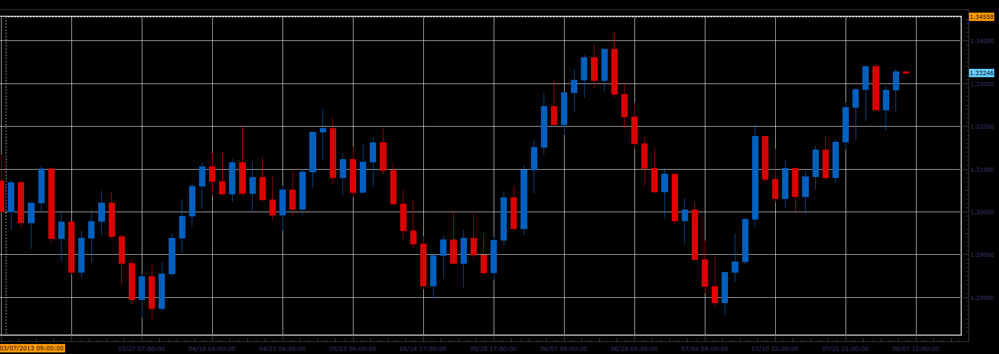

# Range bars

> Source: https://fxcodebase.com/code/viewtopic.php?f=17&t=58797  
> Forum: 17 · Topic 58797 · 14 post(s)

---

## Range bars

**Alexander.Gettinger** · Thu Aug 08, 2013 3:56 pm

Builds the bars of the same size (High-Low=Range).

 

Download:

 [Range_Bars.lua](files/88141/Range_Bars.lua)

The indicator was revised and updated

---

## Re: Range bars

**trendwatch** · Thu Aug 08, 2013 11:29 pm

Does this indy require tick charts? If it does, when will tick charts be availabe? Wasn't it available before?

---

## Re: Range bars

**Alexander.Gettinger** · Fri Aug 09, 2013 12:48 pm

The indicator does not require a tick chart.
This version is view indicator.

---

## Re: 2013-II Beta: Range bars

**SvenStp** · Mon Oct 14, 2013 5:34 pm

"Builds the bars of the same size". But they are not the same size. Not even on the image you uploaded. I dont understand.
Should this be constant range bars or something else?
Cheers, SvenStp.

---

## Re: Range bars

**Apprentice** · Tue Oct 15, 2013 1:37 am

Bump Up

---

## Re: Range bars

**Apprentice** · Tue Oct 15, 2013 1:37 am

Bump Up

---

## Re: Range bars

**GiFtzw3rg** · Fri Feb 14, 2014 3:09 pm

Hi Alexander, hi Apprentice,

i'm a big fan of your Range Bars since 2 weeks. It works well so far but there is an error in displaying
Emas or / and indicators in the chart. See enclosed Picture.

I don't know why this happend.

I my case if i use emas/indicators with normal price historie, everything looks fine.
But when i switch the data source to Range Bars then the Charts looks like this one here.

I tried different settings, used differend indicators. All this scrap happen when i switch the data source.

Do you have an Idee?

For any Tip i'm very happy.
Thanks a lot

Alex aka GiFtzw3rg

---

## Re: Range bars

**Apprentice** · Sat Feb 15, 2014 6:07 am

Hmm, i have test it in static conditions (market closed).
And everything is fine.

I believe the reason is that indicator is not to be recalculated after data update.
Will try to write something by Monday, which will force indicator to recalculate.

Also can provide the upper Chart in full resolution.

---

## Re: Range bars

**GiFtzw3rg** · Tue Feb 18, 2014 11:53 am

Hi Apprentice,

do you have an idea why this happend?
I'm very happy if you could help me.
Thx

---

## Re: Range bars

**Apprentice** · Wed Feb 19, 2014 4:33 am

can u provide the upper Chart in full resolution.

---

## Re: Range bars

**GiFtzw3rg** · Thu Feb 20, 2014 3:18 am

Ok i will try if i'm back home.

I'm uploading the screen on Tiny Pic.
Hope full res. is supported.
i Will post the link here, cause i don't know how to
post full res. screen in this forum.

Cya
Alex

---

## Re: Range bars

**GiFtzw3rg** · Thu Feb 20, 2014 11:08 am

So here is the link:

1900*1200 Screener
[http://i58.tinypic.com/33djnev.jpg](http://i58.tinypic.com/33djnev.jpg)
[http://i58.tinypic.com/28p4ye.jpg](http://i58.tinypic.com/28p4ye.jpg)
[http://i60.tinypic.com/2lj6lgg.jpg](http://i60.tinypic.com/2lj6lgg.jpg)

Hope this helps. If you need more information pls post it.

Greetz Alex

---

## Re: Range bars

**Apprentice** · Sat Feb 22, 2014 6:03 am

These are all the information that I need for now.
Will inform you about the development.

---

## Re: Range bars

**Apprentice** · Fri Jun 02, 2017 6:09 am

Indicator was revised and updated.
