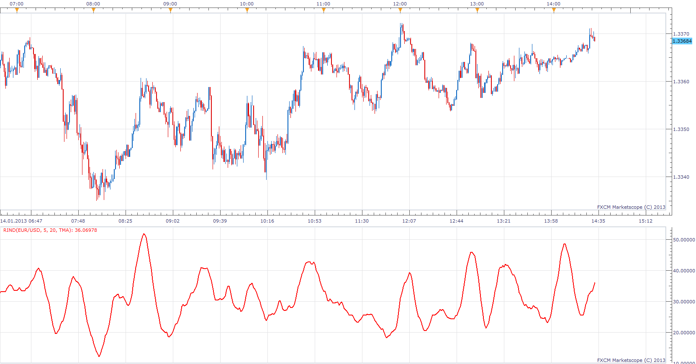

# Range Indicator

> Source: https://fxcodebase.com/code/viewtopic.php?f=17&t=30289  
> Forum: 17 · Topic 30289 · 3 post(s)

---

## Range Indicator

**Apprentice** · Mon Jan 14, 2013 3:55 pm

Range Indicator Compares the intraday range (high - low) to the inter-day (close - previous close) range. When the intraday range is greater than the inter-day range, the Range Indicator will be a high value. This signals an end to the current trend. When the Range Indicator is at a low level, a new trend is about to start.

 [RIND.lua](files/52068/RIND.lua)

The indicator was revised and updated

---

## Re: Range Indicator

**Alexander.Gettinger** · Thu Sep 18, 2014 9:43 am

MQL4 version of Range indicator: [viewtopic.php?f=38&t=61174](https://fxcodebase.com/code/viewtopic.php?f=38&t=61174).

---

## Re: Range Indicator

**Apprentice** · Sat Jun 24, 2017 5:08 am

The indicator was revised and updated.
