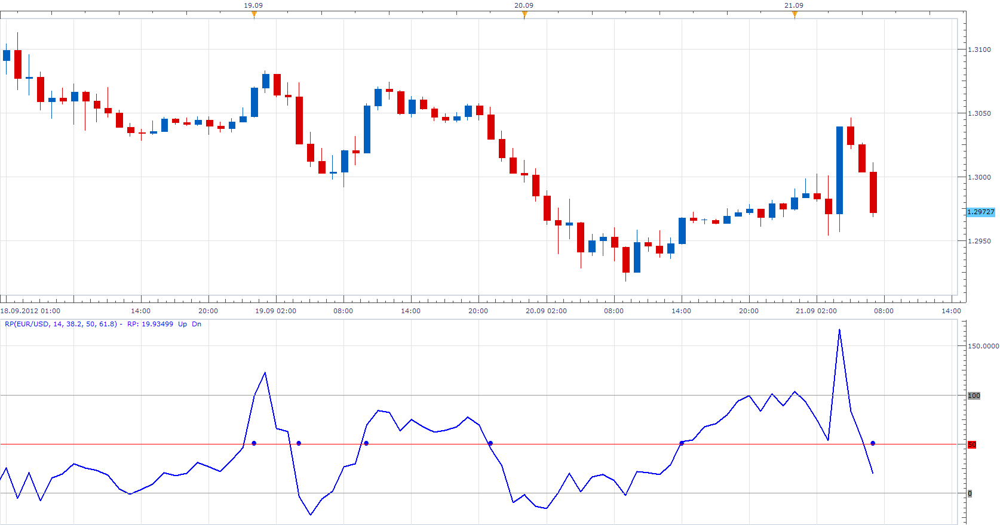

# Range Position

> Source: https://fxcodebase.com/code/viewtopic.php?f=17&t=23643  
> Forum: 17 · Topic 23643 · 3 post(s)

---

## Range Position

**Apprentice** · Fri Sep 21, 2012 2:51 am

Indicator shows, Price's position within the range achieved in the previous N periods.

RP = (Price-min) / ((max-min)/100)

This indicator provides Audio / Email Alerts if and when Price cross over/under one of the three defined levels.

 [RP.lua](files/40683/RP.lua)

Dec 29, 2015: Compatibility issue Fix. _Alert helper is not longer needed.

The indicator was revised and updated

---

## Re: Range Position

**Alexander.Gettinger** · Mon Oct 27, 2014 11:00 am

MQL4 version of Range Position oscillator: [viewtopic.php?f=38&t=61388](https://fxcodebase.com/code/viewtopic.php?f=38&t=61388).

---

## Re: Range Position

**Apprentice** · Tue Jun 27, 2017 3:29 am

The indicator was revised and updated.
