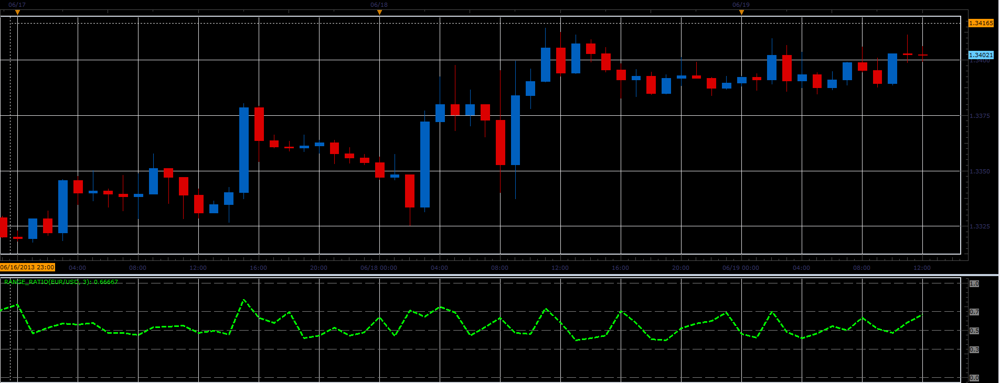

# Range ratio oscillator

> Source: https://fxcodebase.com/code/viewtopic.php?f=17&t=41455  
> Forum: 17 · Topic 41455 · 3 post(s)

---

## Range ratio oscillator

**Alexander.Gettinger** · Wed Jun 19, 2013 2:54 pm

This indicator is a ported MQL5 indicator from [http://www.mql5.com/ru/code/1748](http://www.mql5.com/ru/code/1748) (in Russian).

Formulas:
Range ratio = (MaxP-MinP)/sum, where
MaxP[i], MinP[i] - maximum and minimum prices for range from (i-Period+1) to i,
sum = sum of (High-Low) for range from (i-Period+1) to i.

 

Download:

 [Range_Ratio.lua](files/67704/Range_Ratio.lua)

The indicator was revised and updated

---

## Re: Range ratio oscillator

**Alexander.Gettinger** · Wed Jun 19, 2013 2:57 pm

MQL4 version of Range ratio oscillator: [viewtopic.php?f=38&t=41456](https://fxcodebase.com/code/viewtopic.php?f=38&t=41456)

---

## Re: Range ratio oscillator

**Apprentice** · Tue May 23, 2017 6:36 am

Indicator was revised and updated.
