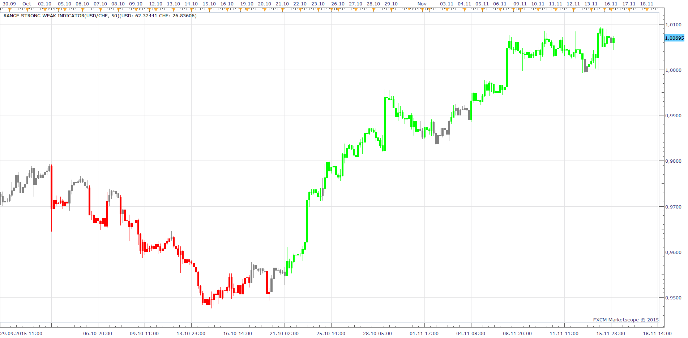

# Range Strong Weak

> Source: https://fxcodebase.com/code/viewtopic.php?f=17&t=60705  
> Forum: 17 · Topic 60705 · 17 post(s)

---

## Range Strong Weak

**Apprentice** · Sun May 18, 2014 12:45 pm


Posted by request.
[viewtopic.php?f=27&t=60699](https://fxcodebase.com/code/viewtopic.php?f=27&t=60699)

Calculation of strength Strength for Last N Periods.

USD-X SW (N) (USD) = (Close - PMin)/(MaxPMin) (values ranges from 0 to 1)
X-USD: SW (N) (USD) = (Max - Close)/(Max-Min) (values ranges from 0 to 1)

SW(USD) = ( SW(1) (USD) + SW(2) (USD) + ... + SW (N) (USD) ) / N * 100

 [Range Strong Weak .lua](files/94066/Range%20Strong%20Weak%20.lua)

 


 [Range Strong Weak Indicator.lua](files/94066/Range%20Strong%20Weak%20Indicator.lua)

 [Range Strong Weak Oscillator.lua](files/94066/Range%20Strong%20Weak%20Oscillator.lua)

---

## Re: Range Strong Weak

**pakoromeu** · Tue Jun 03, 2014 2:11 am

Hi, I need to know if it is possible to fix a bug in this indicator. When I try to compress the chart, shows an error like in the picture. attached two images, one, the indicator without error and another error is shown to compress the chart. is a great indicator, I hope you can help me. Tkns

---

## Re: Range Strong Weak

**Apprentice** · Wed Jun 04, 2014 2:21 am

Fixed.

---

## Re: Range Strong Weak

**Apprentice** · Sun Jun 08, 2014 4:59 am

As requested.
[viewtopic.php?f=27&t=60793&p=94398#p94398](https://fxcodebase.com/code/viewtopic.php?f=27&t=60793&p=94398#p94398)
Range Strong Weak Indicator & Range Strong Weak Oscillator are introduced.

---

## Re: Range Strong Weak

**pakoromeu** · Mon Jun 09, 2014 4:27 am

> **Apprentice wrote:**
> Fixed.

like always, you're the best. Thanks

---

## Re: Range Strong Weak

**NicolaeZ** · Mon Jun 09, 2014 6:20 pm

> **Apprentice wrote:**
> As requested.
> [viewtopic.php?f=27&t=60793&p=94398#p94398](https://fxcodebase.com/code/viewtopic.php?f=27&t=60793&p=94398#p94398)
> Range Strong Weak Indicator & Range Strong Weak Oscillator are introduced.

Thank you Apprentice, very good job!

---

## Re: Range Strong Weak

**Stance** · Fri Nov 13, 2015 3:09 pm

I'm getting the following error message when trying to apply the indicator to EURUSD, I have all 28 symbols enabled:

/FXTS2/indicators/Custom/Range Strong Weak Indicator.lua:131: Incorrect instrument name

---

## Re: Range Strong Weak

**Apprentice** · Mon Nov 16, 2015 4:46 am



I was not able to reproduce this.
Indicator is adjusted by the number of available pairs.
All currency pairs are optional.

---

## Re: Range Strong Weak

**Stance** · Mon Nov 16, 2015 2:18 pm

Here is a pic, I just add it just like any other indicator.

[https://photos-3.dropbox.com/t/2/AADJV4f3e8Kn6JFgH_2B3AmCp9EFzL_aL38hAVGXh18tMg/12/68353796/png/32x32/1/_/1/2/sw.png/EPj2kDUYwakGIAcoBw/e0eFI9BsVhcCKlFbTXHjK1AagxT2x7FZCEMd2KHT2eU?size=1280x960&size_mode=2](https://photos-3.dropbox.com/t/2/AADJV4f3e8Kn6JFgH_2B3AmCp9EFzL_aL38hAVGXh18tMg/12/68353796/png/32x32/1/_/1/2/sw.png/EPj2kDUYwakGIAcoBw/e0eFI9BsVhcCKlFbTXHjK1AagxT2x7FZCEMd2KHT2eU?size=1280x960&size_mode=2)

---

## Re: Range Strong Weak

**Stance** · Mon Nov 16, 2015 2:35 pm

I can add **"Range Strong Weak.lua"**, but not **"Range Strong Weak Indicator.lua"** or **"Range Strong Weak Oscillator.lua"**.

It is giving me:

**"/Range Strong Weak Indicator.lua:131: Incorrect instrument name"**

and

**"/Range Strong Weak Oscillator.lua:143: Incorrect instrument name"**

---

## Re: Range Strong Weak

**Apprentice** · Tue Nov 17, 2015 3:50 am

Try to re-download.
I did not manage to get above picture.

---

## Re: Range Strong Weak

**Stance** · Tue Nov 17, 2015 5:29 am

Just tried, the same problem

**"/Range Strong Weak Indicator.lua:143: Incorrect instrument name"**

Is it because I have an Australian account?

---

## Re: Range Strong Weak

**Stance** · Tue Nov 17, 2015 5:36 am

For some reason this version works.

[http://fxcodebase.com/code/download/file.php?id=11931](https://fxcodebase.com/code/download/file.php?id=11931)

---

## Re: Range Strong Weak

**Stance** · Tue Nov 17, 2015 7:47 am

Hi,

I've tried using the indicator in a strategy with the following lines of code and it runs, but it doesn't seem to do anything as the backtesting results are the same regardless of whatever I change the period and difference to. Am I missing something or is it this indicator won't work in backtesting?

```lua
strategy.parameters:addInteger("SWPeriod", "Strong Weak Period", " " , 200);
strategy.parameters:addDouble("Difference", "Strong Weak Difference", " " , 30);
.
.
local SWPeriod;
local Difference;
local SW;
.
.
SWPeriod = instance.parameters.SWPeriod;
Difference = instance.parameters.Difference;
.
.
SW = core.indicators:create("RANGE STRONG WEAK INDICATOR", Source, SWPeriod, Difference, core.rgb(0, 255, 0), core.rgb(255, 0, 0), core.rgb(128, 128, 128));
.
.
first=math.max(SW.DATA:first());
.
.
SW:update(core.UpdateLast);
.
.
if SW.DATA:colorI(period) ==  core.rgb(0, 255, 0) then
BUY()
elseif SW.DATA:colorI(period) ==  core.rgb( 255,0, 0)
then
SELL()
end
```

---

## Re: Range Strong Weak

**mulligan** · Thu Dec 31, 2015 8:05 am

Range Strong Weak Indicator - With the new TS2 Marketscope I get the error message 143: incorrect instrument name. Working fine on old version.

Thanks for your help

---

## Re: Range Strong Weak

**Apprentice** · Mon Jan 04, 2016 4:54 am

Have received several similar reports, will investigate.

---

## Re: Range Strong Weak

**Apprentice** · Sun Oct 21, 2018 5:40 am

The indicator was revised and updated.
