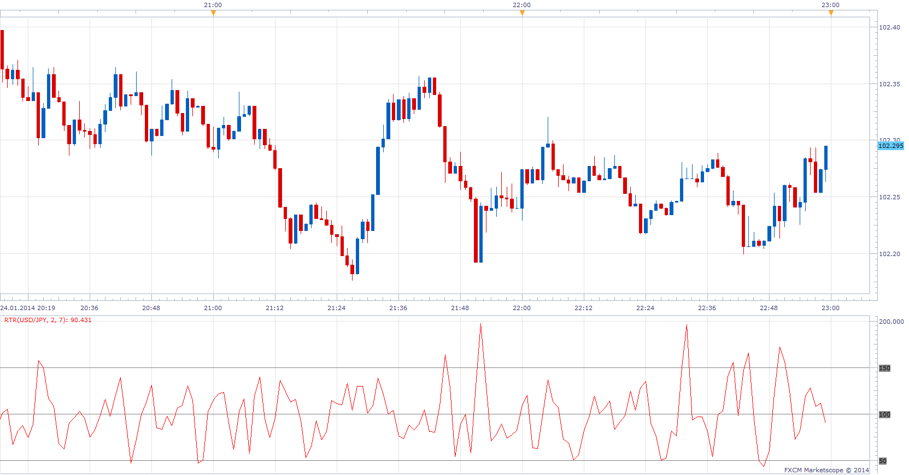

# Range To Range

> Source: https://fxcodebase.com/code/viewtopic.php?f=17&t=60244  
> Forum: 17 · Topic 60244 · 3 post(s)

---

## Range To Range

**Apprentice** · Sun Jan 26, 2014 4:02 am

Posted by request.
[viewtopic.php?f=27&t=60234](https://fxcodebase.com/code/viewtopic.php?f=27&t=60234)
Range To Range can be defined as ATR Ratio.
RTR =(ATR(Fast)/ATR(Slow))*100

 [RTR.lua](files/92281/RTR.lua)

The indicator was revised and updated

---

## Re: Range To Range

**Alexander.Gettinger** · Wed Jun 04, 2014 5:39 pm

MQL4 version of Range To Range oscillator: [viewtopic.php?f=38&t=60774](https://fxcodebase.com/code/viewtopic.php?f=38&t=60774).

---

## Re: Range To Range

**Apprentice** · Mon Jun 19, 2017 8:13 am

The indicator was revised and updated.
