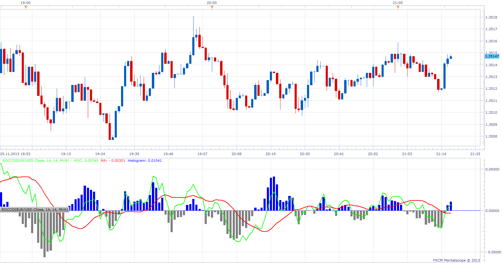

# Rate of Change Convergence-Divergence

> Source: https://fxcodebase.com/code/viewtopic.php?f=17&t=59969  
> Forum: 17 · Topic 59969 · 3 post(s)

---

## Rate of Change Convergence-Divergence

**Apprentice** · Mon Nov 25, 2013 3:15 pm

This indicator will present a histogram,
as the difference of the ROC and its moving average.
The similar to MACD Indicator.

 [ROCCD.lua](files/91104/ROCCD.lua)

The indicator was revised and updated

---

## Re: Rate of Change Convergence-Divergence

**TapLuca** · Tue Nov 26, 2013 2:12 am

Perfect thank you very much...

---

## Re: Rate of Change Convergence-Divergence

**Apprentice** · Thu Jun 22, 2017 6:55 am

The indicator was revised and updated.
