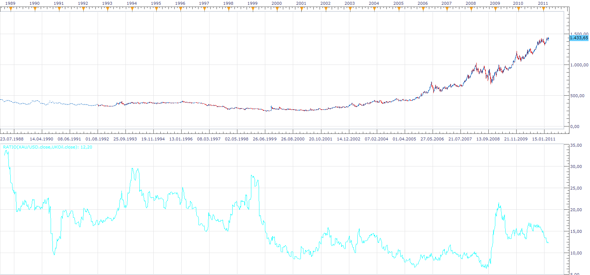
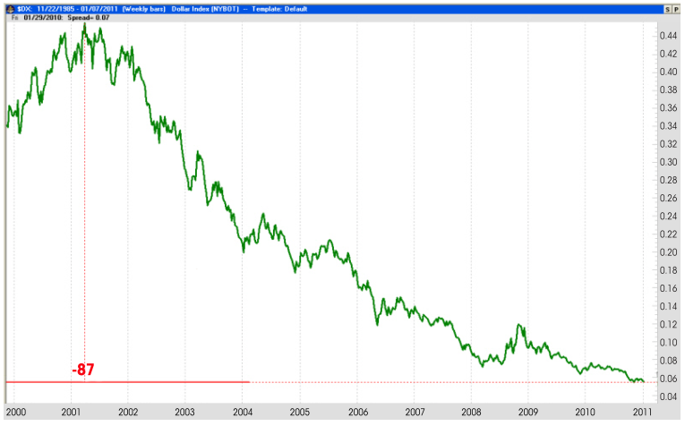
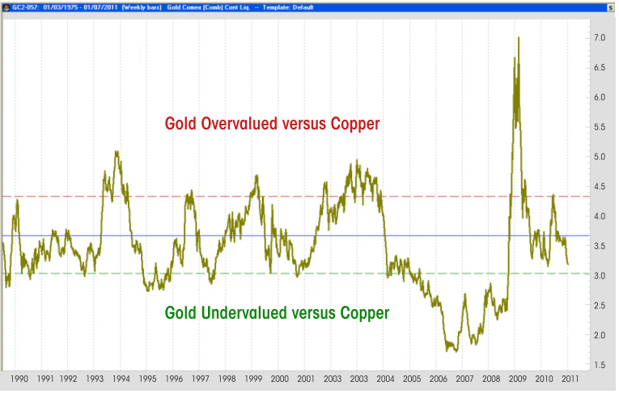
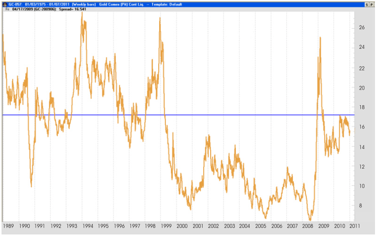

# Ratio

> Source: https://fxcodebase.com/code/viewtopic.php?f=17&t=3810  
> Forum: 17 · Topic 3810 · 5 post(s)

---

## Ratio

**Apprentice** · Fri Apr 01, 2011 5:22 am

Ratio indicator shows the relationship between two instruments.

 [Ratio.lua](files/9283/Ratio.lua)

Ratio = Chart Price/ Selected Instrument Price

This is an example of analysis using this indicator.

 

Dollar Value vs Gold

 

Gold / Copper Ratio

 

Gold / Oil Ratio

Do you think that gold is expensive.
1st Growth of gold value is primarily the result of a low value of dollar.
2nd Gold / Oil and Gold / Copper ratio shows that gold is fair valued.
3rd Analysis of fiscal and monetary policy and its impact on inflation, especially the value of gold, suggests a continuation of previous trends, the conservative target is 2000 dollar, but growth above this level should not surprise us.

Moreover, the relative price of gold falls, even if its absolute price increases.
This analysis is not trading recommendation, is just an example of use of this indicator.

Trading on the basis of this analysis is possible using some advanced strategies.

 [Two Source Ratio.lua](files/9283/Two%20Source%20Ratio.lua)

Ratio = Price1/Price2
Ratio for EUR/USD and AUD/USD
Is 1,11862 /0,744496 = 1,50158
MQ4/MT4 version
[viewtopic.php?f=38&t=67214](https://fxcodebase.com/code/viewtopic.php?f=38&t=67214)

---

## Re: Ratio

**Apprentice** · Fri Feb 15, 2013 11:00 am

MACD Indicator is calculated based on the ratio between the two currency pairs.

 [Ratio MACD.lua](files/54687/Ratio%20MACD.lua)

---

## Re: Ratio

**Apprentice** · Wed May 03, 2017 1:55 pm

Indicator was revised and updated.

---

## Re: Ratio

**Apprentice** · Tue May 30, 2017 6:55 am

Two Source Ratio.lua added.

---

## Re: Ratio

**Apprentice** · Wed Feb 21, 2018 6:19 am

The Indicator was revised and updated.
