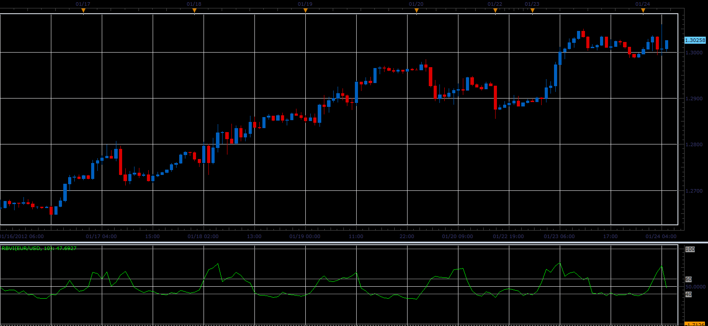

# RBVI oscillator

> Source: https://fxcodebase.com/code/viewtopic.php?f=17&t=12226  
> Forum: 17 · Topic 12226 · 3 post(s)

---

## RBVI oscillator

**Alexander.Gettinger** · Tue Jan 24, 2012 5:31 am

This indicator is a ported MQL5 indicator from [http://www.mql5.com/en/code/719](http://www.mql5.com/en/code/719)

Formulas:
RBVI[i]=100*Positive[i]/(Positive[i]+Negative[i]), where
Positive - average of sump, Negative - average of sumn,
if rel>0 sump=rel and sumn=0,
if rel<0 sumn=-rel, sump=0,
rel=ATR[i]*Volume[i]-ATR[i-1]*Volume[i-1].

 

Download:

 [RBVI.lua](files/24215/RBVI.lua)

The indicator was revised and updated

---

## Re: RBVI oscillator

**tahquo** · Tue Mar 13, 2012 3:32 pm

Would it be incorrect to think of this indicator as a liquidity indicator?

---

## Re: RBVI oscillator

**Apprentice** · Mon Mar 27, 2017 3:48 pm

Indicator was revised and updated.
