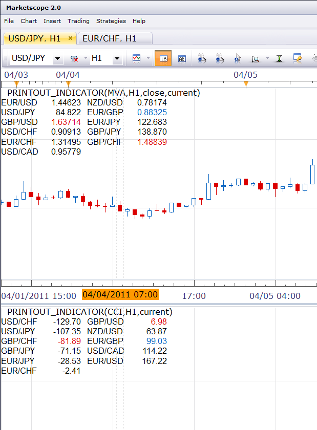
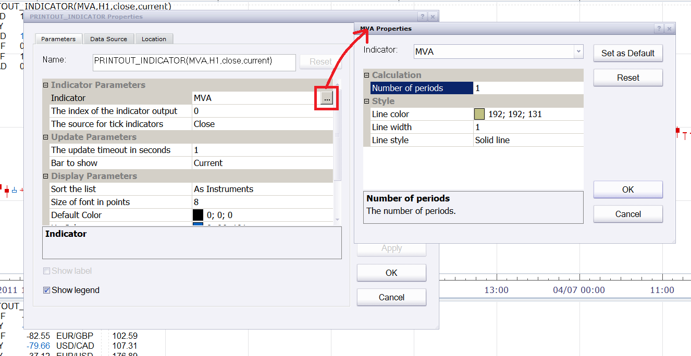

# Readout indicator

> Source: https://fxcodebase.com/code/viewtopic.php?f=17&t=3870  
> Forum: 17 · Topic 3870 · 3 post(s)

---

## Readout indicator

**Nikolay.Gekht** · Fri Apr 08, 2011 3:43 pm

The simple indicator which shows the latest value of chosen indicator for all instruments you are currently subscribed. The data is displayed as a table. The indicator updates every second.
The numbers higher or lower than displayed on previous second are highlighted.

You can configure:
* The indicator to be displayed (hint: use MVA(1) to show the price)
* Whether the current (live) bar value or the recent (the last closed bar) value shall be shown
* How much instruments must be displayed per row
* Font size
* Font color
* The sort order: as the instruments are sorted, by value from low to high and by value from high to low.

Notes:
1) The indicator does NOT watch for changing the subscription. If you change it - please reapply the indicator.
2) When there is a number of the same values for different instrument and sorting by value is turned on, the order of instruments having the same value may changes every second.
3) The indicator may work only when Trading Station is logged in and when it is applied on live chart. The indicator does not work on snapshots.

 

How to choose the data to show:

1) Open the indicator properties.
2) Click on the first parameter (indicator). The ellipsis button appears
3) Click on ellipsis button. Another indicator properties window is shown. Configure the parameter of the indicator to show and then click OK.
4) Configure other parameters of printout indicator and click OK to apply it.

 

Download indicator:

 [printout_indicator.lua](files/9522/printout_indicator.lua)

Thanks a lot **sho-me-pips** user for the idea and his efforts to design and test the indicator.

p.s. Do not forget to visit our new [FXCodebase Wiki](https://fxcodebase.com/wiki).

The indicator was revised and updated

---

## Re: Readout indicator

**thetruth** · Fri Apr 15, 2011 9:13 am

interesting indicator, thanks!
i am thinking about how to use this information, for me works better with "core.indicator" instruction,
some thing like ichm.lua, [viewtopic.php?f=17&t=3890](https://fxcodebase.com/code/viewtopic.php?f=17&t=3890).
and with some calculation, for example for mva, if price - mva value = positive, then green value.
or if price - mva value = negative, then red value. or just a colored arrow.
thanks and good work!!

---

## Re: Readout indicator

**Apprentice** · Sun Mar 12, 2017 5:29 pm

Indicator was revised and updated.
