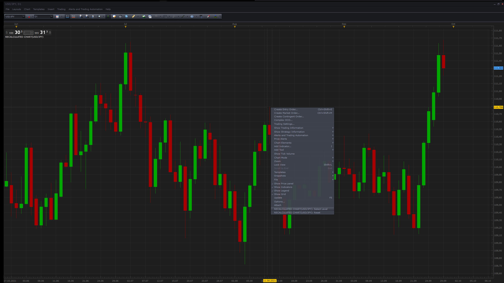

# Recalculated Chart

> Source: https://fxcodebase.com/code/viewtopic.php?f=17&t=71533  
> Forum: 17 · Topic 71533 · 1 post(s)

---

## Recalculated Chart

**Apprentice** · Wed Sep 29, 2021 4:12 am

Indicator will recalculate the chart based on user selected level used as a starting point.

 [Recalculated Chart.lua](files/143798/Recalculated%20Chart.lua)

 

To select the level or reset the indicator please use the context menu options.
