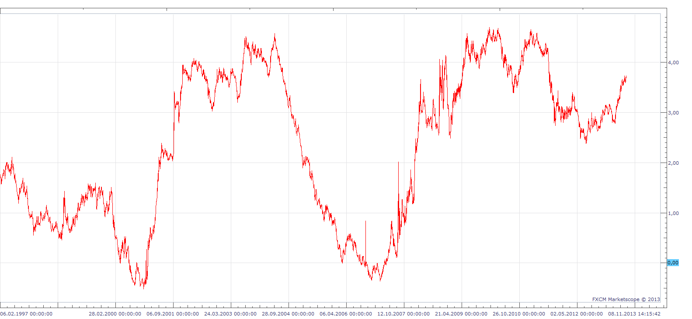
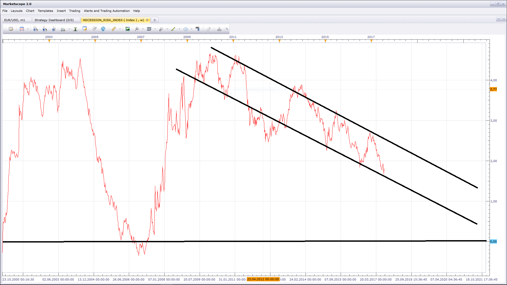

# Recession Risk Index

> Source: https://fxcodebase.com/code/viewtopic.php?f=17&t=59259  
> Forum: 17 · Topic 59259 · 24 post(s)

---

## Recession Risk Index

**Apprentice** · Tue Aug 20, 2013 10:31 am

 

This index is my baby.

This, View will help you keep track of the general condition of the economy, with ease.
Basic guidelines.

Simplified.
The negative slope Bad.
Negative value, worse.

As you can see, a negative value can be linked to the recession,
negative slope, with the worsening economic situation.

 [Recession Risk Index.bin](files/88795/Recession%20Risk%20Index.bin)

Please add this ddl to your TS folder.

 [http_lua.dll](files/88795/http_lua.dll)

U can Import View as any other Indicator.
Unfortunately u can not add it as a regular indicator,
will not be visible in the list of available indicators.
Here is shown How U can add View to Chart.

 

---

## Re: Recession Risk Index

**Patrick Sweet** · Tue Aug 20, 2013 11:43 am

wow! Good stuff! Impressed!

---

## Cycle Interpreter

**Apprentice** · Tue Aug 20, 2013 1:39 pm

This indicator is designed as an interpreter of the results to the upper indicator.

It can be also used with other indicators and data sources.

Basically, it will find min and max value for the selected period,
and display value of source in range from 0 to 100

0 indicates the minimum
100 indicates the maximum

In this case
0 is the bottom of market cycle
100 is the top of market cycle

if the period is set to 0
when calculating the indicator takes into account all the data points, from first to last.
in any case, only the last N periods is used in the calculation.

 [Cycle Interpreter.lua](files/88801/Cycle%20Interpreter.lua)

 [Cycle Interpreter with Alert.lua](files/88801/Cycle%20Interpreter%20with%20Alert.lua)

This indicator will provides Audio / Email Alerts if and when Cycle Interpreter indicator cross given level.
Dec 22, 2015: Compatibility issue Fix. _Alert helper is not longer needed.

---

## Re: Recession Risk Index

**Apprentice** · Wed Aug 21, 2013 2:55 am

Inverse Option added to Cycle Interpreter.

---

## Re: Recession Risk Index

**Patrick Sweet** · Wed Aug 21, 2013 11:33 am

The cycle interpretater is very interesting and useful.
I am calibrating it against some pairs......and it is delivering some useful information.
Any chance to add 50%, 'upper', and 'lower', adjustable lines (default = 75%...but adjustable ala 'overbought-oversold' thresholds on other occilators?

Nice work!
Patrick

---

## Re: Recession Risk Index

**Apprentice** · Wed Aug 21, 2013 11:49 am

OB/OS Levels added to Cycle Interpreter.

Keep in mind that Recession Risk Index is not designed to generates trading signals.
It is an indicator of economic conditions, the tide that moves the market.

---

## Re: Recession Risk Index

**Patrick Sweet** · Wed Aug 21, 2013 2:50 pm

Indeed. The good recession risk index itself provide completely different information.
Your math behind the cycle interpreter helps understand the index.
But as you pointed-out, the cycle interpreter can crunch other data sources, too, and I think the fun is just beginning!
Thanks!

---

## Re: Recession Risk Index

**Outside_The_Box** · Tue Oct 22, 2013 3:16 am

This is very cool Apprentice. Do you use global variables to create this (data from all over the world) or is it based mostly off of the U.S. economy or the Euro Zone? Just curious.

---

## Re: Recession Risk Index

**Apprentice** · Tue Oct 22, 2013 5:05 pm

It is tailored for the U.S. economy, and as such, can be used as a proxy for the world economy. I assume that similar indices can be written for other economies.

---

## Re: Recession Risk Index

**Outside_The_Box** · Thu Oct 24, 2013 3:49 am

I realize that you probably don't want to give out the recipe for your secret sauce, but I am curious why the recession risk index is rising into 2009. Isn't the index rising indicative of improving economic conditions while falling indicates worsening conditions?

---

## Re: Recession Risk Index

**Apprentice** · Thu Oct 24, 2013 6:07 am

You're right.
It is not perfect fit!
As it will not use the GDP data, rather, as a source it will use yields on government bonds.
It will be the economic climate indicator, rather then state of the economy.

---

## Re: Recession Risk Index

**mjf1288** · Sun Oct 27, 2013 9:35 am

What calculations go into this index? Its hard to understand it without knowing what economic indicators are being used in the calculation. Thanks

---

## Re: Recession Risk Index

**Apprentice** · Sun Oct 27, 2013 12:46 pm

> as a source it will use yields on government bonds

---

## Re: Recession Risk Index

**mjf1288** · Sun Oct 27, 2013 2:09 pm

> **Apprentice wrote:**
>
>
> > as a source it will use yields on government bonds

What duration? it looks like 2s5s10s, but I'm not sure.

---

## Re: Recession Risk Index

**toinou21** · Wed May 14, 2014 10:48 pm

Good morning Apprentice,
I just discovered your indicator, you caught my interest. Do you think you could add an email alert and a sound alert when the indicator reach overbought and oversold area ?
Thanks in advance.
Best.
Toinou

---

## Re: Recession Risk Index

**Apprentice** · Thu May 15, 2014 3:10 am

Of course it is possible.
I'm not sure whether this is necessary.
As this alerts are only given several times a year, at most.
If you're going to insist I can do this for you.
It makes sense for Cycle Interpreter.

---

## Re: Recession Risk Index

**Coondawg71** · Thu May 15, 2014 4:24 am

Apprentice,

Have you considered applying this to the Japanese Bonds or U.K. Gilts ???? It would certainly be interested to compare them against each other !!!

Thanks,

sjc

---

## Re: Recession Risk Index

**Apprentice** · Thu May 15, 2014 5:49 am

I use Yahoo finance "TYX", "TNX","FVX","IRX","IRX","IRX" as date source.
If appropriate counterpart is available (on Yahoo) for these economies,
It can be done, sure.

---

## Re: Recession Risk Index

**Apprentice** · Thu May 15, 2014 6:45 am

Indicator is now updated.
It will allow the selection of the Data source.
I have add Cycle Interpreter with Alert as well

---

## Re: Recession Risk Index

**toinou21** · Fri May 16, 2014 12:36 am

> **Apprentice wrote:**
> Indicator is now updated.
> It will allow the selection of the Data source.
> I have add Cycle Interpreter with Alert as well

Thank you so much Apprentice

---

## Re: Recession Risk Index

**Apprentice** · Thu Jul 27, 2017 8:55 am

The indicator was revised and updated.

 

Gradually but surely, we are on descend to pre-recession values.

---

## Re: Recession Risk Index

**Apprentice** · Mon Feb 05, 2018 10:14 am

The Indicator was revised and updated.

---

## Re: Recession Risk Index

**mayk01** · Tue Oct 03, 2023 5:15 am

Hello,
is it possible to update?
It doesn't work in the view. It hangs up after 30 seconds.
The climate is changing if everything is true.

Best regards,
M.

---

## Re: Recession Risk Index

**Apprentice** · Fri Oct 06, 2023 3:22 am

We have added your request to the development list.
Development reference 905.
