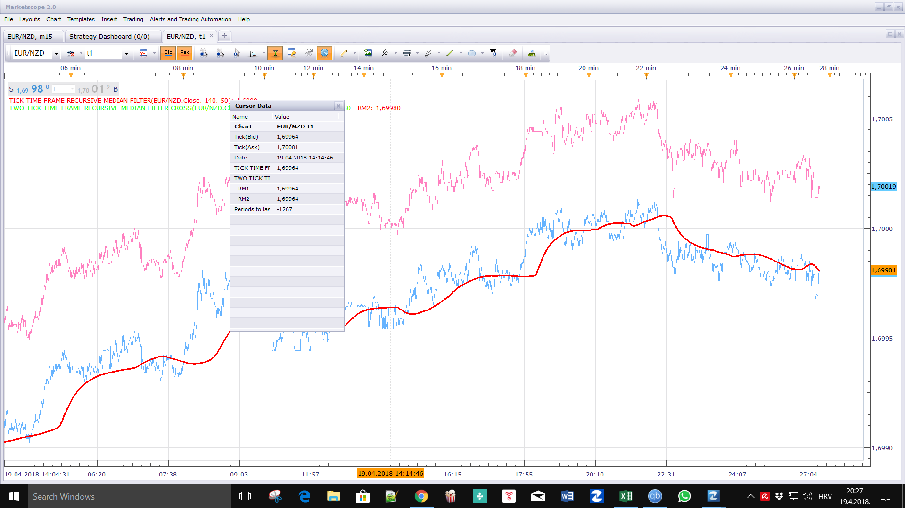

# Recursive Median Filter

> Source: https://fxcodebase.com/code/viewtopic.php?f=17&t=65722  
> Forum: 17 · Topic 65722 · 7 post(s)

---

## Recursive Median Filter

**Apprentice** · Sun Feb 11, 2018 6:18 am

As described in the article "Look, No Spikes! Recursive Median Filters" by John F. Ehlers, March 2018 issue of S & C magazine.

 [Recursive Median Filter.lua](files/117709/Recursive%20Median%20Filter.lua)

 [Recursive Median Oscillator.lua](files/117709/Recursive%20Median%20Oscillator.lua)

 [Tick Time Frame Recursive Median Filter.lua](files/117709/Tick%20Time%20Frame%20Recursive%20Median%20Filter.lua)

 [Tick Time Frame Recursive Median Oscillator.lua](files/117709/Tick%20Time%20Frame%20Recursive%20Median%20Oscillator.lua)

 [Two Tick Time Frame Recursive Median Filter Cross.lua](files/117709/Two%20Tick%20Time%20Frame%20Recursive%20Median%20Filter%20Cross.lua)

---

## Re: Recursive Median Filter

**Paul W** · Sun Apr 15, 2018 12:37 pm

Is it possible to create a "TWO RECURSIVE MEDIAN FILTER" - with alert

similar to "TWO TICK TIMED MOVINGES CROSS" ?

have tested, and compared

Recursive Median Filter appears to display fewer, and better alerts, than Two Tick Timed MAs

imo

Thanks

---

## Re: Recursive Median Filter

**Apprentice** · Tue Apr 17, 2018 6:06 am

Tick Time Frame Recursive Median Filter.lua & Tick Time Frame Recursive Median Oscillator.lua added.

---

## Re: Recursive Median Filter

**Apprentice** · Tue Apr 17, 2018 6:54 am

Two Tick Time Frame Recursive Median Filter Cross added.

---

## Re: Recursive Median Filter

**Paul W** · Tue Apr 17, 2018 9:58 am

My mistake

original error post was due to loading issues - my system - all features are working

----------------- upon further testing

have added 2 "Recursive Median Filter.lua" with settings I use

added "Two Tick Time Frame Recursive Median Filter Cross.lua" with identical settings (I believe)

when comparing, they should match-up (I believe) - attachment documents otherwise ?

or is there a setting I have omtted ?

thanks

---

## Re: Recursive Median Filter

**Paul W** · Wed Apr 18, 2018 1:32 pm

also have been able to duplicate "Two Tick Time Frame Recursive Median Filter Cross.lua" error

where "Recursive Median Filter.lua" with identical settings (I believe) loads without error ?

your assistance would be appreciated

thanks

---

## Re: Recursive Median Filter

**Apprentice** · Thu Apr 19, 2018 3:31 pm

As you can see here.
All three lines are the same.
Make sure that you have enough data loaded.
Because the current value is based on previous candle line values.
If gaps occur, try to use a higher duration.
