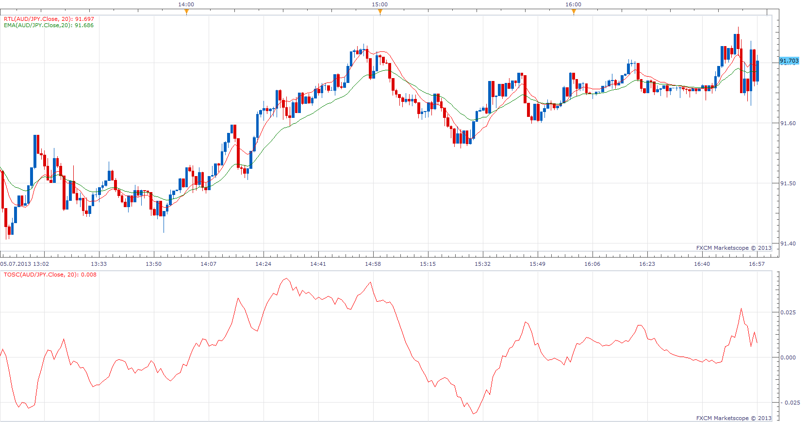

# Recursive Trendline and TOSC

> Source: https://fxcodebase.com/code/viewtopic.php?f=17&t=46409  
> Forum: 17 · Topic 46409 · 6 post(s)

---

## Recursive Trendline and TOSC

**Apprentice** · Sun Jul 07, 2013 7:28 am

As described by Dennis Meyers in 1999 december issue of S&C magazin

 [RTL.lua](files/73279/RTL.lua)

 [TOSC.lua](files/73279/TOSC.lua)

The indicator was revised and updated

---

## Re: Recursive Trendline and TOSC

**Alexander.Gettinger** · Tue Aug 13, 2013 2:09 pm

MQL4 version of Recursive Trendline and TOSC: [viewtopic.php?f=38&t=59085](https://fxcodebase.com/code/viewtopic.php?f=38&t=59085).

---

## Re: Recursive Trendline and TOSC

**Apprentice** · Fri Jun 09, 2017 7:50 am

The indicator was revised and updated.

---

## Re: Recursive Trendline and TOSC

**Recursive Trendline** · Wed Jun 14, 2017 9:47 am

Hello Apprentice,

Recursive Trendline looks benefitial. Can you please explain how is it calculated? (The method)

Regards,

---

## Re: Recursive Trendline and TOSC

**Recursive Trendline** · Thu Jun 15, 2017 5:19 am

What is the method of calculation of Recursive Trendline?

Regards,

---

## Re: Recursive Trendline and TOSC

**Apprentice** · Fri Jun 16, 2017 3:37 am

alpha=2/(Period+1)
b0 = (1-alpha)* b0[-1] + Close[0];
 X1[+1] = (1-alpha)*X1 + alpha*(Close+b0-b0[-1]);
TOSC=X1[+1];
