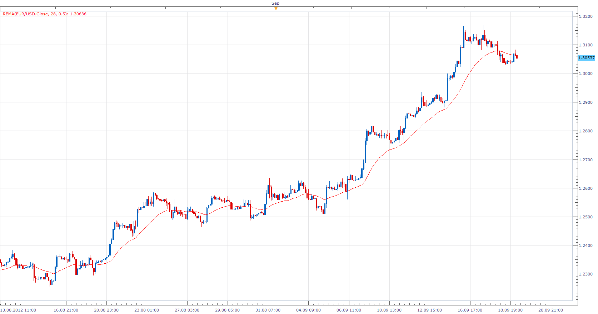
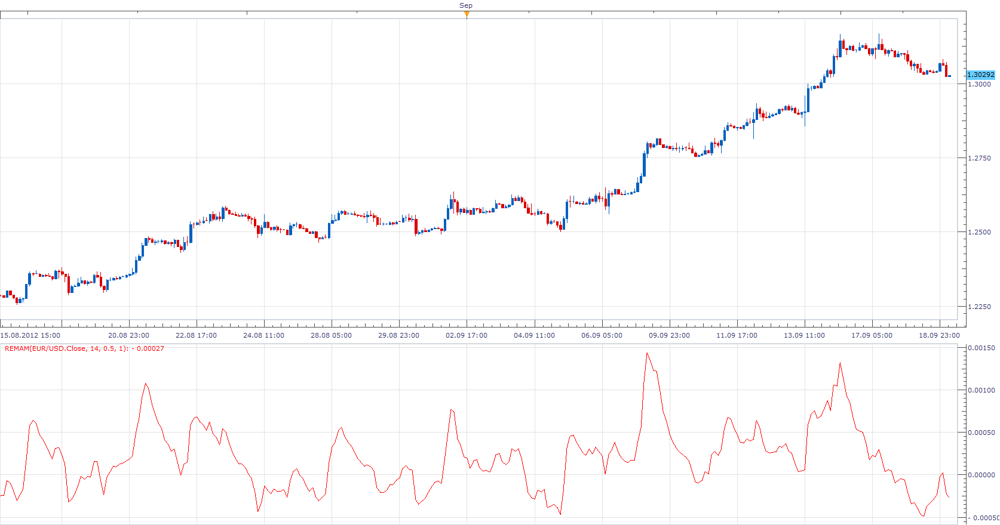

# Regularized EMA

> Source: https://fxcodebase.com/code/viewtopic.php?f=17&t=23582  
> Forum: 17 · Topic 23582 · 3 post(s)

---

## Regularized EMA

**Apprentice** · Wed Sep 19, 2012 3:43 am

The regularized exponential moving average by Chris Satchwell is a variation on the EMA designed to be smoother then EMA but not introduce too much extra lag.

 [REMA.lua](files/40580/REMA.lua)

The indicator was revised and updated

---

## Re: Regularized EMA

**Apprentice** · Wed Sep 19, 2012 4:01 am

*REMA Momentum*

REMA momentum indicator is formed from REMA .
REMAM[period]= (REMA[period] -REMA[period-1])/REMA[period-1];

 [REMAM.lua](files/40581/REMAM.lua)

---

## Re: Regularized EMA

**Apprentice** · Thu Apr 13, 2017 8:40 am

Indicator was revised and updated.
