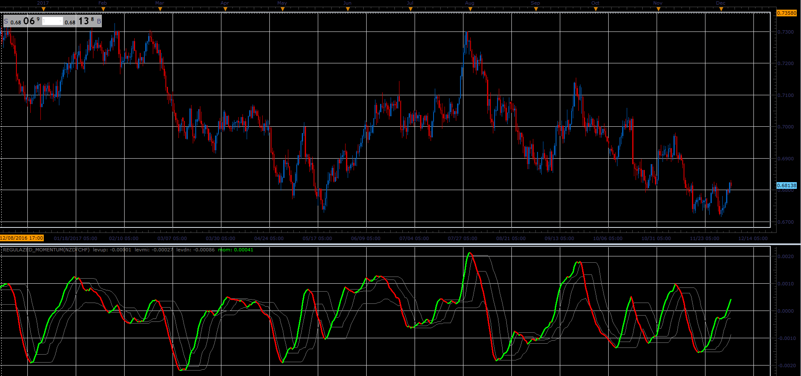

# Regulazed momentum

> Source: https://fxcodebase.com/code/viewtopic.php?f=17&t=65440  
> Forum: 17 · Topic 65440 · 6 post(s)

---

## Regulazed momentum

**Alexander.Gettinger** · Wed Dec 06, 2017 4:21 pm

Based on request: [viewtopic.php?f=27&t=65416](https://fxcodebase.com/code/viewtopic.php?f=27&t=65416)

 

Download:

 [Regulazed_Momentum.lua](files/116397/Regulazed_Momentum.lua)

 [Regulazed_Momentum with Alert.lua](files/116397/Regulazed_Momentum%20with%20Alert.lua)

 

 [MTF MCP Regulazed Momentum Heat Map.lua](files/116397/MTF%20MCP%20Regulazed%20Momentum%20Heat%20Map.lua)

---

## Re: Regulazed momentum

**Apprentice** · Thu Dec 07, 2017 5:49 am

MTF MCP Regulazed Momentum Heat Map.lua Added.

---

## Re: Regulazed momentum

**bartwas1** · Thu Dec 07, 2017 7:28 am

Thanks for adapting this momentum to lua and adding some extras - heat map.

---

## Re: Regulazed momentum

**Apprentice** · Wed Mar 28, 2018 4:29 pm

The Indicator was revised and updated.

---

## Re: Regulazed momentum

**mulligan** · Tue Oct 02, 2018 12:11 pm

Could we please get a Regulazed momentum with alert. Normal alert functions (sound, dialogue box, live or end of turn, etc.) based on color change up and down.

Thanks very much

---

## Re: Regulazed momentum

**Apprentice** · Wed Oct 03, 2018 4:53 am

Regulazed_Momentum with Alert.lua added.
