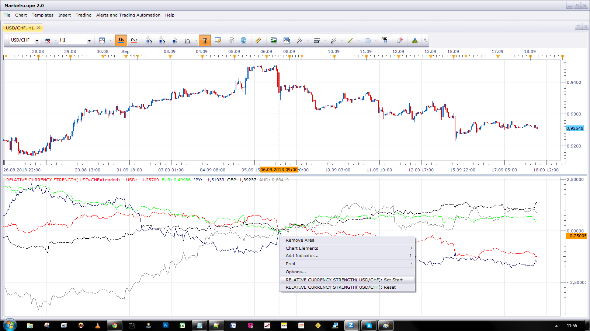

# Relative Currency Strength

> Source: https://fxcodebase.com/code/viewtopic.php?f=17&t=59518  
> Forum: 17 · Topic 59518 · 29 post(s)

---

## Relative Currency Strength

**Apprentice** · Tue Sep 17, 2013 1:42 pm

Pair method.
Shows the percentage change for all selected currency pairs in the given period.

Index Method
Shows the percentage change for all indexes in the given period.

Currency pair, index is calculated as the average of all percentage change
for all currency pairs that contain the currency in question.

Trailing Relative Currency Strength
Percentage is calculated as the change in the last N periods.

 [Trailing Relative Currency Strength.lua](files/89530/Trailing%20Relative%20Currency%20Strength.lua)

 

Relative Currency Strength
Percentage is calculated as the change from defined date.
Start date can be set as paramerat or using Left Mouse menu options "Set Start"
Reset returns control to a parameter.

 [Relative Currency Strength.lua](files/89530/Relative%20Currency%20Strength.lua)

 [Relative Currency Strength with Alert.lua](files/89530/Relative%20Currency%20Strength%20with%20Alert.lua)

Currencies
EUR, USD, GBP, JPY, AUD

Mandatory subscriptions.
"EUR/USD","GBP/USD","USD/JPY","AUD/USD","EUR/GBP","EUR/JPY","EUR/AUD",	"GBP/JPY","GBP/AUD","AUD/JPY"

Expanded Versions

 [Expanded Trailing Relative Currency Strength.lua](files/89530/Expanded%20Trailing%20Relative%20Currency%20Strength.lua)

 [Expanded Relative Currency Strength.lua](files/89530/Expanded%20Relative%20Currency%20Strength.lua)

Additional currencies NZD, CHF, CAD
Additional subscriptions
"EUR/CHF","EUR/NZD","EUR/CAD","GBP/NZD","GBP/CAD","GBP/CHF","AUD/CHF","AUD/NZD","AUD/CAD","NZD/JPY","CAD/JPY","CHF/JPY","USD/CHF","USD/CAD","NZD/USD", "NZD/CAD","CAD/CHF","NZD/CHF"

If your account has subscriptions limit , set on 20 currency pairs.
Contact FXCM support, and ask to remove this limit for your account.

---

## Re: Relative Currency Strength

**OverDriven** · Tue Sep 17, 2013 7:18 pm

I'm getting an error that says "Incorrect instrument name". I think the error is occurring on line 120.

---

## Re: Relative Currency Strength

**Apprentice** · Wed Sep 18, 2013 3:45 am

See mandatory subscriptions.

---

## Re: Relative Currency Strength

**benben99** · Thu Sep 19, 2013 4:00 pm

> **Apprentice wrote:**
> See mandatory subscriptions.

hey boss
can u add the NZD and the CAD to the indicator and also lines like 0, 100,200 ????????
thanks

---

## Re: Relative Currency Strength

**Apprentice** · Fri Sep 20, 2013 3:51 am

Extended version added (CAD, CHF, NZD) .
Performance improvements for regular.
OB/OS Levels added, Currently set to 0.

---

## Re: Relative Currency Strength

**ddrrbb** · Wed Mar 19, 2014 5:43 pm

Is it possible to add the currency names for the at the right side of the chart next to their price line? With so many colored lines, it is difficult to know which currency is which. Or if you can tell me what code I can add to the indicator to make it work that way, I would appreciate it. Thanks.

---

## Re: Relative Currency Strength

**Apprentice** · Thu Mar 20, 2014 4:01 am

Instrument Name Added.

---

## Re: Relative Currency Strength

**b0chatma** · Mon Jun 23, 2014 4:30 pm

Can you fix the start date periods on this indicator? For example I want it to always reflect the last 75 periods. As of now I have to continue to reset the indicator in order to do this.

---

## Re: Relative Currency Strength

**Apprentice** · Tue Jun 24, 2014 3:42 am

I believe Relative Currency Strength.lua will provide this functionality.
If the start date set with "Start Date" start date will always be the same.
If u do not set start date or u reset it.
Start will be moved from time to time.
You can set it via the Period parameter.

---

## Re: Relative Currency Strength

**amine.dechemi** · Sat Aug 23, 2014 1:12 pm

hello ,
can we have the same indicator and add NOK , ZAR , ils , try , huf , rub ,sek ,hkd ,sgd , dkk , czk , pnl , mxn

merci d'avance

---

## Re: Relative Currency Strength

**Apprentice** · Sun Aug 24, 2014 4:24 am

Unfortunately, the required currencies, will not have the same resolution.
All above currencies have 7 references in other currencies.
Required currencies have four at best, one or two in most cases.

---

## Re: Relative Currency Strength

**ThemBonez** · Tue May 19, 2015 9:46 am

Hello,
Could we have an indicator that would be one line representing the average of the expanded INDEX currencies.
Thank You

---

## Re: Relative Currency Strength

**ThemBonez** · Tue May 19, 2015 9:48 am

Hello,
Could we add a line representing the average of the expanded INDEX currencies?
Thank You

---

## Re: Relative Currency Strength

**Apprentice** · Fri May 22, 2015 4:04 am

Could you clarify.
Average of all currencies for current period
 or an average of each currency for last N periods.

---

## Re: Relative Currency Strength

**Stance** · Wed Jul 15, 2015 4:17 pm

Can an alert/strategy be written for when 1 currency index crosses another?

---

## Re: Relative Currency Strength

**Apprentice** · Thu Jul 16, 2015 3:56 am

Your request is added to the development list.

---

## Re: Relative Currency Strength

**IQFX36** · Tue Jan 26, 2016 4:05 pm

I have an error messsage:
' attemp to index field 'close' (a nil value) '
Any idea?
I try to us it in tick Price!
Thank you an advance

---

## Re: Relative Currency Strength

**Apprentice** · Wed Jan 27, 2016 4:31 am

Trailing Relative Currency Strength & Relative Currency Strength are updated.
GBP / AUD has been replaced with the GBP / CHF

---

## Re: Relative Currency Strength

**Apprentice** · Wed Jan 27, 2016 4:46 am

I was not able to reproduce.
About where indicator we speak.

---

## Re: Relative Currency Strength

**jrichardson83** · Sun Feb 07, 2016 2:46 pm

Could we add the option of placing horizontal lines at certain levels, for example at +/- 2,500 etc. Also, can we add line thickness option? I'm talking specifically about the Exp. Rel. Currency Strength indie

---

## Re: Relative Currency Strength

**Apprentice** · Mon Feb 08, 2016 4:23 am

See OB / OS Levels section.

---

## Re: Relative Currency Strength

**IQFX36** · Thu Apr 28, 2016 5:03 am

Hi Appentice,
Could we add an alarm sound on OB/OS level?
Thx in advance

---

## Re: Relative Currency Strength

**Apprentice** · Sun May 01, 2016 7:54 am

Relative Currency Strength with Alert.lua added.

---

## Re: Relative Currency Strength

**IQFX36** · Sun May 01, 2016 12:21 pm

Wow!!!
Thx a lot!!!

---

## Re: Relative Currency Strength

**IQFX36** · Sun May 01, 2016 12:24 pm

Could be in the extended versión please???

---

## Re: Relative Currency Strength

**Apprentice** · Wed May 04, 2016 2:22 am

Your request is added to the development list.

---

## Re: Relative Currency Strength

**ntrader** · Wed Aug 17, 2016 2:11 am

Hi Apprentice,

I have problems with the indicator. The lines are not smoothed. It displays vertical and horizontal lines, is this normal. Your screen shot of the indicator looks different.

Hope you can help.

Many thanks
Pieter

---

## Re: Relative Currency Strength

**Apprentice** · Wed Aug 17, 2016 2:33 pm

Perfect again.
Can you share your screen?

---

## Re: Relative Currency Strength

**Apprentice** · Sun Feb 04, 2018 8:09 am

The indicator was revised and updated.
