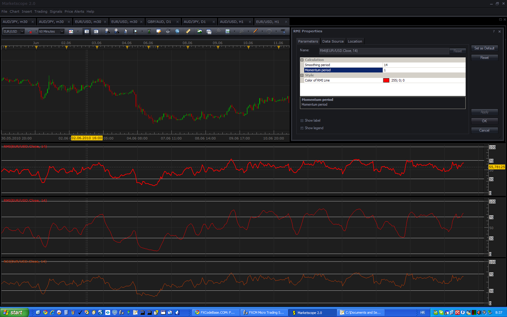
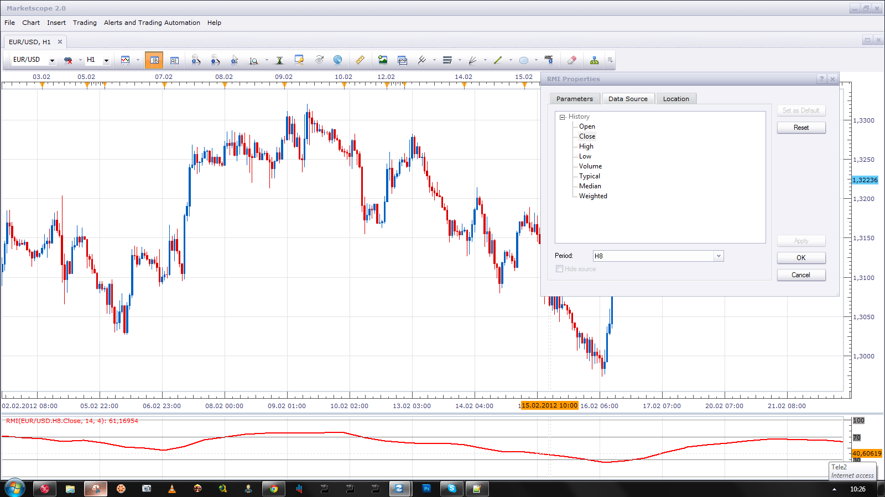

# Relative Momentum Index (RMI)

> Source: https://fxcodebase.com/code/viewtopic.php?f=17&t=1387  
> Forum: 17 · Topic 1387 · 9 post(s)

---

## Relative Momentum Index (RMI)

**Apprentice** · Mon Jun 21, 2010 1:34 am

*Relative Momentum Index (RMI)*

Relative Momentum Index or RMI is a momentum indicator developed by Roger Altman.

Relative momentum index is basically Relative Strength Index (RSI) .

Unlike the RSI, which we get as the difference between today and yesterday's price,
RMI is obtained as the difference between current price and price N periods ago.

If the RMI parameter Momemtum Period is set to 1 we have a standard RSI.

 [RMI.lua](files/2678/RMI.lua)

The indicator was revised and updated

---

## Re: Relative Momentum Index (RMI)

**lisa_baby_xx** · Wed Jun 01, 2011 10:13 am

Dear Apprentice,

Can you add the following parameters to this wonderful indicator:

-Line type.
-Line thickness, and most importantly:
-User defineable Overbought/Oversold levels.

I find this indicator is not as jittery as the regular RSI.

Much love and Many - MANY - Thanks! XXX.
lisa_baby_xx

---

## Re: Relative Momentum Index (RMI)

**Apprentice** · Wed Jun 01, 2011 3:23 pm

Your request has been added to developmental cue.

---

## Re: Relative Momentum Index (RMI)

**Apprentice** · Wed Jun 01, 2011 3:58 pm

Style Option Added.

---

## Re: Relative Momentum Index (RMI)

**Giantball** · Tue Feb 21, 2012 6:14 pm

Hi,

Please create a bigger timeframe RMI,(bfRMI). Thank you for helping us small guys out.

Best Regards,
G

---

## Re: Relative Momentum Index (RMI)

**Apprentice** · Wed Feb 22, 2012 4:27 am

This type of requests / indicators is obsolete.
Something like this, is possible using standard, Marketscope functionality.
Simply change the Source Time Frame.

---

## Re: Relative Momentum Index (RMI)

**kalprao** · Sun Nov 30, 2014 11:04 pm

Hello apprentice

can you please add an option for Line colors .

Colors of up and down trend
UPUP , UPDN
DNUP , DNDN

Thank you ,it will greatly appreciated

---

## Re: Relative Momentum Index (RMI)

**Apprentice** · Tue Dec 02, 2014 6:48 pm

What we will defined up & down trend.

---

## Re: Relative Momentum Index (RMI)

**Apprentice** · Mon Jun 26, 2017 10:15 am

The indicator was revised and updated.
