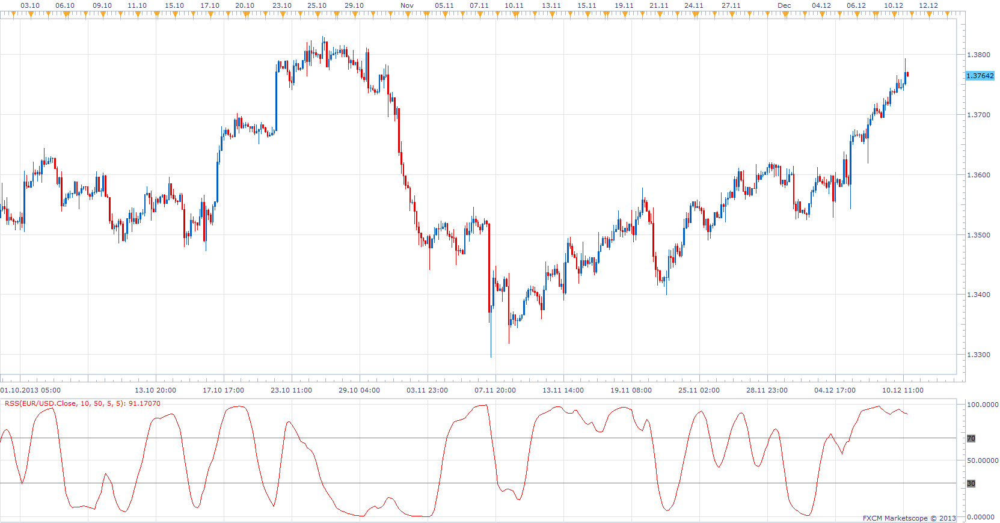

# Relative Spread Strength

> Source: https://fxcodebase.com/code/viewtopic.php?f=17&t=60079  
> Forum: 17 · Topic 60079 · 4 post(s)

---

## Relative Spread Strength

**Apprentice** · Tue Dec 10, 2013 12:33 pm

Ian Copsey's relative spread strength (RSS) indicator that he presents in October 2006 issue of S&C.

 [RSS.lua](files/91431/RSS.lua)

The indicator was revised and updated

---

## Rapid RSI

**Apprentice** · Tue Dec 10, 2013 12:50 pm

 [Rapid RSI.lua](files/91432/Rapid%20RSI.lua)

---

## Re: Relative Spread Strength

**Alexander.Gettinger** · Wed Aug 20, 2014 10:01 am

MQL4 version of oscillators: [viewtopic.php?f=38&t=61058](https://fxcodebase.com/code/viewtopic.php?f=38&t=61058).

---

## Re: Relative Spread Strength

**Apprentice** · Sun Jun 25, 2017 1:29 pm

The indicator was revised and updated.
