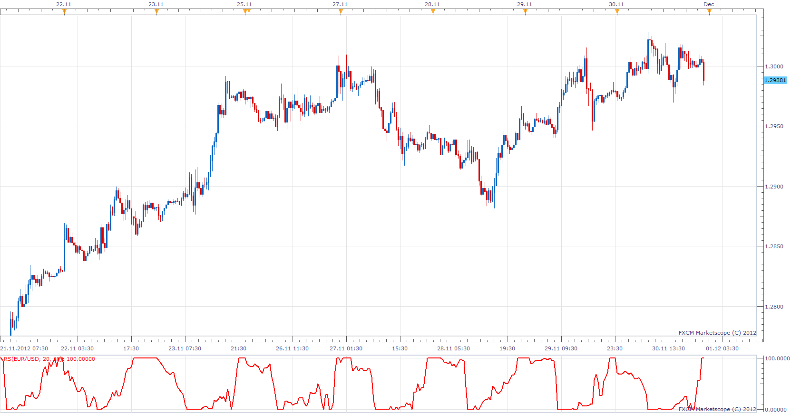

# Relative Spread

> Source: https://fxcodebase.com/code/viewtopic.php?f=17&t=27289  
> Forum: 17 · Topic 27289 · 2 post(s)

---

## Relative Spread

**Apprentice** · Sun Dec 02, 2012 6:16 am

SPREAD = AVG of Ask - AVG of Bid
RS = ( SPREAD -MIN) / ((MAX-MIN)/100)

 [RS.lua](files/47647/RS.lua)

The indicator was revised and updated

---

## Re: Relative Spread

**Apprentice** · Tue May 02, 2017 12:07 pm

Indicator was revised and updated.
