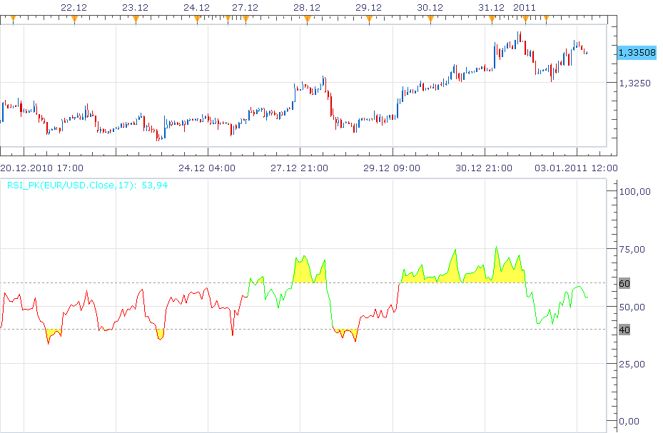

# Relative Stength Index with zone and trend highlighting

> Source: https://fxcodebase.com/code/viewtopic.php?f=17&t=3080  
> Forum: 17 · Topic 3080 · 13 post(s)

---

## Relative Stength Index with zone and trend highlighting

**Nikolay.Gekht** · Mon Jan 03, 2011 4:25 pm

This indicator is just a regular RSI calculated using this formula:

RSI(n) is
pos := if close >= close[-1] then close - close[-1] else 0
neg := if close < close[-1] then close[-1] - close else 0
rs := WMA(pos, n) / WMA(neg, n)
rsi := 100 - (100 / (1 + rs))

View of this indicator is optimized for working and displaying the results of the "Combining RSI with RSI" strategy described in the Peter Konner's article in January 2011 issues of "Stock & Commodities"

The indicator additionally:
a) Changes the line color depending on the trend direction shown by RSI indicator.
b) Highlight areas above and below the levels chosen

 

 [RSI_PK_Indicator.lua](files/7179/RSI_PK_Indicator.lua)

 [RSI_PK.lua](files/7179/RSI_PK.lua)

 [RSI_PK Averages.lua](files/7179/RSI_PK%20Averages.lua)

 [RSI_PK with Averages Filter.lua](files/7179/RSI_PK%20with%20Averages%20Filter.lua)

 [RSI_PK with Averages Filter.7510109079.lua](files/7179/RSI_PK%20with%20Averages%20Filter.7510109079.lua)

Averages.lua is available here.
[viewtopic.php?f=17&t=2430](https://fxcodebase.com/code/viewtopic.php?f=17&t=2430)

The indicator was revised and updated

---

## Re: Relative Stength Index with zone and trend highlighting

**raychan** · Sun Jul 29, 2012 12:24 am

I would appreciate if you can write a strategy that purely applies the RSI_PK indicator for use on trade station, not the Combining RSI with RSI strategy. Simply buy on green and sell on red of the indicator. Many Thanks.

---

## Re: Relative Stength Index with zone and trend highlighting

**SuperTrader** · Tue Aug 21, 2012 1:16 am

Thank you Nikolay, this a visually **very** helpful version of the RSI (specially the highlighting of areas above and below the levels chosen). Could we please have the **same** visual representation for the standard CCI indicator ? (I mean **just** the same highlighting of the OB/OS areas, **NOT** the changing of the line color depending on the trend direction). Thank you very much in advance !

---

## Re: Relative Stength Index with zone and trend highlighting

**Apprentice** · Wed Aug 22, 2012 1:44 am

Your request is added to the development list.

---

## RSI_PK with the dots or arrows

**Jeffreyvnlk** · Tue Jul 09, 2013 12:01 am

Appreciated if you could make a second version of this great indicator which placing the dots or arrows around the bars on the price chart when RSI >70 or <30.Thanks

---

## Re: Relative Stength Index with zone and trend highlighting

**Apprentice** · Tue Jul 09, 2013 4:30 am

Your request is added to the development list.

---

## Re: Relative Stength Index with zone and trend highlighting

**Jeffreyvnlk** · Tue Jul 09, 2013 6:05 pm

> **Apprentice wrote:**
> Your request is added to the development list.

I believe i found the solution on the thread which made from you as well:
[viewtopic.php?f=17&t=25319&p=43572&hilit=RSI+overlay#p43572](https://fxcodebase.com/code/viewtopic.php?f=17&t=25319&p=43572&hilit=RSI+overlay#p43572)

So thank you

---

## Re: Relative Stength Index with zone and trend highlighting

**Jeffreyvnlk** · Wed Jul 10, 2013 1:06 am

> **Apprentice wrote:**
> Your request is added to the development list.

I believe you already made some kind of RSI overlay somewhere in this forum. Sorry for interupting

---

## Re: Relative Stength Index with zone and trend highlighting

**mulligan** · Wed Mar 02, 2016 7:31 pm

Very good indicator. I can't match the line color change with current RSI signals without a lot of repeating. Could you possibly add an alert to this indicator based on line color uptrend and downtrend. Thanks very much.

---

## Re: Relative Stength Index with zone and trend highlighting

**Apprentice** · Thu Mar 03, 2016 4:59 am

Alert Option Added.

---

## Re: Relative Stength Index with zone and trend highlighting

**Apprentice** · Sun Aug 27, 2017 6:31 am

The indicator was revised and updated.

---

## Re: Relative Stength Index with zone and trend highlighting

**7510109079** · Wed Jan 24, 2018 7:43 am

reposted this request in correct place under [http://fxcodebase.com/code/viewforum.php?f=27](https://fxcodebase.com/code/viewforum.php?f=27)

---

## Re: Relative Stength Index with zone and trend highlighting

**Apprentice** · Thu Jan 25, 2018 2:17 pm

RSI_PK Averages.lua added.
