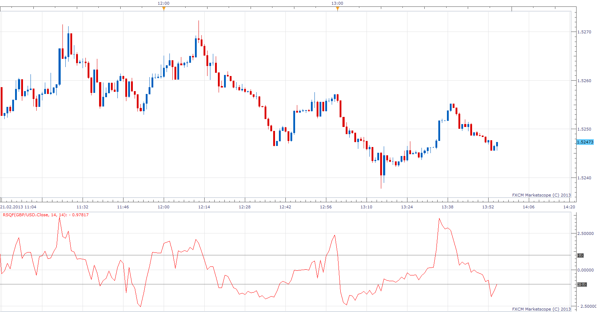

# Relative strength quality factor

> Source: https://fxcodebase.com/code/viewtopic.php?f=17&t=32296  
> Forum: 17 · Topic 32296 · 2 post(s)

---

## Relative strength quality factor

**Apprentice** · Thu Feb 21, 2013 3:19 pm

As described by Donald Jones and Toad Stromquist in October 1986 issue of S&C Magazine.
RSQF will typically be 25 to 65 percent more sensitive than the standard
RSI. This can be translated into a one to three daylead in warning of an OB/OS condition, as compared
to the RSI.

 [RSQF.lua](files/55050/RSQF.lua)

The indicator was revised and updated

---

## Re: Relative strength quality factor

**Apprentice** · Wed May 03, 2017 2:05 pm

Indicator was revised and updated.
