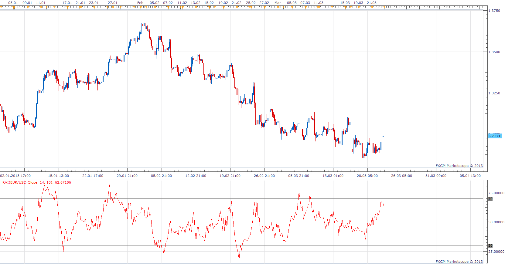
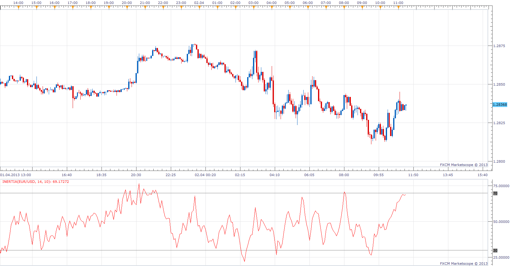

# Relative Volatility Index

> Source: https://fxcodebase.com/code/viewtopic.php?f=17&t=33759  
> Forum: 17 · Topic 33759 · 3 post(s)

---

## Relative Volatility Index

**Apprentice** · Sat Mar 23, 2013 2:00 pm

 Relative Volatility Index was presented by Donald Dorsey in the June 1993 issue of Technical Analysis of Stocks and Commodities

Up Day U = STDEV else U =0;
Down Day D = STDEV else D =0;

RVI = 100 * MA of U /( MA of U+ MA of D)
 Relative Volatility Index is similar to the Relative Strength Index (RSI), however it uses the standard deviation over the past 10 days rather than daily price change.

 [RVI.lua](files/57292/RVI.lua)

The indicator was revised and updated

---

## Re: Relative Volatility Index

**Apprentice** · Tue Apr 02, 2013 11:45 am

Inertia was presented by Donald Dorsey in september 1995 issue of S&C magazine.
Inertia (RVI of High + RVI of Low ) /2
Positive Inertia
Inertia> 50
Negative Inertia
Inertia <50

 [Inertia.lua](files/57830/Inertia.lua)

---

## Re: Relative Volatility Index

**Apprentice** · Wed May 10, 2017 5:28 am

Indicator was revised and updated.
