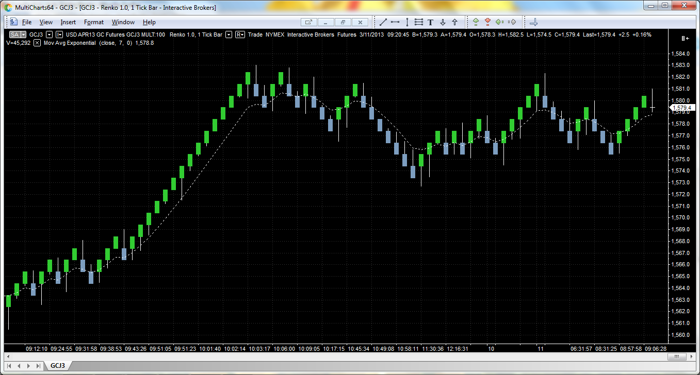

# Renko Chart New Version!

> Source: https://fxcodebase.com/code/viewtopic.php?f=17&t=60748  
> Forum: 17 · Topic 60748 · 38 post(s)

---

## Renko Chart New Version!

**moomoofx** · Sun Jun 01, 2014 12:40 am

Hi Everyone,

Since the new version of Trading Station came bundled with views such as Renko, there have been a number of requests for strategies on these views. However, the Renko view that came bundled with Trading Station is still suffering from some teething issues and does not support strategies well.

I have produced this new version that can be used to write strategies on top of it.

 [Renko_candles_New.lua](files/94236/Renko_candles_New.lua)

I have made the following changes:
-- Fixed bug handling no history for strategies that crashes backtester
-- History futher enhanced to autoload enough data.
-- Fixed bug to prevent crashing (remove subscription in release instance - thanks Valeria!)
-- Added bars limit for target number of bars initially required.
-- Added dateLimit to prevent loading too long.
-- Added detection of when the server limit of data has been reached, and aborts loading further (which probably makes dateLimit legacy)
-- Forces subscription to new prices (removed load_to date)
-- Default timeframe set to m1 as this is the closest to the real thing. Should be tick really.
-- Added Volume (or an attempt to calculate it. If someone can verify my logic I would appreciate it).
-- Removed localization as I cannot translate **New** into all the other languages.

I think this is a good start. Someone could now take this and enhance it to support ticks, and then I think we will be pretty close to having a good view.

To see a sample strategy that uses this, please see this one: [viewtopic.php?f=31&t=60749](https://fxcodebase.com/code/viewtopic.php?f=31&t=60749)

Some final comments
- This new view allows you to load a certain number of bars (or attempt to) which makes it a bit better than the one that comes with Trading Station.
- If you use a strategy with this view, you do not have to have the view open - the strategy will open it internally.
- There are certain tricks to writing a strategy that uses this view. Please see the strategy linked above for details.

Cheers,
MooMooFX

The strategy based on this view.
[viewtopic.php?f=31&t=66876](https://fxcodebase.com/code/viewtopic.php?f=31&t=66876)

---

## Re: Renko Chart New Version!

**Ramos04** · Sun Jun 01, 2014 3:46 pm

Surely, I think its better than the old one in terms of building from m1 look back period (history), is it possible to add a show shadow/wick yes/no option (I have no programing knowledge so dont know what it takes). Looking forward to trying it on live market

---

## Re: Renko Chart New Version!

**Apprentice** · Mon Jun 02, 2014 3:01 am

Regular Renko Chart dont have shadow / wick.

---

## Re: Renko Chart New Version!

**rose123** · Thu Jun 05, 2014 9:47 am

HI,
...eworks\FXTS2\Indicators\Custom\Renko_candles_New.lua:397: Command is not supported

THIS ERROR DEVOLOPED WHEN I RUN BACK TEST . WHAT I HAVE TO DO.

---

## Re: Renko Chart New Version!

**Miguelator** · Fri Jun 06, 2014 9:17 am

Congratulations
Everything works fine with this indicator.

---

## Re: Renko Chart New Version!

**moomoofx** · Fri Jun 06, 2014 5:45 pm

> **rose123 wrote:**
> HI,
> ...eworks\FXTS2\Indicators\Custom\Renko_candles_New.lua:397: Command is not supported
>
> THIS ERROR DEVOLOPED WHEN I RUN BACK TEST . WHAT I HAVE TO DO.

Hi Rose123,

The renko chart automatically attempts to load the history of prices (to build the historical renko bars) but loading history is not supported in the backtester or debugger, since the date range of data to be loaded is already preset by the user.

I actually already try to detect this situation and present the user with an error instead:
"Renko Bars Unable to load any history. Likely reason is running in Backtester or Debugger. Ensure sufficient data has been loaded manually."

Do you see this additional error message as well?
Does the backtest keep running anyway?
Could you let me know the strategy and input details?

Thanks,
MooMooFX

---

## Re: Renko Chart New Version!

**rose123** · Sat Jun 07, 2014 7:30 am

hi,

i actually get this error message when running the strategy based on renko bar and ichimoku which is posted on the following page.

[viewtopic.php?f=31&t=60749](http://www.fxcodebase.com/code/viewtopic.php?f=31&t=60749)

details of my back test:

parameters: default parameters
buy : when price ,upper cloud cross over
sell: wher price ,lower cloud cross under

thank you.

---

## Re: Renko Chart New Version!

**moomoofx** · Sun Jun 08, 2014 8:59 am

> **rose123 wrote:**
> hi,
>
> i actually get this error message when running the strategy based on renko bar and ichimoku which is posted on the following page.
>
> [http://www.fxcodebase.com/code/viewtopi ... 31&t=60749](http://www.fxcodebase.com/code/viewtopic.php?f=31&t=60749)
>
> details of my back test:
>
> parameters: default parameters
> buy : when price ,upper cloud cross over
> sell: wher price ,lower cloud cross under
>
> thank you.

Sorry I don't have this problem. I only see my error message. What instrument/symbol and date range are you trying to backtest for?

Thanks,
MooMooFX

---

## Re: Renko Chart New Version!

**rplust** · Thu Jun 26, 2014 3:39 am

> **Miguelator wrote:**
> Congratulations
> Everything works fine with this indicator.

What's the name of the Indicators you are using. From this site?

---

## Re: Renko Chart New Version!

**tmdabc** · Sun Oct 18, 2015 8:46 pm

what is this based on？can we choose high or low to draw renko？

---

## Re: Renko Chart New Version!

**cnikitopoulos94** · Sun Nov 15, 2015 11:55 pm

This Renko works perfectly fine so far. Shows historical data perfectly well.. going to test it too see how it works with any other.

---

## Re: Renko Chart New Version!

**panos59** · Mon Mar 14, 2016 11:09 pm

Wondering if somebody could fix a renko indicator or strategy which sets the blocksize automatic according to an ATR value or some other custom value..something similar to this MT4 expert:

[https://www.mql5.com/en/code/11739](https://www.mql5.com/en/code/11739)

---

## Re: Renko Chart New Version!

**Apprentice** · Wed Mar 16, 2016 4:10 am

Your request is added to the development list.

---

## Re: Renko Chart New Version!

**DAVIDR** · Mon Apr 04, 2016 3:09 am

Hi, I just tried adding the Renko Indicator to my charts. I imported it to my indicators, but when I searched for it, I could not find it. Tried twice and failed, both on laptop and desktop. Not had any problem importing indicators before. Is there a problem or am I missing something here?

---

## Re: Renko Chart New Version!

**cnikitopoulos94** · Mon Apr 04, 2016 4:07 pm

Hey David R.

Yes, you would have to go to your chart, click file then create view. Then click Renko_Chart_New and there you have it. Enjoy.

---

## Re: Renko Chart New Version!

**GabrieleAzara** · Wed Apr 06, 2016 12:48 am

> **Miguelator wrote:**
> Congratulations
> Everything works fine with this indicator.

---

## Re: Renko Chart New Version!

**mykkee** · Fri Apr 08, 2016 12:36 pm

Hi, do you know if there is any work being done on range bar charts....I downloaded on older version and the charts if you have say a 3 pip bar, the chart will print a new bar every minute even if the price didn't move 3 pips....also the indicators are all out of sync with the price.....

---

## Re: Renko Chart New Version!

**Apprentice** · Wed Apr 13, 2016 2:24 am

I do not understand your high / low remark.
Renko does not have high / low.

---

## Re: Renko Chart New Version!

**Cactus** · Thu Apr 28, 2016 4:53 pm

Can this be made an indicator instead of a view, like haiken ashi is? This would allow for it to be imported into FX Strategy Wizard and create strategies with renko bricks like that

---

## Re: Renko Chart New Version!

**Apprentice** · Sun May 01, 2016 6:14 am

While this it is theoretically possible.
See outdated version.
[viewtopic.php?f=17&t=2360&p=7926&hilit=renko#p7926](https://fxcodebase.com/code/viewtopic.php?f=17&t=2360&p=7926&hilit=renko#p7926)
Renko Chart is not sync with candles.
Will need to relculate "Renco" indicator after each tick.

---

## Re: Renko Chart New Version!

**DAVIDR** · Mon Jun 06, 2016 7:06 am

Hi, I loaded Renko_Candles_New on my charts and set 5 pip bricks.

However, I noticed that price moved 15 pips in same direction of last brick, and yet no new brick had formed. Clearly there is a problem here. How can I resolve the problem?

---

## Re: Renko Chart New Version!

**manintheplains** · Tue Jul 05, 2016 3:41 pm

The best way to see bricks is to set 1min chart and if the price move up or down your setting you will see new bricks but only after 1min.

I don't know if is normal, but on my platform it works pretty good in this way.

---

## Re: Renko Chart New Version!

**Apprentice** · Thu Oct 05, 2017 5:31 am

The indicator was revised and updated.

---

## Re: Renko Chart New Version!

**Taskryr** · Fri Dec 08, 2017 4:38 pm

Hello,

was the brick size based on ATR ever added to this chart view?

Thanks,

---

## Re: Renko Chart New Version!

**Apprentice** · Fri Dec 15, 2017 6:43 am

I do not think so.
Have pointed this task to my development team.

---

## Re: Renko Chart New Version!

**Apprentice** · Sun Dec 17, 2017 6:46 am

[Renko_candles_atr.lua](files/116513/Renko_candles_atr.lua)

---

## Re: Renko Chart New Version!

**Silverthorn** · Thu Feb 22, 2018 8:00 pm

Hi Apprentice,

Can I please have a version of the Renko Bricks that have the range of price movement covered until the next brick is drawn shown as a wick on the brick?

Standard Renko rules to create the bricks (like candle bodies) with the high and low of the trading range that was covered until the creation of the next brick shown as a line behind (wick)

This would act like a proxy trend strength indicator for the Renko Bricks. In a strong trend we would see only wicks extending in the direction of the trend and to the top of the next brick. As you see wicks starting to form on the opposite side of the brick we would consider there to be indecision in the market and the possibility of a stall or reversal.

I hope that is clear.

Thanks.

---

## Re: Renko Chart New Version!

**Silverthorn** · Sun Feb 25, 2018 8:13 pm

Hi,

I found an image of Renko Bricks drawn as I was describing above. Hope this makes it clearer.

 

---

## Re: Renko Chart New Version!

**Apprentice** · Mon Feb 26, 2018 4:51 pm

Something like Mean Renko Bars View?
[viewtopic.php?f=17&t=60743&hilit=renko](https://fxcodebase.com/code/viewtopic.php?f=17&t=60743&hilit=renko)

---

## Re: Renko Chart New Version!

**Silverthorn** · Sun Mar 04, 2018 11:34 pm

Thanks for that. Appears to work perfectly. Why is it marked Obsolete?

---

## Re: Renko Chart New Version!

**Apprentice** · Mon Mar 05, 2018 7:42 am

Will will not be developed further.

---

## Re: Renko Chart New Version!

**omgepe** · Sun Nov 08, 2020 7:39 am

> **Miguelator wrote:**
> Congratulations
> Everything works fine with this indicator.

may i know what indicator do you use in this picture?

thanks
gp

---

## Re: Renko Chart New Version!

**Gilles** · Thu Nov 03, 2022 12:01 pm

Hi Apprentice,

Would it be possible to get a Renko_Candles_Tick_ATR.lua that would be based on TART.lua
Thank you very much :) !

---

## Re: Renko Chart New Version!

**Apprentice** · Fri Nov 04, 2022 3:29 am

We have added your request to the development list.
Development reference 705.

---

## Re: Renko Chart New Version!

**Apprentice** · Fri Nov 04, 2022 5:39 am

 [Renko_Candles_Tick_ATR.lua](files/148153/Renko_Candles_Tick_ATR.lua)

TATR.lua
[https://fxcodebase.com/code/viewtopic.php?f=17&t=34094](https://fxcodebase.com/code/viewtopic.php?f=17&t=34094)

---

## Re: Renko Chart New Version!

**Gilles** · Fri Nov 04, 2022 1:37 pm

Hi Apprentice,
Thank you so much.
Next step :
Please, i would like to get a strategy based on it.
The Tick_Extreme_TMA_Line to be applied to Renko_Candles_Tick_ATR.close.

If Line is Green then BUY elseif Line is Red then SELL end

Thank you !

---

## Re: Renko Chart New Version!

**Apprentice** · Sat Nov 05, 2022 9:41 am

We have added your request to the development list.
Development reference 713.

---

## Re: Renko Chart New Version!

**Apprentice** · Thu Aug 10, 2023 11:51 am

Try this version.
[https://fxcodebase.com/code/viewtopic.php?f=31&t=74020](https://fxcodebase.com/code/viewtopic.php?f=31&t=74020)
