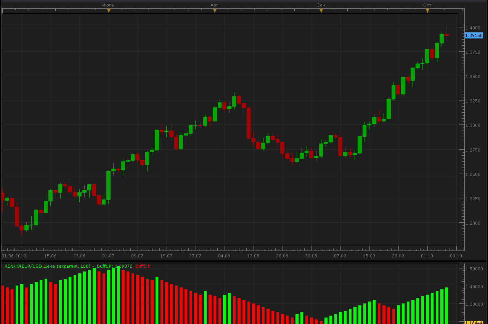
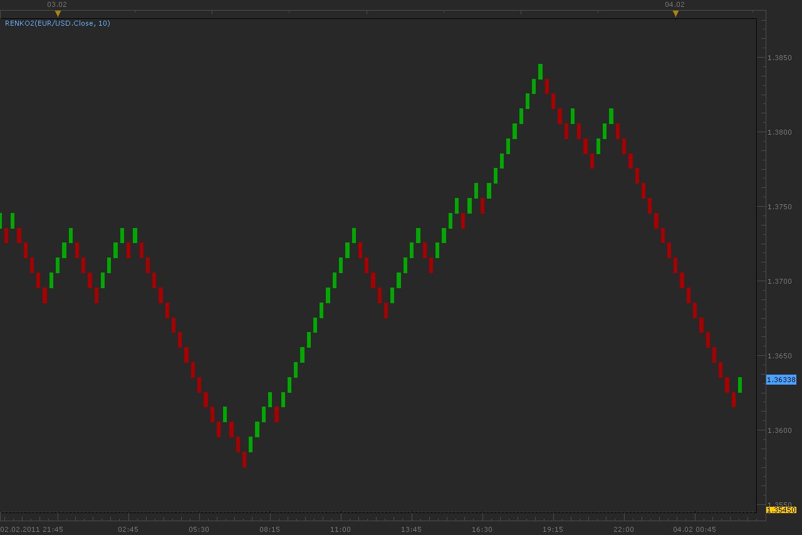
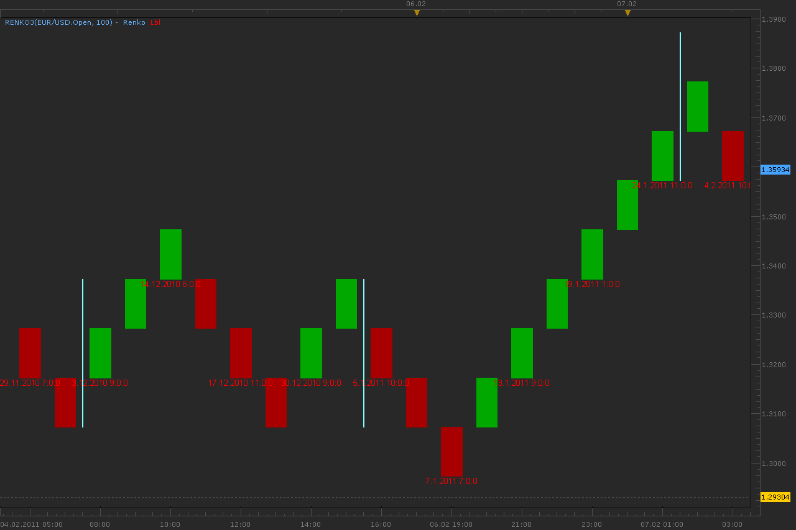
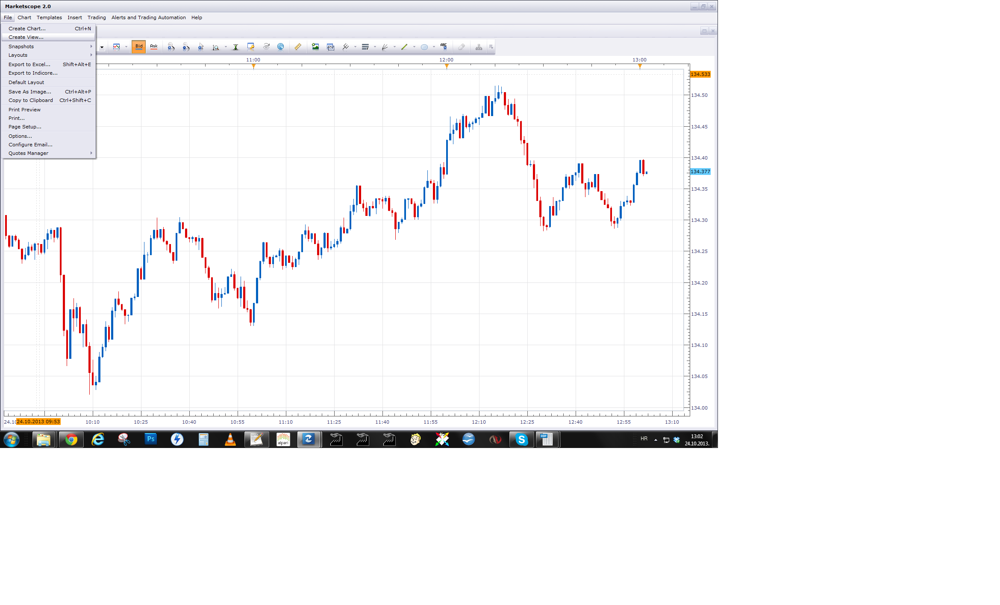
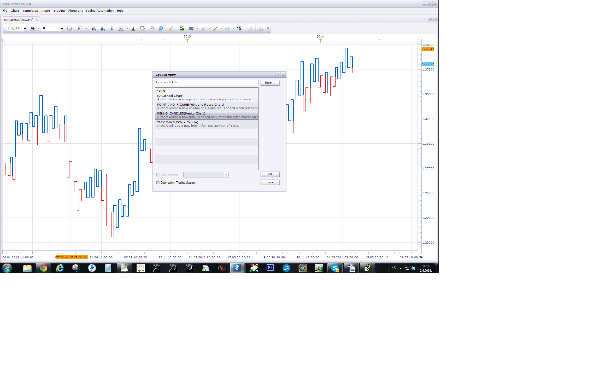
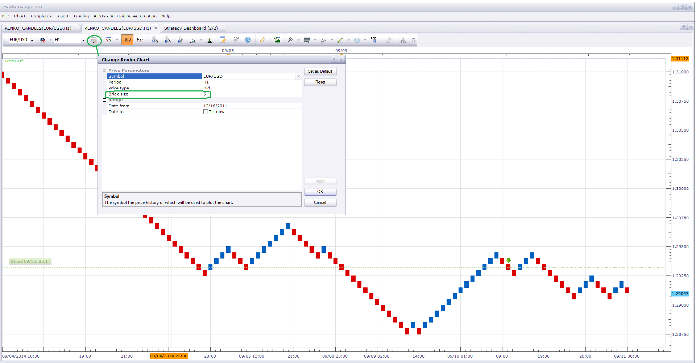

# Renko chart (Obsolete)

> Source: https://fxcodebase.com/code/viewtopic.php?f=17&t=2360  
> Forum: 17 · Topic 2360 · 59 post(s)

---

## Renko chart (Obsolete)

**Alexander.Gettinger** · Thu Oct 07, 2010 3:56 pm



 [Renko.lua](files/5080/Renko.lua)

This indicator is obsolete.

 


I encourage you to Use Renko View instead.

---

## Re: Renko chart.

**Checkz** · Sun Oct 10, 2010 4:27 am

IS THERE A WAY TO REPLACE THE CANDLESTICKS WITH THE RENKO BARS DISPLAYING THEM ON THE ACTUAL CHART INSTEAD OF BELOW IT?

---

## Re: Renko chart.

**Alexander.Gettinger** · Fri Feb 04, 2011 2:45 am

Update of Renko chart.
Now, Renko bricks are drawn at source chart.

 



Download:

 [Renko2.lua](files/7909/Renko2.lua)

---

## Re: Renko chart.

**patick** · Fri Feb 04, 2011 5:08 am

Very nice... thank you!

For those of us applying other indicators a Renko chart, keep in mind, you'll need to go to the indicators properties and select Renko:

---

## Re: Renko chart.

**patick** · Fri Feb 04, 2011 8:16 am

Ok, now that I've been watching the Renko bricks for the past several hours, I see a problem... not sure if there is a permanent solution, but I'll suggest a couple optional workarounds.

The brick widths are exactly the width of whatever TF chart you have the indie running (i.e., m1, m5... etc.). This ties the brick to the time scale at the bottom of the chart, which we know is not an accurate depiction since Renko is price dependent, not time. So, looking at the chart, it looks like you are seeing 3 hours of price action, when in reality, you could be looking at 2 days or more.

If you do not have control of setting the time scale on the chart, I would suggest the following:

1) Use the tool tip to display the actual Renko brick open and close date/time.
2) Add an option of drawing period separators on the chart... every 2, 4, 8 hours... etc., to distinguish not only intra-day PA, but also one day from the next.

---

## Re: Renko chart.

**Alexander.Gettinger** · Fri Feb 04, 2011 8:47 pm

> **patick wrote:**
> If you do not have control of setting the time scale on the chart, I would suggest the following:
>
> 1) Use the tool tip to display the actual Renko brick open and close date/time.
> 2) Add an option of drawing period separators on the chart... every 2, 4, 8 hours... etc., to distinguish not only intra-day PA, but also one day from the next.

OK. I work on this.

---

## Re: Renko chart.

**Alexander.Gettinger** · Mon Feb 07, 2011 3:11 am

Renko chart with datetime labels and period separators.

 



Download:

 [Renko3.lua](files/7984/Renko3.lua)

---

## Re: Renko chart.

**patick** · Mon Feb 07, 2011 11:51 am

Testing now... but looks good, Mr. Gettinger.

Thanks!

Now see something.... I attached a Power Point file to highlight.

---

## Re: Renko chart.

**whninja** · Wed Feb 16, 2011 2:54 pm

Better Renko for lua

Here is my matlab version for a better renko chart ... perhaps it helps ...

---

## Re: Renko chart.

**Alexander.Gettinger** · Thu Feb 17, 2011 4:06 am

Renko3.lua updated.
Fixed error with multiple separators.
Please, download this indicator again.

---

## Re: Renko chart.

**patick** · Thu Feb 17, 2011 9:48 am

Much appreciated... that fixed the problem.

---

## Re: Renko chart.

**patick** · Thu Feb 17, 2011 1:16 pm

whninja,

Nice work! This is the only way to do it properly to avoid brick lag/missing bricks in Market Scope.

---

## Re: Renko chart.

**whninja** · Fri Feb 18, 2011 2:40 am

I know, but at this time i have not the time and the skills in lua to do similar. i transfer my data to matlab for analysis.
the good is: lua and matlab are equal in scripting ...

best regards

---

## Re: Renko chart.

**Alexander.Gettinger** · Mon Feb 21, 2011 2:33 am

There is a feature is present in all version Renko from this topic. View of Renko chart depends on first point. For two different first points charts can look different.

Indicator Renlo2M without this feature.
Download:

 [Renko2M.lua](files/8292/Renko2M.lua)

---

## Re: Renko chart.

**whninja** · Wed Feb 23, 2011 2:21 pm

can someone help

i had some trouble with the streams and array calc

```lua
function Init()
    indicator:name("BetterRenko");
    indicator:description("BetterRenko");
    indicator:requiredSource(core.Bar);
    indicator:type(core.Indicator);
    indicator:setTag("replaceSource", "t");

    indicator.parameters:addGroup("Calculation");
    indicator.parameters:addInteger("Step", "Step in pips", "", 10);

end

local first;
local source = nil;
local Step;
local up = nil;
local down = nil;

local n;
local i;
local open = nil;
local high = nil;
local low = nil;
local close = nil;

function Prepare()
    source = instance.source.close;
    Step=instance.parameters.Step;
    first = source:first();
    up = instance:addInternalStream(first, 0);
    down = instance:addInternalStream(first, 0);
    local name = profile:id() .. "(" .. source:name() .. ", " .. instance.parameters.Step .. ")";
    instance:name(name);
    open = instance:addStream("open", core.Line, name, "open", core.rgb(0, 0, 0), first)
    high = instance:addStream("high", core.Line, name, "high", core.rgb(0, 0, 0), first)
    low = instance:addStream("low", core.Line, name, "low", core.rgb(0, 0, 0), first)
    close = instance:addStream("close", core.Line, name, "close", core.rgb(0, 0, 0), first)
    instance:createCandleGroup("Renko", "Renko", open, high, low, close);
end

function Update(period, mode)
   if (period==source:size()-1) then

    n=1;
    up[n] = source[first];
    down[n] = source[first];

    for i=first+1,period,1 do
        local not_done;

        if n == first then
            up[n] = source[i];
            down[n] = source[i];
            n = n + 1;
        else
           
            if source[i] > up[n-1] + Step*source:pipSize() then
                up[n] = up[n-1] + Step*source:pipSize();
                down[n] = up[n-1] - Step*source:pipSize();

                n = n + 1;

                if source[i] > up[n-1] + Step*source:pipSize() then
                    not_done = 1;
                else
                    not_done = 0;
                end

                while(not_done == 1) do
                    up[n] = up[n-1] + Step*source:pipSize();
                    down[n] = up[n-1] - Step*source:pipSize();

                    n = n + 1;

                    if source[i] > up[n-1] + Step*source:pipSize() then
                        not_done = 1;
                    else
                        not_done = 0;
                    end
                end

            elseif source[i] < down[n-1] - Step*source:pipSize() then
                down[n] = down[n-1] - Step*source:pipSize();
                up[n] = down[n-1] + Step*source:pipSize();

                n = n + 1;

                if source[i] < down[n-1] - Step*source:pipSize() then
                    not_done = 1;
                else
                    not_done = 0;
                end

                while(not_done == 1) do   
                    down[n] = down[n-1] - Step*source:pipSize();
                    up[n] = down[n-1] + Step*source:pipSize();

                    n = n + 1;

                    if source[i] < down[n-1] - Step*source:pipSize() then
                        not_done = 1;
                    else
                        not_done = 0;
                    end
                end
            else
                down[n] = down[n-1];
                up[n] = up[n-1]

                n = n + 1;

            end
        end
    end

    for i=1,open:size()-1,1 do

        local m=1;
        if i < 2 then
            open[m]=nil;
            close[m]=nil;
            low[m]=nil;
            high[m]=nil;
        else
            if up[i] > up[i-1] then
                open[m]=down[i];
                close[m]=up[i];
                low[m]=down[i];
                high[m]=up[i];
                m = m + 1;

            end
            if up[i] > up[i-1] then
                open[m]=up[i];
                close[m]=down[i];
                low[m]=down[i];
                high[m]=up[i];
                m = m + 1;
            end
        end
    end
end
end
```

---

## Re: Renko chart.

**Victor.Tereschenko** · Thu Feb 24, 2011 7:39 am

> **whninja wrote:**
> can someone help
>
> i had some trouble with the streams and array calc

What king of trouble do you have? "70: Index is out of range."? This peace of code could access the "up" stream with incorrect index ("n"). "N" could become greater that the current period. You shoud add a check for correct index (n <= period).

```lua
while(not_done == 1) do
                    up[n] = up[n-1] + Step*source:pipSize();
                    down[n] = up[n-1] - Step*source:pipSize();

                    n = n + 1;

                    if source[i] > up[n-1] + Step*source:pipSize() then
                        not_done = 1;
                    else
                        not_done = 0;
                    end
                end
```

---

## Re: Renko chart.

**whninja** · Thu Feb 24, 2011 2:35 pm

thanks my problem is

n can be greater period (with a small bricksize) or n can be smaller period (with a higher bricksize)

n is the count for the bricks - in this case a higher range of a bar can have more bricks (trend)
i is a count for period/bar - in this case more bars can have only a brick (sideways)

tomorow i will swith i with (current ) period

---

## Re: Renko chart.

**Victor.Tereschenko** · Mon Feb 28, 2011 8:22 am

> **whninja wrote:**
> thanks my problem is
>
> n can be greater period (with a small bricksize) or n can be smaller period (with a higher bricksize)
>
> n is the count for the bricks - in this case a higher range of a bar can have more bricks (trend)
> i is a count for period/bar - in this case more bars can have only a brick (sideways)
>
> tomorow i will swith i with (current ) period

You an array instead of internal stream.

```
local up = {};
local down = {};
function Prepare()
...
end
```

instead of

```lua
local up = nil;
local down = nil;
function Prepare()
...
    up = instance:addInternalStream(first, 0);
    down = instance:addInternalStream(first, 0)
...
end
```

Internal stream sizes/clears automatically when it is nessesary. With array you're forced to fo it manually.

```lua
function Update(period, mode)
    if mode == core.UpdateAll then
        -- clear arrays
        up = {};
        ...
    end
end
```

---

## Re: Renko chart.

**Pippin** · Tue May 17, 2011 1:24 pm

Which is the most updated renko indicator? I'm new to trading with tsII as well as this site. Any help in finding the most recent renko tool will be greatly appreciated. Thanks

---

## Re: Renko chart.

**TheEdge** · Wed Jan 11, 2012 1:29 pm

Hello,

I don't think this is working properly...I have notice that the bars are not printing until there is a change in direction.

I have a 1hr chart with Renko set at 50pips you'll notice that price is around 250pips but there are no new bars.

This needs to be fixed. Also when using these TSII is very slow and often crashes...maybe someone could convince FXCM to have these as a standard feature as they do on Strategy Trader.

---

## Re: Renko chart.

**TheEdge** · Wed Jan 11, 2012 4:08 pm

Hello,

One more thing I noticed that needs to be address, we need the option to select the starting date and time that we want the bricks to start from.

As it is now I'm not sure how far back it's getting it's data but the bricks are not located in the same place when if you restart TSII...this is cause major problems when trying to use this system .

This is a feature in Strategy Trader.

---

## Re: Renko chart.

**Apprentice** · Wed Jan 11, 2012 4:41 pm

Your request has been added to the developmental cue.

---

## Re: Renko chart.

**Fosking** · Thu Feb 09, 2012 5:52 pm

Hey Apprentice!

Have you had any luck on a fully operational renko chart?
The work you guys have done so far is great but it keeps crashing Marketscope.
I have tried searching for a proper MT4 renko chart but have had no luck.

I am looking forward for you guys to crack this!
Many thanks

---

## Re: Renko chart.

**Apprentice** · Fri Feb 10, 2012 4:47 am

Can you provide us with crash report.
It is located within FXTS2/crash folder.
It is imperative that you copy its contents,
prior to the restart of the TS.

---

## Re: Renko chart.

**TheEdge** · Thu Apr 05, 2012 10:12 am

Apprentice,

I have not been able to create a crash since updating TS2, however if you select Renko bars of 5pips and try and load 120 or more days of data say in the 4 hour time frame it will lock up TS2.

As I said before I think the option to select the look back days would be the fix.

Here are some issues with these and some possible solutions for any one wanting to use these.

Issues First:

These Renko bars are time dependent and they shouldn't be dependent on time. If, you watch the charts and compare these to Candle charts you will see that price often moves more than 5pips (the setting for the Renko Bar) but a new bar doesn't print, new bars only seem to print after the close of the Candle.

A true Renko closes and opens everytime price exceeds the default value, if the Renko is set at 5pips than at 5pips the first bars closes and the next bar opens.

It seems these are using candle data to to determiner when to open and close. This is not bad except that if a candle goes in your favor say 50pips before closing you would not see this in the renko instead you see price leave your renko bars behind, conversely if price where to move against you wouldn't known it had until the close of the candle. (The Renko3.lua seems to have this problem more so than the Renko2m, but I like the added features of the Renko3 better)

I suggested before that maybe the fxcm team needs to pull the code from strategy trader and add the renko bar as a standard option rather than an indicator.

So the next question is it possible to code this to use tick data with a look back period rather than using the candle data?

Using these renko bars on TS2 as they are now,

I suggest renko2m.lua on a 1minute chart with the Renko set at 5pips, once on the chart zoom out so the maximum data is downloaded from the server this will give results similar to Strategy Trader. Just keep in mind if price moves you will not see the result until the 1minute candle closes.

I have a strategy I think would be good fit for renko bars if the issues can be ironed out.

If not can you guys encode an indicator for Strategy Trader?

Renko2m on left, Renko3 on right

Renko2m and Renko3 Comparison,
It would seem the Renko3 did a better job of showing price closer to the top, but Renko3 seems to allow price to move much farther away before printing bricks.

BUT when compared to Strategy Trader Renko2 does a better job.
As a matter of fact if we set the look back period the same 24hrs. we get almost the exact same price top by .00007 pips.

If you want to use renko bars use Renko2m,

---

## Re: Renko chart.

**Apprentice** · Fri Apr 06, 2012 4:04 am

When I find time, I will try to offer a solution.

---

## Re: Renko chart.

**GideonHanekom** · Wed May 09, 2012 3:05 pm

Hi Guys

I've been trading using Renko2.lua with settings 5 pips on a 15 minute chart and it works just fine for my scalping strategy. Would it be possible to change the indicator just a little so that the wick remains after a new brick is formed. How this helps is your pivot levels and support and resistance indicators are more accurate as the levels are often really a little further away from the open or close of the brick. Also with back testing and stop loss determination this would help as well.

Kind regards

Gideon

---

## Re: Renko chart.

**GideonHanekom** · Thu May 10, 2012 2:54 am

Thank you apprentice, I'll hang on for dear life!

Kind regards

Gideon

---

## Re: Renko chart.

**GideonHanekom** · Thu May 17, 2012 6:26 am

Hi Apprentice
Just for info, I found that even Renko2.lua does not print the bricks absolutely correctly. Renko chart should really make a new brick after the specified brick size, 5 pips or whatever, and should not be time bound.

Hope you find time

Kind regards

Gideon Hanekom

---

## Re: Renko chart.

**TheEdge** · Thu May 17, 2012 8:10 am

> **GideonHanekom wrote:**
> Hi Guys
>
> I've been trading using Renko2.lua with settings 5 pips on a 15 minute chart and it works just fine for my scalping strategy. Would it be possible to change the indicator just a little so that the wick remains after a new brick is formed. How this helps is your pivot levels and support and resistance indicators are more accurate as the levels are often really a little further away from the open or close of the brick. Also with back testing and stop loss determination this would help as well.
>
> Kind regards
>
> Gideon

How are you compensating for the fact that indicators do not stay with the bars? Are you refreshing all the time? How also do you compensate for the time effect...meaning it takes 15 minutes for the bars to print as they only seem to print after the close of the 15 minute or what ever time frame one is using?

I am very interested in using these but I don't like the time effect as the bricks lag to much for my trading style. Very interested how you are managing to compensate for these effects.

Thanks in Advance,

OnTheEdge

---

## Re: Renko chart.

**GideonHanekom** · Thu May 17, 2012 9:47 am

Hi

Because I use only moving averages and swing high low (support and resistance) and pivots I do not have to compensate for below the chart indicators.

My problem is that because the Renko candles are just indicators on TS2 charts, support, resistance and pivot levels are not correct and also, as I found recently, a new brick is not formed every time price moves the specified distance. (5 pips in my case).

I've reverted to 15 minute time chart for entries. Such a pity as I had really good strategy going on.

Kind regards

Gideon

---

## Re: Renko chart.

**TheEdge** · Fri May 18, 2012 3:38 pm

> **GideonHanekom wrote:**
> Hi
>
> Because I use only moving averages and swing high low (support and resistance) and pivots I do not have to compensate for below the chart indicators.
>
> My problem is that because the Renko candles are just indicators on TS2 charts, support, resistance and pivot levels are not correct and also, as I found recently, a new brick is not formed every time price moves the specified distance. (5 pips in my case).
>
> I've reverted to 15 minute time chart for entries. Such a pity as I had really good strategy going on.
>
> Kind regards
>
> Gideon

Hi, You are having the same problems it sounds like that I have with the Renko Bricks, IMHO, You will have better results using the 1 minute chart since the time is shorter and so the bricks print more often.

I am testing Renko on the mt4 platform for the last couple of days and I am much happier with the results, however I despise mt4 it's like bringing a knife to a gun fight...I wish FXCM would add Renko as a standard feature to TS2 or maybe Apprentice could get it working...I would be willing to through in a few $ to lend a hand to making these work in TS2.

Best of luck in your trading!

---

## Re: Renko chart.

**GideonHanekom** · Sat May 19, 2012 4:32 am

Tx Mate, I'll give it a try and I agree with you Renko charts should be an option under Chart Types on the TS 2 Platform. In my opinion the TS2 platform is way more classy than MT4

Kind regards

Gideon

---

## Re: Renko chart.

**Aladdin** · Fri Sep 14, 2012 3:47 am

Hello everyone,

I'm so confused, what I know Renko chart is price dependent and time has no function on it, but when I'm changing the time frame 1min, 15min, 1hr, ... ,and so on, I find the chart defers each time frame!!!!

Waiting for your valued help.

---

## Re: Renko chart.

**Apprentice** · Fri Sep 14, 2012 3:50 am

Renko, Kagi, P & F, Range Bar Indicators dont have time frames.
They are controlled with parameters, in this case it is "Step".
"Box" Size for single Renko Chart Element.

---

## Re: Renko chart.

**Aladdin** · Fri Sep 14, 2012 4:36 am

That what I'm getting!!

Renko3 at 15min
Renko3 at 1min
Renko3 at 1D >>> platform crash!!

---

## Re: Renko chart.

**mulligan** · Fri Dec 28, 2012 1:55 pm

I'm having a problem with the Renko3 chart I hope you can help with. I've tried multiple indicators, changing data source to Renko. The indicators work fine, but quickly start shifting out of phase with the bars. To get an accurate indicator reading, I have to click on the indicator, bring up the property box, click OK, basically reset the indicator. Then it starts shifting again. Chart set on 1 min. time frame, Renko3 set on 1 or 2 pips. Some of the indicators tried are LSR, TSI, TARZAN, BB_MACDV6, MACD. Any help is appreciated.

---

## Re: Renko chart.

**Lolopoulos19** · Tue Apr 16, 2013 1:17 pm

Dear Apprentice and friends,

Last week I heard about Renko bars and started testing the Renko 2, Renko 3 and Renko2M that I found here. Seems like all the three of them have serious problems, like false HIGH/LOW, range etc.
Moreover, the platform is not loading data after some point and crashes (check the image).

Can anyoyne create or upload a good-operating RENKO indicator, please?
I would realy like to test this strategy with 20 or 30 pip brick width, without trouble....

Thanks in advance.

---

## Re: Renko chart.

**stainer** · Thu Oct 24, 2013 3:55 am

Is it possible to get a alert for renko 2. I've been using Renko for around a week and Its very hard to try keep on top of what's happening on the charts as time is removed.

Can you design it so you have the option for direction change as well please.

---

## Re: Renko chart.

**Apprentice** · Thu Oct 24, 2013 6:02 am



This version is obsolete.
Try new Renko View instead.

---

## Re: Renko chart

**trendwatch** · Thu Oct 24, 2013 1:55 pm

**EDIT: Removed installation & downloaded and installed again. Solved!**

I tried that but there's nothing to chose from. So no Renko view available. I tried to import the renko2 indy as a view but it gets installed as an indicator and thus doesn't appear in the "view list". Can you tell me from where I can dowload the views?

---

## Re: Renko chart

**stainer** · Thu Oct 24, 2013 11:00 pm

Sorry its the new one I am using, Is it possible to get a alert for the new one.
When I asked can we get one that alerts a change of direction I ment when it prints a new brick in opposite direction.

As I said ive been using renko for about a week with some great results but its so hard to moniter more than a few currency's waiting for a new brick to print when it can happen at any time due to there being no time involved.

Thank you

---

## Re: Renko chart

**trendwatch** · Fri Oct 25, 2013 3:18 am

The new Create View version is still not working correctly! It only paints a new candle when the chosen period ends. I hoped this would be solved with this option.

So if you set the brick size to 5 and price moves 5 pips it does not paint a new brick untill the chosen chart period ends. This makes it useless in my opinion because it should be time independent. It should paint a new brick when the preset brick size is reached not when brick size is reached AND the chart period ends.

And thats not all, if price moves 20 pips up in the chart period and moves back to 3 pips the 4 bricks aren't even painted! So you can not see that price moved 4 bricks (aka 20 pips).

Just open the same Renko view in a m1 and a m5, you'll see what i mean.

---

## Re: Renko chart

**trendwatch** · Wed Nov 06, 2013 8:08 am

Any news on the malfunctioning

> Create view

 option? Any idea on when will this be fixed? The way it's functioning now It's completely useless.

---

## Re: Renko chart

**Apprentice** · Thu Nov 07, 2013 4:32 am

Unfortunately, no update about this issue.
Will be informed of any developments.

---

## Re: Renko chart

**GiFtzw3rg** · Thu Feb 20, 2014 3:15 am

Hello together,

the point which trendwatch is discussing is absolutly right.
The bricks are deleted when a strong counter move is appearing and the bricks are only "painted" when the choosen time period is over.

These are no Real Renko Bars. And therefor they are useless.

Apprentice or Alex Gettinger, do you have an solution for that?
I like renko but they must work correctly.

Many Thx for your help...
Greetz

---

## Re: Renko chart

**KrembuFX** · Thu Feb 20, 2014 9:30 am

Also looking forward for this.

meanwhile there is this tick renko view. [viewtopic.php?f=31&t=60066](https://fxcodebase.com/code/viewtopic.php?f=31&t=60066)

my only problem with this is that it fetch too little history from servers.

i need to leave my TSII open for about 1-2 days to get valuable data for trading

---

## Re: Renko chart

**shulya** · Mon Mar 31, 2014 10:27 am

Hello, is there any progress on the development? As stated above the indicator needs to be independent of time, otherwise it's useless.
Unfortunately it's a critical indicator for my trading style and I'll be forced to switch to Ninja Trader
Thanks.

---

## Re: Renko chart

**GiFtzw3rg** · Mon Mar 31, 2014 11:53 am

Hi,
i'm using Renko2 so far. My problem is that i don't know when 1 Renkobrick is closed(finished). If there were 2 Bricks long for example i thought near the pivot point this could be the trendchange. Stochastic and Ichimoku gives me the same signals. Then i go long. What happend is that when there comes a countermove the 2 white drawn Renkobricks are deleted from the charts!

How could this happen? Two or sometimes 3 long Renkos are deleted and drawn into a short Renko. When this happend, Stochastic and Ichimoku signals are also deleted and are showing NO Signal!

Is this a Bug? I lost some money because of this Sh..!
So when will i know if the Renkobrick is really finished and the trend goes the right direction?

Thanks for all answer
Alex

---

## Re: Renko chart

**Apprentice** · Wed Apr 02, 2014 3:14 am

This indicator is obsolete.

 



I encourage you to use Renko View.

---

## Re: Renko chart (Obsolete)

**shulya** · Wed Apr 02, 2014 9:28 am

I'm getting:
An error occurred during the calculation of the indicator 'RENKO_CANDLES'. The error details: Renko_candles.lua:219: Index is out of range.
In every range configuration
never mind

---

## Re: Renko chart (Obsolete)

**nweiss** · Mon Sep 08, 2014 3:56 pm

why the renko chart is not correct showing btw. the indi is not refreshing automatically !

---

## Re: Renko chart (Obsolete)

**Valeria** · Thu Sep 11, 2014 5:50 am

Hi nweiss,

Please note that the Renko indicator from this thread is obsolete. Please use the Renko view which is now available in MarketScope. For that go to the File menu and select Create View, in the Create View dialog box select RENKO_CANDLES and click OK. Then in the Renko Chart Properties dialog box set the parameters to values of your choice and click OK.

As to automatic refreshing, I guess that the cause of the issue is in the Brick size of the Renko chart. Please try to use less brick size. The smaller it is, the faster the chart refreshes. For example, set brick size = 5. Please try to change the brick size and let me know whether the issue is solved or not.

 



---

## Re: Renko chart (Obsolete)

**trdacc.149** · Tue Aug 23, 2016 11:09 am

Hi,

Do we have any strategy on this RENKO2M, or any renko INDICATOR (not Renko View)?
If anyone can share any template on how to use Renko indicator as a source , would be much appreciated.

Thanks

---

## Re: Renko chart (Obsolete)

**Apprentice** · Thu Sep 21, 2017 5:07 am

Bump up.

---

## Re: Renko chart (Obsolete)

**fxant2a** · Sat Sep 23, 2017 3:46 pm

Hello Sir,

Do you have RENKO chart for MT4?

Thanks
Antonis

---

## Re: Renko chart (Obsolete)

**Apprentice** · Mon Sep 25, 2017 3:33 pm

Your request is added to the development list under Id Number 3903

---

## Re: Renko chart (Obsolete)

**Alexander.Gettinger** · Thu Sep 28, 2017 11:54 am

> **fxant2a wrote:**
> Hello Sir,
>
> Do you have RENKO chart for MT4?
>
> Thanks
> Antonis

Please, try this indicator: [viewtopic.php?f=38&t=65126](https://fxcodebase.com/code/viewtopic.php?f=38&t=65126)

---

## Re: Renko chart (Obsolete)

**Apprentice** · Sun Oct 21, 2018 5:27 am

Bump up.
