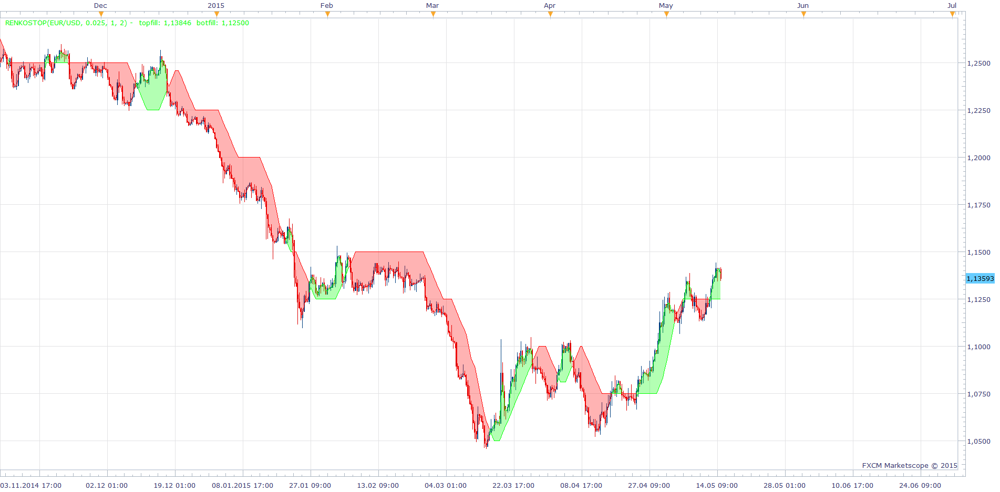

# Renko Stop

> Source: https://fxcodebase.com/code/viewtopic.php?f=17&t=62223  
> Forum: 17 · Topic 62223 · 19 post(s)

---

## Renko Stop

**Apprentice** · Fri May 15, 2015 5:41 am

Based on request.
[viewtopic.php?f=27&t=62195](https://fxcodebase.com/code/viewtopic.php?f=27&t=62195)

 [RenkoStop.lua](files/100481/RenkoStop.lua)

 [RenkoStopwithAlert.lua](files/100481/RenkoStopwithAlert.lua)

Indicator based strategy.
[viewtopic.php?f=31&t=69382](https://fxcodebase.com/code/viewtopic.php?f=31&t=69382)

MT4/MQ4 version.
[viewtopic.php?f=38&t=69453](https://fxcodebase.com/code/viewtopic.php?f=38&t=69453)

---

## Re: Renko Stop

**Stance** · Mon Jun 01, 2015 5:02 pm

HI, is it possible to have an alert for this?

---

## Re: Renko Stop

**tmdabc** · Sun Oct 18, 2015 8:24 pm

does it fit renko view？

---

## Re: Renko Stop

**Apprentice** · Mon Oct 19, 2015 2:49 am

Yes.

---

## Re: Renko Stop

**Apprentice** · Mon Oct 19, 2015 2:49 am

Yes

---

## Re: Renko Stop

**tmdabc** · Mon Oct 19, 2015 7:57 am

thanks a lot

---

## Re: Renko Stop

**Apprentice** · Fri Dec 04, 2015 5:44 am

Compatibility issue fixed.
_Alert Helper is not longer needed.

---

## Re: Renko Stop

**Apprentice** · Mon Oct 22, 2018 5:41 am

The indicator was revised and updated.

---

## Re: Renko Stop

**yolerap** · Sun Feb 02, 2020 7:47 am

Hi,

Possible having strategy based on the renkostop please ? Buy when it's green and sell when it's Red.
Please add the options Timeframe for Renkostop and Timeframe trading. Please add stop fixe and breakeven and trading live or end of turn.
Thank you

---

## Re: Renko Stop

**Apprentice** · Mon Feb 03, 2020 6:13 am

Your request is added to the development list.
Development reference 625.

---

## Re: Renko Stop

**xpertize** · Tue Feb 04, 2020 10:55 am

Hi Apprentice,

Does this Renko Stop repaint?

---

## Re: Renko Stop

**Apprentice** · Tue Feb 04, 2020 1:17 pm

It does NOT.

---

## Re: Renko Stop

**Apprentice** · Wed Feb 05, 2020 9:46 am

Indicator based strategy.
[viewtopic.php?f=31&t=69382](https://fxcodebase.com/code/viewtopic.php?f=31&t=69382)

---

## Re: Renko Stop

**xpertize** · Thu Feb 06, 2020 1:23 am

Thanks Apprentice!

---

## Re: Renko Stop

**blueray077** · Sun Feb 23, 2020 8:40 am

Hello Apprentice!

It would good idea for MT4 user to have the mql4 version...can this accomplished. it appears to be non repainting in my opinion

---

## Re: Renko Stop

**Apprentice** · Mon Feb 24, 2020 4:19 am

Your request is added to the development list.
Development reference 770.

---

## Re: Renko Stop

**Apprentice** · Tue Feb 25, 2020 10:20 am

MT4/MQ4 version.
[viewtopic.php?f=38&t=69453](https://fxcodebase.com/code/viewtopic.php?f=38&t=69453)

---

## Re: Renko Stop

**ahmedalhosenyy** · Fri Oct 10, 2025 1:04 pm

Hello ,

Why the indicator draw differently in my side !.
it shows different drawing

thanks

---

## Re: Renko Stop

**Apprentice** · Sun Oct 12, 2025 2:15 am

We have added your request to the development list.
Development reference 644
