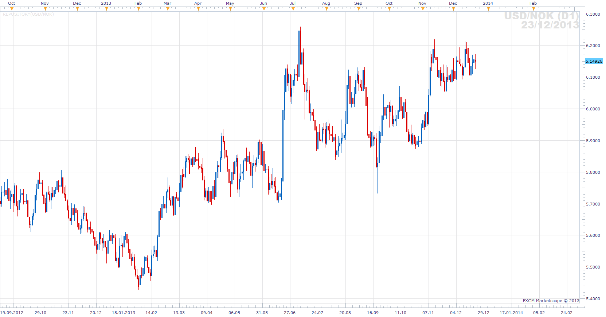
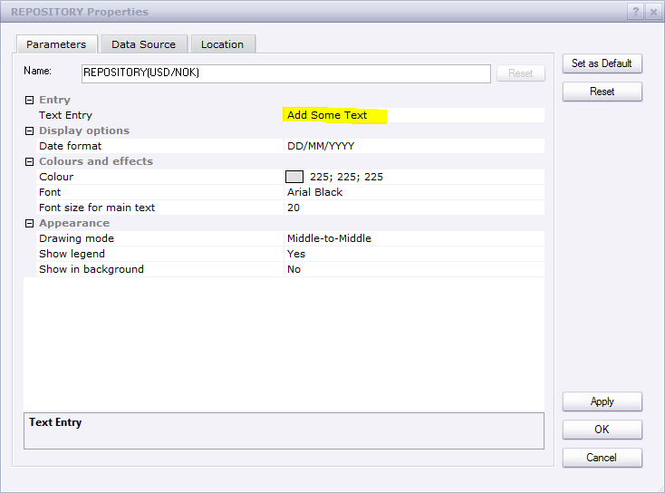
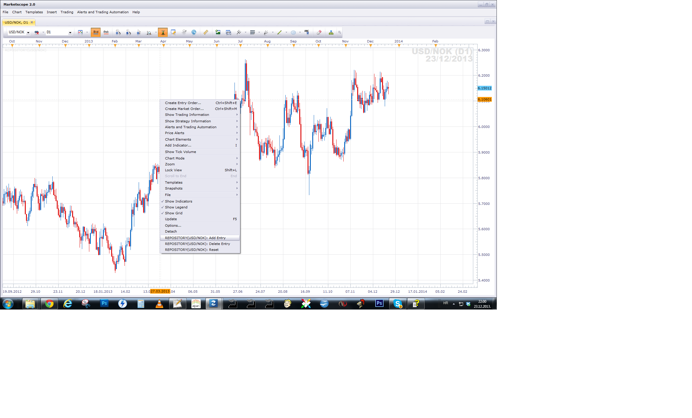
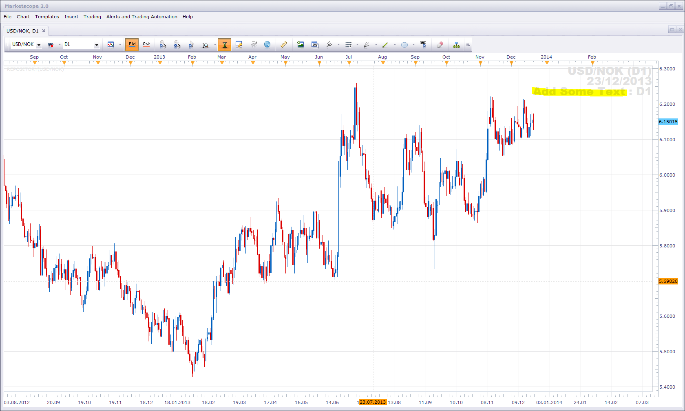

# Repository

> Source: https://fxcodebase.com/code/viewtopic.php?f=17&t=60142  
> Forum: 17 · Topic 60142 · 9 post(s)

---

## Repository

**Apprentice** · Mon Dec 23, 2013 4:10 pm

This indicator will enable you to save a short notes.

U can have one note per Time Frame.
All your notes will be listed for an active currency pair.

Your Notes will be there after TS restart or Currency Pair / Time Frame Change.

 

Short How To.
Enter preferred Text in Text Entry, Paremeter Field

 

Add Text entered in the repository.
(Use Left Mouse menu control Add Entry)

 

Surely, your comment will appear on Chart.

 [Repository.lua](files/91669/Repository.lua)

The indicator was revised and updated

---

## Re: Repository

**Silverthorn** · Fri Dec 27, 2013 9:54 pm

Could the date be set to the date of the last save so there is a reference to how up to date the analysis is.

---

## Re: Repository

**Silverthorn** · Fri Dec 27, 2013 9:58 pm

Is there also any way that the colour of each entry could be set individually to allow a visual reference for views at each time interval or the ability to select one of the icons you used used in your MACD dashboard for each time period?

---

## Re: Repository

**Silverthorn** · Fri Dec 27, 2013 9:59 pm

Thanks Apprentice this is an AWESOME indicator.

---

## Re: Repository

**Apprentice** · Sat Dec 28, 2013 5:03 am

Coloring, tagging date added.

---

## Re: Repository

**Silverthorn** · Thu Jan 02, 2014 12:56 am

Thanks mate. You rock!!

---

## Re: Repository

**Apprentice** · Wed Jun 14, 2017 7:02 am

The indicator was revised and updated.

---

## Re: Repository

**tomkmbox** · Thu Jan 18, 2018 7:32 pm

Can you support Greek letters?

---

## Re: Repository

**Apprentice** · Sat Jan 20, 2018 3:32 pm

If you want to have Greek descriptions.
Can you provide the necessary translation?
