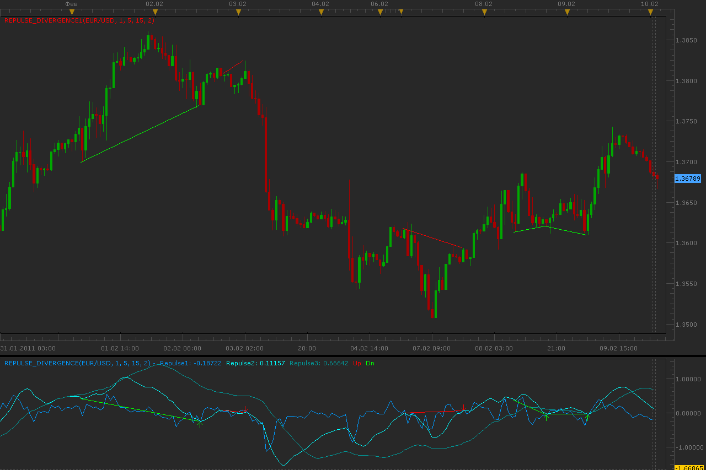

# Repulse divergence indicators

> Source: https://fxcodebase.com/code/viewtopic.php?f=17&t=3362  
> Forum: 17 · Topic 3362 · 10 post(s)

---

## Repulse divergence indicators

**Alexander.Gettinger** · Thu Feb 10, 2011 3:00 am

Indicators search divergence between one of lines Repulse indicator ([viewtopic.php?f=17&t=2067](https://fxcodebase.com/code/viewtopic.php?f=17&t=2067)) and price.

 

Download indicator which finds to divergence:

 [Repulse_Divergence.lua](files/8049/Repulse_Divergence.lua)

Download indicator which draw divergence on price chart:

 [Repulse_Divergence1.lua](files/8049/Repulse_Divergence1.lua)

For this indicators must be installed Repulse indicator ([viewtopic.php?f=17&t=2067](https://fxcodebase.com/code/viewtopic.php?f=17&t=2067)).

The indicator was revised and updated

---

## Re: Repulse divergence indicators

**Alexander.Gettinger** · Thu Feb 10, 2011 3:41 am

Strategy based on Repulse divergence indicator: [viewtopic.php?f=31&t=3363](https://fxcodebase.com/code/viewtopic.php?f=31&t=3363)

---

## Re: Repulse divergence indicators

**kaya_171** · Thu Feb 10, 2011 3:50 am

Hi Alexander

good job thanks a lot but it doesn't works like it would be

my english is very poor so I prepare a chart with divergences of 3 repulses

Have a good day and thanks yet

---

## Re: Repulse divergence indicators

**kaya_171** · Thu Feb 10, 2011 4:34 am

a graph with divergences on each repulse

It's just to have classic divergences, not hidden...

repulse 1 analysed the quality of one impulsion
repulse 5 analyse the quality of two impulsions (between 2 tops or bottoms)
repulse 15 analyse the quality of two more importants impulsions (between 2 tops or bottoms)

in reality, this indicator was made for not changing of time unity :
for example :
unity of time : 5 minuts
repulse 1 => one impulsion on the 5 minuts
repulse 5 => one impulsion on the 25 minuts (<=> 30')
repulse 15 => one impulsion on the 75 minuts (<=> 60')

I hope you'll understand me (if it's necessary, I have a friend who speaks very well english, I will call her for best explanation )

---

## Re: Repulse divergence indicators

**kaya_171** · Thu Feb 10, 2011 4:41 am

a chart :

 

---

## Re: Repulse divergence indicators

**Lfox1988** · Mon Oct 07, 2013 5:00 pm

Hello,

It's possible to get this for MT4 ?
Sorry for my English

---

## Re: Repulse divergence indicators

**Apprentice** · Tue Oct 08, 2013 2:09 am

Your request is added to the development list.

---

## Re: Repulse divergence indicators

**Lfox1988** · Tue Oct 08, 2013 5:38 pm

Thank you very much !

---

## Re: Repulse divergence indicators

**Alexander.Gettinger** · Fri Nov 29, 2013 12:56 pm

> **Lfox1988 wrote:**
> Hello,
>
> It's possible to get this for MT4 ?
> Sorry for my English

Repulse divergence indicator: [viewtopic.php?f=38&t=60015](https://fxcodebase.com/code/viewtopic.php?f=38&t=60015)

---

## Re: Repulse divergence indicators

**Apprentice** · Sat Jun 17, 2017 4:20 am

The indicator was revised and updated.
