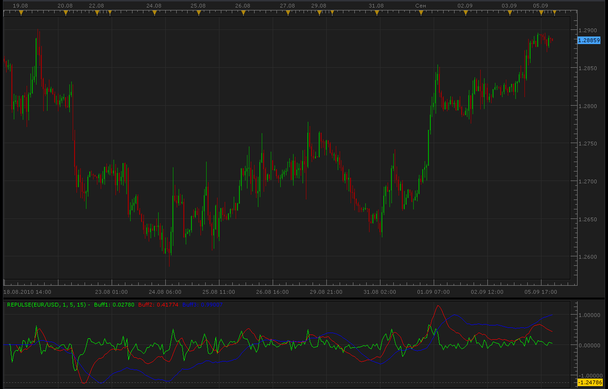

# Repulse indicator

> Source: https://fxcodebase.com/code/viewtopic.php?f=17&t=2067  
> Forum: 17 · Topic 2067 · 23 post(s)

---

## Repulse indicator

**Alexander.Gettinger** · Sun Sep 05, 2010 10:24 pm

[viewtopic.php?f=27&t=1904](https://fxcodebase.com/code/viewtopic.php?f=27&t=1904)

 

 [Repulse.lua](files/4231/Repulse.lua)

Smoothed repulse

 

 [Repulse Heat Map.lua](files/4231/Repulse%20Heat%20Map.lua)

---

## Re: Repulse indicator

**kaya_171** · Tue Feb 08, 2011 6:07 am

Hello Alexander

Is it possible to have automatics lines for divergences (as for MACD) on the three repulse

Thanks

---

## Re: Repulse indicator

**Alexander.Gettinger** · Tue Feb 08, 2011 1:17 pm

> **kaya_171 wrote:**
> Is it possible to have automatics lines for divergences (as for MACD) on the three repulse

You want to search divergences for each of three lines?

---

## Re: Repulse indicator

**kaya_171** · Wed Feb 09, 2011 5:39 am

hello

in a perfect world, I would have divergences on repulse 1, repulse 5 and repulse 15

thank you in advance

---

## Re: Repulse indicator

**Alexander.Gettinger** · Wed Feb 09, 2011 9:39 am

Small question.
You interest divergence between pairs repulse lines or divergence between repulse line and price?

---

## Re: Repulse indicator

**kaya_171** · Wed Feb 09, 2011 9:58 am

It's divergence between repulse line and price

Thanks a lot for working on it

Respectfully

---

## Re: Repulse indicator

**Alexander.Gettinger** · Thu Feb 10, 2011 3:01 am

Please, see this topic: [viewtopic.php?f=17&t=3362](https://fxcodebase.com/code/viewtopic.php?f=17&t=3362)

---

## Re: Repulse indicator

**Terminus** · Thu Jun 09, 2011 6:33 am

Hi,

I suggest two improvements

1/ Having the ability to adjust the size of the lines
2/ A decimal scale for accuracy (two digits after the decimal point)

---

## Re: Repulse indicator

**Apprentice** · Thu Jun 09, 2011 11:14 am

Style Options Added.

---

## Re: Repulse indicator

**Terminus** · Thu Jun 09, 2011 1:52 pm

Thank you very much for your work and your reactivity Apprentice.

Just one suggestion more...

you make that for the buff1 (repulse 1)
but not for buff2 (repulse 5) and buff3 (repulse15)

---

## Re: Repulse indicator

**Apprentice** · Tue Sep 04, 2012 1:03 am

Stream Precision Updated.

---

## Re: Repulse indicator

**transformer** · Sat Nov 30, 2013 9:45 am

hi,

can you create a strategy based on repulse inidcator

buy level:0
sell level:0

buy: repulse2>repulse 3 and repulse 1 cross over repulse 2 and repulse 1> buy level
sell: repulse 2<repulse3 and repulse 1 cross under repulse 2 and repulse 1< sell level

---

## Re: Repulse indicator

**Apprentice** · Sun Dec 01, 2013 5:55 am

Requested can be found here.
[viewtopic.php?f=31&t=60040&p=91278#p91278](https://fxcodebase.com/code/viewtopic.php?f=31&t=60040&p=91278#p91278)

---

## Re: Repulse indicator

**jacklrfx** · Fri Sep 23, 2016 5:53 am

Hi,
Could you please modify the indicator to have the output with two colour, I mean something similar to Averages indicator, in which the average is green if the trend is long and red if the trend is short, so something based on slope?

---

## Re: Repulse indicator

**jacklrfx** · Sat Sep 24, 2016 4:17 am

I have tried to do on my own, I think it could be correct..
Apprentice, I am interested in improving my knowledge of Lua Programming and to
help coding, some advices?

 [Repulse with color.lua](files/108254/Repulse%20with%20color.lua)

---

## Re: Repulse indicator

**Apprentice** · Mon Sep 26, 2016 6:19 am

Have made a minor update.
In your version, both lines have the same color.

Continue writing excellence will come with experience.

You can learn a lot from already available codes, SDK examples.
Will be here if you will need any additional help.

---

## Re: Repulse indicator

**Apprentice** · Sat Jun 17, 2017 4:14 am

The indicator was revised and updated.

---

## Re: Repulse indicator

**Apprentice** · Sat Jun 17, 2017 4:18 am

The indicator was revised and updated.

---

## Re: Repulse indicator

**Nostromo1904** · Wed Jan 19, 2022 10:57 am

Hi Apprentice

Could you add a "horizontal zero line" to this indi ?

Thank you

---

## Re: Repulse indicator

**Apprentice** · Fri Jan 21, 2022 9:11 am

Your request is added to the development list.
Development reference 50.

---

## Re: Repulse indicator

**Apprentice** · Fri Jan 21, 2022 11:06 am

Try it now.

---

## Re: Repulse indicator

**Nostromo1904** · Fri Jan 21, 2022 3:39 pm

Perfect!

---

## Re: Repulse indicator

**Apprentice** · Thu Aug 11, 2022 5:30 am

Repulse Heat Map.lua added.
